# 高级XML导入系统 (Advanced XML Import System)

## 概述

这个项目实现了一个基于Apache Olingo的高级XML导入系统，能够自动处理复杂的XML依赖关系，包括循环依赖检测、多层依赖解析、缓存优化等功能。

## 核心功能

### 1. AdvancedMetadataParser
- **自动依赖解析**: 自动分析和加载XML文件中的所有引用
- **循环依赖检测**: 使用DFS算法检测循环依赖并提供详细报告
- **拓扑排序**: 计算正确的加载顺序
- **智能缓存**: 提供线程安全的缓存机制，提高解析性能
- **详细统计**: 提供完整的解析统计信息和性能指标

### 2. AdvancedXmlImportEdmProvider
- **集成EDM提供者**: 与Apache Olingo无缝集成
- **自动统计报告**: 解析完成后自动输出统计信息
- **错误处理**: 完善的错误处理和日志记录

## 项目结构

```mermaid
graph TD
    ROOT[/"📁 spring-boot-odata-xml-import"/]
    
    ROOT --> SRC[/"📁 src"/]
    
    SRC --> MAIN[/"📁 main"/]
    SRC --> TEST[/"📁 test"/]
    
    MAIN --> JAVA_MAIN[/"📁 java/com/example/xmlimport"/]
    
    JAVA_MAIN --> PARSER["📄 AdvancedMetadataParser.java<br/>🔍 核心解析器"]
    JAVA_MAIN --> PROVIDER["📄 AdvancedXmlImportEdmProvider.java<br/>🏗️ EDM提供者"]
    JAVA_MAIN --> APP["📄 XmlImportApplication.java<br/>🚀 Spring Boot应用"]
    JAVA_MAIN --> CONTROLLER["📄 XmlImportODataController.java<br/>🌐 OData控制器"]
    JAVA_MAIN --> PROCESSOR["📄 XmlImportMetadataProcessor.java<br/>⚙️ 元数据处理器"]
    
    TEST --> JAVA_TEST[/"📁 java/com/example/xmlimport"/]
    TEST --> RES_TEST[/"📁 resources/test-scenarios"/]
    
    JAVA_TEST --> TEST_PARSER["📄 AdvancedMetadataParserTest.java<br/>🧪 核心测试"]
    JAVA_TEST --> TEST_INTEGRATION["📄 AdvancedXmlImportEdmProviderIntegrationTest.java<br/>🔗 集成测试"]
    JAVA_TEST --> TEST_EXAMPLE["📄 AdvancedMetadataParserUsageExampleTest.java<br/>📋 使用示例"]
    
    RES_TEST --> MULTILEVEL[/"📁 multi-level"/]
    RES_TEST --> CIRCULAR[/"📁 circular"/]
    
    MULTILEVEL --> ML_CHAIN["📄 多层依赖链<br/>schema-a.xml → schema-b.xml<br/>→ schema-c.xml → schema-d.xml"]
    
    CIRCULAR --> CIRC_TWO["📄 两方循环<br/>schema-x.xml ↔ schema-y.xml"]
    CIRCULAR --> CIRC_THREE["📄 三方循环<br/>schema-p1.xml → schema-p2.xml<br/>→ schema-p3.xml → schema-p1.xml"]
    
    %% 样式定义
    classDef folderStyle fill:#e3f2fd,stroke:#1976d2,stroke-width:2px
    classDef javaStyle fill:#e8f5e8,stroke:#388e3c,stroke-width:2px
    classDef testStyle fill:#fff3e0,stroke:#f57c00,stroke-width:2px
    classDef xmlStyle fill:#fce4ec,stroke:#c2185b,stroke-width:2px
    
    class ROOT,SRC,MAIN,TEST,JAVA_MAIN,JAVA_TEST,RES_TEST,MULTILEVEL,CIRCULAR folderStyle
    class PARSER,PROVIDER,APP,CONTROLLER,PROCESSOR javaStyle
    class TEST_PARSER,TEST_INTEGRATION,TEST_EXAMPLE testStyle
    class ML_CHAIN,CIRC_TWO,CIRC_THREE xmlStyle
```



## 核心类详解

### AdvancedMetadataParser

#### 主要方法
- `parseAllReferences(String rootSchemaPath)`: 解析所有引用
- `getStatistics()`: 获取解析统计信息
- `clearCache()`: 清理缓存
- `resetStatistics()`: 重置统计信息

#### 核心算法
1. **DFS循环检测**: 使用深度优先搜索检测循环依赖
2. **拓扑排序**: 确保依赖项的正确加载顺序
3. **多策略解析**: 支持ClassPath、FileSystem、URL等多种引用解析策略

#### 统计信息 (ParseStatistics)
- 总文件数量
- 解析耗时
- 缓存命中次数
- 循环依赖数量和路径
- 加载顺序
- 错误信息

### AdvancedXmlImportEdmProvider

继承自`SchemaBasedEdmProvider`，提供以下增强功能：
- 自动使用`AdvancedMetadataParser`解析XML
- 解析完成后自动输出统计信息
- 完善的错误处理和日志记录

## 使用方法

### 1. 基本使用

```java
// 创建解析器实例
AdvancedMetadataParser parser = new AdvancedMetadataParser();

// 解析XML文件及其所有依赖
List<EdmxReference> references = parser.parseAllReferences("path/to/schema.xml");

// 获取统计信息
ParseStatistics stats = parser.getStatistics();
System.out.println("总文件数: " + stats.getTotalFilesLoaded());
System.out.println("解析时间: " + stats.getParsingTimeMs() + "ms");
```

### 2. 与Spring Boot集成

```java
@Component
public class MyEdmProvider extends AdvancedXmlImportEdmProvider {
    
    @PostConstruct
    public void initialize() {
        setRootSchemaPath("classpath:schemas/main-schema.xml");
    }
}
```

### 3. 处理循环依赖

```java
// 解析可能包含循环依赖的文件
List<EdmxReference> references = parser.parseAllReferences("schema-with-cycles.xml");

// 检查循环依赖
ParseStatistics stats = parser.getStatistics();
if (stats.getCircularDependenciesDetected() > 0) {
    System.out.println("发现循环依赖:");
    stats.getCircularDependencyPaths().forEach(System.out::println);
}
```

## 测试场景

### 多层依赖测试
- **四层依赖链**: A → B → C → D
- **验证加载顺序**: D → C → B → A
- **验证依赖解析**: 所有依赖都正确加载

### 循环依赖测试
- **简单循环**: X ←→ Y
- **三方循环**: P1 → P2 → P3 → P1
- **循环检测**: 验证所有循环都被检测到

### 性能测试
- **大量文件**: 测试20+文件的解析性能
- **缓存效果**: 验证缓存机制的有效性
- **内存使用**: 监控内存使用情况

### 错误处理测试
- **文件不存在**: 处理缺失的引用文件
- **格式错误**: 处理格式不正确的XML
- **依赖缺失**: 处理无法解析的依赖

## 配置选项

### 应用配置 (application.properties)
```properties
# 服务器配置
server.port=8080

# 日志配置
logging.level.com.example.xmlimport=DEBUG
logging.level.org.apache.olingo=INFO

# 缓存配置
xmlimport.cache.enabled=true
xmlimport.cache.maxSize=1000
xmlimport.cache.ttl=3600
```

### XML Schema配置
```xml
<!-- 基本引用 -->
<edmx:Reference Uri="other-schema.xml">
    <edmx:Include Namespace="Other.Namespace"/>
</edmx:Reference>

<!-- 条件引用 -->
<edmx:Reference Uri="optional-schema.xml">
    <edmx:Include Namespace="Optional.Namespace" Optional="true"/>
</edmx:Reference>
```

## 最佳实践

### 1. 避免深度循环依赖
- 尽量减少循环依赖的深度
- 使用接口和抽象类来打破循环

### 2. 优化文件结构
- 将公共类型放在基础schema中
- 按功能模块组织schema文件

### 3. 性能优化
- 启用缓存机制
- 合理设置缓存大小和TTL
- 定期清理不使用的缓存

### 4. 错误处理
- 使用Optional引用处理可选依赖
- 提供详细的错误信息和日志
- 实现优雅的降级策略

## 故障排除

### 常见问题

1. **循环依赖错误**
   - 检查schema文件的引用关系
   - 使用测试工具验证依赖图
   - 考虑重构schema结构

2. **文件找不到错误**
   - 检查文件路径是否正确
   - 验证classpath配置
   - 确认文件存在且可读

3. **解析性能问题**
   - 启用缓存机制
   - 检查是否有重复解析
   - 优化schema文件结构

### 调试技巧

1. **启用详细日志**
   ```properties
   logging.level.com.example.xmlimport=DEBUG
   ```

2. **使用统计信息**
   ```java
   ParseStatistics stats = parser.getStatistics();
   System.out.println("Load order: " + stats.getLoadOrder());
   System.out.println("Errors: " + stats.getErrorMessages());
   ```

3. **测试单个文件**
   ```java
   // 测试单个文件的解析
   parser.parseAllReferences("single-schema.xml");
   ```

## 扩展功能

### 自定义ReferenceResolver
```java
public class CustomReferenceResolver implements ReferenceResolver {
    @Override
    public InputStream resolve(String uri) throws IOException {
        // 实现自定义的引用解析逻辑
        return customResolveLogic(uri);
    }
}
```

### 自定义缓存策略
```java
public class CustomCacheStrategy extends AdvancedMetadataParser {
    @Override
    protected void configureCacheSettings() {
        // 自定义缓存配置
        setCacheMaxSize(5000);
        setCacheTtlSeconds(7200);
    }
}
```

## 版本兼容性

- **Apache Olingo**: 5.0.0+
- **Spring Boot**: 3.2.0+
- **Java**: 17+
- **Maven**: 3.8+

## 贡献指南

1. Fork项目
2. 创建功能分支
3. 编写测试
4. 提交Pull Request

## 许可证

本项目采用Apache License 2.0许可证。

---

更多详细信息，请参考源代码中的JavaDoc注释和测试用例。
