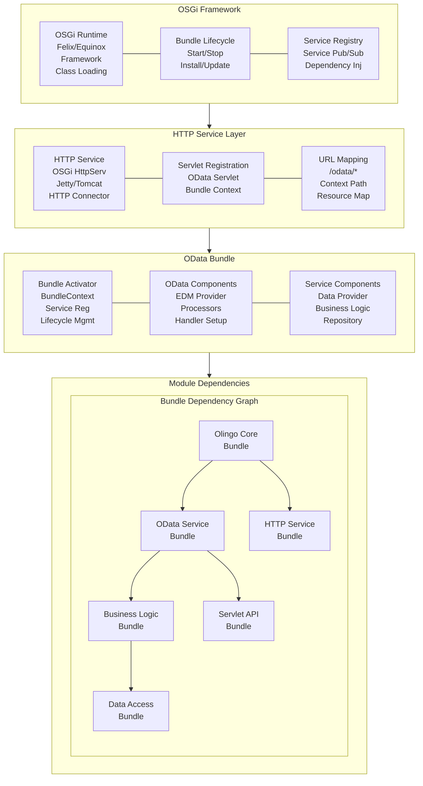
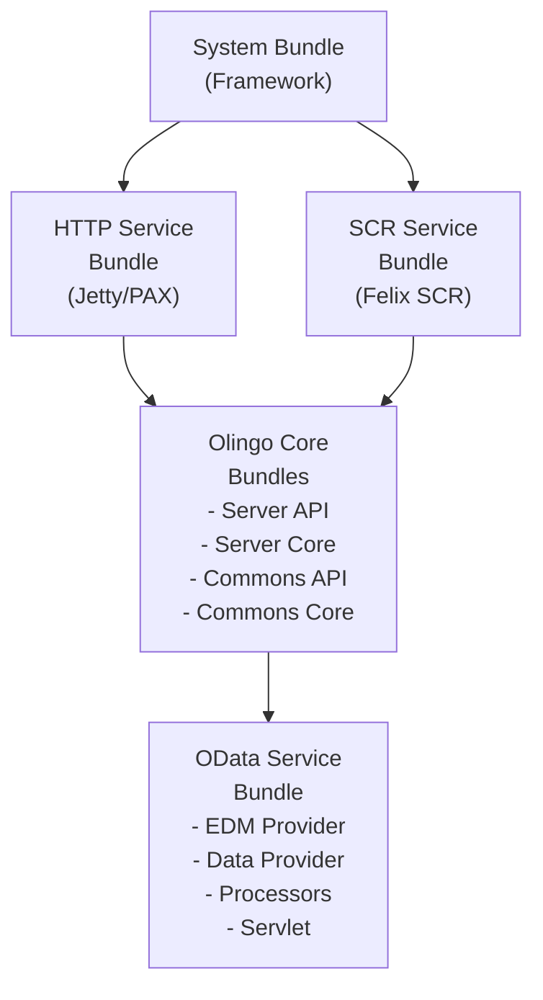

# OData OSGi 示例项目 (samples/osgi)

## 概览

`samples/osgi` 项目是一个 **OSGi 容器环境下的 OData 服务实现**，演示了如何在 OSGi (Open Services Gateway Initiative) 模块化框架中部署和运行 Apache Olingo OData 服务。该项目展示了 OData 服务在企业级 OSGi 容器中的集成模式。

## 学习目标

- 掌握 OSGi 环境下的 OData 服务部署
- 理解 OSGi Bundle 的模块化架构
- 学会 OSGi 服务注册和发现机制
- 了解企业级 OSGi 容器中的 OData 集成

## 核心架构

### OSGi OData 架构图



## 核心组件

### 1. Bundle Activator - OSGi 生命周期管理

```java
/**
 * OSGi Bundle Activator for OData Service
 * 
 * This activator manages the lifecycle of the OData service bundle,
 * including service registration, dependency injection, and cleanup.
 */
public class ODataServiceActivator implements BundleActivator {

    private ServiceRegistration<Servlet> servletRegistration;
    private ServiceTracker<HttpService, HttpService> httpServiceTracker;
    private ODataServlet oDataServlet;

    @Override
    public void start(BundleContext context) throws Exception {
        System.out.println("Starting OData Service Bundle...");
        
        // Initialize OData servlet
        oDataServlet = new ODataServlet();
        
        // Track HTTP Service for servlet registration
        httpServiceTracker = new ServiceTracker<HttpService, HttpService>(context, HttpService.class, null) {
            @Override
            public HttpService addingService(ServiceReference<HttpService> reference) {
                HttpService httpService = super.addingService(reference);
                try {
                    // Register OData servlet with HTTP service
                    Dictionary<String, String> initParams = new Hashtable<>();
                    initParams.put("servlet-name", "ODataServlet");
                    
                    httpService.registerServlet("/odata", oDataServlet, initParams, null);
                    System.out.println("OData servlet registered at /odata");
                    
                } catch (Exception e) {
                    System.err.println("Failed to register OData servlet: " + e.getMessage());
                }
                
                return httpService;
            }
            
            @Override
            public void removedService(ServiceReference<HttpService> reference, HttpService service) {
                try {
                    service.unregister("/odata");
                    System.out.println("OData servlet unregistered");
                } catch (Exception e) {
                    System.err.println("Failed to unregister OData servlet: " + e.getMessage());
                }
                super.removedService(reference, service);
            }
        };
        
        httpServiceTracker.open();
        
        // Register OData service components as OSGi services
        registerODataServices(context);
    }

    @Override
    public void stop(BundleContext context) throws Exception {
        System.out.println("Stopping OData Service Bundle...");
        
        // Close HTTP service tracker
        if (httpServiceTracker != null) {
            httpServiceTracker.close();
        }
        
        // Unregister servlet
        if (servletRegistration != null) {
            servletRegistration.unregister();
        }
        
        // Cleanup OData servlet
        if (oDataServlet != null) {
            oDataServlet.destroy();
        }
    }

    private void registerODataServices(BundleContext context) {
        // Register EDM Provider as OSGi service
        EdmProvider edmProvider = new OSGiEdmProvider();
        context.registerService(EdmProvider.class, edmProvider, null);
        
        // Register Data Provider as OSGi service
        DataProvider dataProvider = new OSGiDataProvider();
        context.registerService(DataProvider.class, dataProvider, null);
        
        System.out.println("OData service components registered");
    }
}
```

**Bundle Activator 特性**：
- **生命周期管理**：管理 Bundle 的启动和停止
- **服务跟踪**：跟踪 HTTP Service 的可用性
- **动态注册**：动态注册和注销 Servlet
- **服务发布**：将 OData 组件作为 OSGi 服务发布

### 2. OSGi OData Servlet - HTTP 服务集成

```java
/**
 * OSGi-aware OData Servlet
 * 
 * This servlet integrates OData framework with OSGi services,
 * providing dependency injection and service lifecycle management.
 */
public class ODataServlet extends HttpServlet {

    private static final long serialVersionUID = 1L;
    private BundleContext bundleContext;
    private ServiceTracker<EdmProvider, EdmProvider> edmProviderTracker;
    private ServiceTracker<DataProvider, DataProvider> dataProviderTracker;

    @Override
    public void init(ServletConfig config) throws ServletException {
        super.init(config);
        
        // Get bundle context from servlet context
        bundleContext = (BundleContext) config.getServletContext()
            .getAttribute("osgi-bundlecontext");
        
        if (bundleContext == null) {
            throw new ServletException("OSGi BundleContext not available");
        }
        
        // Track EDM Provider service
        edmProviderTracker = new ServiceTracker<>(bundleContext, EdmProvider.class, null);
        edmProviderTracker.open();
        
        // Track Data Provider service
        dataProviderTracker = new ServiceTracker<>(bundleContext, DataProvider.class, null);
        dataProviderTracker.open();
    }

    @Override
    protected void service(HttpServletRequest request, HttpServletResponse response)
            throws ServletException, IOException {
        
        try {
            // Get EDM Provider from OSGi service registry
            EdmProvider edmProvider = edmProviderTracker.getService();
            if (edmProvider == null) {
                throw new ServletException("EdmProvider service not available");
            }
            
            // Get Data Provider from OSGi service registry
            DataProvider dataProvider = dataProviderTracker.getService();
            if (dataProvider == null) {
                throw new ServletException("DataProvider service not available");
            }
            
            // Initialize OData framework
            OData odata = OData.newInstance();
            ServiceMetadata serviceMetadata = odata.createServiceMetadata(edmProvider, new ArrayList<>());
            
            // Create HTTP handler
            ODataHttpHandler handler = odata.createHandler(serviceMetadata);
            
            // Register processors
            handler.register(new OSGiEntityProcessor(dataProvider));
            
            // Process request
            handler.process(request, response);
            
        } catch (Exception e) {
            throw new ServletException("OData request processing failed", e);
        }
    }

    @Override
    public void destroy() {
        // Close service trackers
        if (edmProviderTracker != null) {
            edmProviderTracker.close();
        }
        
        if (dataProviderTracker != null) {
            dataProviderTracker.close();
        }
        
        super.destroy();
    }
}
```

**OSGi Servlet 特性**：
- **服务跟踪**：动态跟踪 OSGi 服务的可用性
- **依赖注入**：通过 Service Tracker 获取依赖服务
- **生命周期集成**：与 OSGi Bundle 生命周期集成
- **异常处理**：处理服务不可用的情况

### 3. OSGi EDM Provider - 模块化元数据提供器

```java
/**
 * OSGi-aware EDM Provider
 * 
 * This provider can be dynamically updated and reloaded
 * in the OSGi environment without stopping the entire application.
 */
@Component(service = EdmProvider.class, immediate = true)
public class OSGiEdmProvider extends CsdlAbstractEdmProvider {

    private static final String NAMESPACE = "OSGi.OData.Demo";
    
    // Entity type definitions
    public static final String ET_CAR_NAME = "Car";
    public static final String ET_MANUFACTURER_NAME = "Manufacturer";
    public static final FullQualifiedName ET_CAR_FQN = new FullQualifiedName(NAMESPACE, ET_CAR_NAME);
    public static final FullQualifiedName ET_MANUFACTURER_FQN = new FullQualifiedName(NAMESPACE, ET_MANUFACTURER_NAME);
    
    // Entity set definitions
    public static final String ES_CARS_NAME = "Cars";
    public static final String ES_MANUFACTURERS_NAME = "Manufacturers";
    
    // Container definition
    public static final String CONTAINER_NAME = "Container";
    public static final FullQualifiedName CONTAINER_FQN = new FullQualifiedName(NAMESPACE, CONTAINER_NAME);

    @Override
    public CsdlEntityType getEntityType(FullQualifiedName entityTypeName) throws ODataException {
        if (ET_CAR_FQN.equals(entityTypeName)) {
            return getCarEntityType();
        } else if (ET_MANUFACTURER_FQN.equals(entityTypeName)) {
            return getManufacturerEntityType();
        }
        return null;
    }

    private CsdlEntityType getCarEntityType() {
        // Property definitions
        CsdlProperty id = new CsdlProperty().setName("Id")
            .setType(EdmPrimitiveTypeKind.Int32.getFullQualifiedName())
            .setNullable(false);
        
        CsdlProperty model = new CsdlProperty().setName("Model")
            .setType(EdmPrimitiveTypeKind.String.getFullQualifiedName())
            .setMaxLength(100);
        
        CsdlProperty price = new CsdlProperty().setName("Price")
            .setType(EdmPrimitiveTypeKind.Double.getFullQualifiedName());
        
        CsdlProperty year = new CsdlProperty().setName("Year")
            .setType(EdmPrimitiveTypeKind.Int32.getFullQualifiedName());

        // Navigation property
        CsdlNavigationProperty navProp = new CsdlNavigationProperty()
            .setName("Manufacturer")
            .setType(ET_MANUFACTURER_FQN)
            .setNullable(false)
            .setPartner("Cars");

        // Key definition
        CsdlPropertyRef propertyRef = new CsdlPropertyRef().setName("Id");

        // Entity type
        CsdlEntityType entityType = new CsdlEntityType();
        entityType.setName(ET_CAR_NAME);
        entityType.setProperties(Arrays.asList(id, model, price, year));
        entityType.setNavigationProperties(Arrays.asList(navProp));
        entityType.setKey(Arrays.asList(propertyRef));

        return entityType;
    }

    private CsdlEntityType getManufacturerEntityType() {
        // Property definitions
        CsdlProperty id = new CsdlProperty().setName("Id")
            .setType(EdmPrimitiveTypeKind.Int32.getFullQualifiedName())
            .setNullable(false);
        
        CsdlProperty name = new CsdlProperty().setName("Name")
            .setType(EdmPrimitiveTypeKind.String.getFullQualifiedName())
            .setMaxLength(100);
        
        CsdlProperty founded = new CsdlProperty().setName("Founded")
            .setType(EdmPrimitiveTypeKind.Int32.getFullQualifiedName());

        // Navigation property
        CsdlNavigationProperty navProp = new CsdlNavigationProperty()
            .setName("Cars")
            .setType(ET_CAR_FQN)
            .setCollection(true)
            .setPartner("Manufacturer");

        // Key definition
        CsdlPropertyRef propertyRef = new CsdlPropertyRef().setName("Id");

        // Entity type
        CsdlEntityType entityType = new CsdlEntityType();
        entityType.setName(ET_MANUFACTURER_NAME);
        entityType.setProperties(Arrays.asList(id, name, founded));
        entityType.setNavigationProperties(Arrays.asList(navProp));
        entityType.setKey(Arrays.asList(propertyRef));

        return entityType;
    }

    @Override
    public CsdlEntitySet getEntitySet(FullQualifiedName entityContainer, String entitySetName) throws ODataException {
        if (CONTAINER_FQN.equals(entityContainer)) {
            if (ES_CARS_NAME.equals(entitySetName)) {
                return new CsdlEntitySet()
                    .setName(ES_CARS_NAME)
                    .setType(ET_CAR_FQN);
            } else if (ES_MANUFACTURERS_NAME.equals(entitySetName)) {
                return new CsdlEntitySet()
                    .setName(ES_MANUFACTURERS_NAME)
                    .setType(ET_MANUFACTURER_FQN);
            }
        }
        return null;
    }

    @Override
    public CsdlEntityContainer getEntityContainer() throws ODataException {
        // Entity sets
        CsdlEntitySet carsEntitySet = new CsdlEntitySet()
            .setName(ES_CARS_NAME)
            .setType(ET_CAR_FQN);

        CsdlEntitySet manufacturersEntitySet = new CsdlEntitySet()
            .setName(ES_MANUFACTURERS_NAME)
            .setType(ET_MANUFACTURER_FQN);

        // Entity container
        CsdlEntityContainer entityContainer = new CsdlEntityContainer()
            .setName(CONTAINER_NAME)
            .setEntitySets(Arrays.asList(carsEntitySet, manufacturersEntitySet));

        return entityContainer;
    }

    @Override
    public List<CsdlSchema> getSchemas() throws ODataException {
        CsdlSchema schema = new CsdlSchema()
            .setNamespace(NAMESPACE)
            .setEntityTypes(Arrays.asList(getCarEntityType(), getManufacturerEntityType()))
            .setEntityContainer(getEntityContainer());

        return Arrays.asList(schema);
    }
}
```

**OSGi EDM Provider 特性**：
- **组件注解**：使用 OSGi Declarative Services 注解
- **动态更新**：支持运行时更新而不停止应用
- **服务发布**：自动发布为 OSGi 服务
- **模块化设计**：清晰的模块边界和依赖关系

### 4. OSGi Data Provider - 模块化数据访问

```java
/**
 * OSGi-aware Data Provider
 * 
 * This provider can be replaced or updated at runtime
 * and supports dependency injection of other OSGi services.
 */
@Component(service = DataProvider.class, immediate = true)
public class OSGiDataProvider {

    private final Map<String, EntityCollection> data = new ConcurrentHashMap<>();
    private final AtomicInteger carIdCounter = new AtomicInteger(1);
    private final AtomicInteger manufacturerIdCounter = new AtomicInteger(1);

    // Optional injection of persistence service
    @Reference(cardinality = ReferenceCardinality.OPTIONAL)
    private volatile PersistenceService persistenceService;

    @Activate
    public void activate() {
        System.out.println("OSGi Data Provider activated");
        initializeData();
    }

    @Deactivate
    public void deactivate() {
        System.out.println("OSGi Data Provider deactivated");
        data.clear();
    }

    private void initializeData() {
        // Check if persistence service is available
        if (persistenceService != null) {
            loadDataFromPersistence();
        } else {
            loadSampleData();
        }
    }

    private void loadDataFromPersistence() {
        try {
            // Load from persistence service
            EntityCollection cars = persistenceService.loadEntityCollection("Cars");
            EntityCollection manufacturers = persistenceService.loadEntityCollection("Manufacturers");
            
            data.put("Cars", cars);
            data.put("Manufacturers", manufacturers);
            
        } catch (Exception e) {
            System.err.println("Failed to load from persistence, using sample data: " + e.getMessage());
            loadSampleData();
        }
    }

    private void loadSampleData() {
        // Initialize manufacturers
        EntityCollection manufacturerCollection = new EntityCollection();
        
        Entity bmw = new Entity()
            .addProperty(new Property(null, "Id", ValueType.PRIMITIVE, 1))
            .addProperty(new Property(null, "Name", ValueType.PRIMITIVE, "BMW"))
            .addProperty(new Property(null, "Founded", ValueType.PRIMITIVE, 1916));
        manufacturerCollection.getEntities().add(bmw);

        Entity mercedes = new Entity()
            .addProperty(new Property(null, "Id", ValueType.PRIMITIVE, 2))
            .addProperty(new Property(null, "Name", ValueType.PRIMITIVE, "Mercedes-Benz"))
            .addProperty(new Property(null, "Founded", ValueType.PRIMITIVE, 1926));
        manufacturerCollection.getEntities().add(mercedes);

        data.put("Manufacturers", manufacturerCollection);

        // Initialize cars
        EntityCollection carCollection = new EntityCollection();
        
        Entity car1 = new Entity()
            .addProperty(new Property(null, "Id", ValueType.PRIMITIVE, 1))
            .addProperty(new Property(null, "Model", ValueType.PRIMITIVE, "F30"))
            .addProperty(new Property(null, "Price", ValueType.PRIMITIVE, 31200.0))
            .addProperty(new Property(null, "Year", ValueType.PRIMITIVE, 2012));
        carCollection.getEntities().add(car1);

        Entity car2 = new Entity()
            .addProperty(new Property(null, "Id", ValueType.PRIMITIVE, 2))
            .addProperty(new Property(null, "Model", ValueType.PRIMITIVE, "X5"))
            .addProperty(new Property(null, "Price", ValueType.PRIMITIVE, 75000.0))
            .addProperty(new Property(null, "Year", ValueType.PRIMITIVE, 2018));
        carCollection.getEntities().add(car2);

        data.put("Cars", carCollection);
    }

    // Data access methods
    public EntityCollection readEntitySetData(String entitySetName) throws ODataApplicationException {
        EntityCollection collection = data.get(entitySetName);
        if (collection == null) {
            throw new ODataApplicationException("Unknown entity set: " + entitySetName,
                HttpStatusCode.NOT_FOUND.getStatusCode(), Locale.ENGLISH);
        }
        return collection;
    }

    public Entity readEntityData(String entitySetName, List<UriParameter> keyParams) 
        throws ODataApplicationException {
        
        EntityCollection entitySet = readEntitySetData(entitySetName);
        
        // Find entity by key parameters
        for (Entity entity : entitySet.getEntities()) {
            boolean allMatched = true;
            for (UriParameter keyParam : keyParams) {
                Property property = entity.getProperty(keyParam.getName());
                if (property == null || !property.getValue().toString().equals(keyParam.getText())) {
                    allMatched = false;
                    break;
                }
            }
            if (allMatched) {
                return entity;
            }
        }
        
        throw new ODataApplicationException("Entity not found",
            HttpStatusCode.NOT_FOUND.getStatusCode(), Locale.ENGLISH);
    }

    // CRUD operations with persistence support
    public Entity createEntity(String entitySetName, Entity entity) throws ODataApplicationException {
        EntityCollection entitySet = readEntitySetData(entitySetName);
        
        // Generate new ID
        int newId;
        if ("Cars".equals(entitySetName)) {
            newId = carIdCounter.getAndIncrement();
        } else if ("Manufacturers".equals(entitySetName)) {
            newId = manufacturerIdCounter.getAndIncrement();
        } else {
            throw new ODataApplicationException("Unknown entity set",
                HttpStatusCode.BAD_REQUEST.getStatusCode(), Locale.ENGLISH);
        }
        
        // Set ID property
        entity.getProperties().removeIf(p -> "Id".equals(p.getName()));
        entity.addProperty(new Property(null, "Id", ValueType.PRIMITIVE, newId));
        
        // Add to collection
        entitySet.getEntities().add(entity);
        
        // Persist if service available
        if (persistenceService != null) {
            try {
                persistenceService.saveEntity(entitySetName, entity);
            } catch (Exception e) {
                System.err.println("Failed to persist entity: " + e.getMessage());
            }
        }
        
        return entity;
    }

    public Entity updateEntity(String entitySetName, List<UriParameter> keyParams, Entity updateEntity) 
        throws ODataApplicationException {
        
        Entity existingEntity = readEntityData(entitySetName, keyParams);
        
        // Update properties
        for (Property updateProperty : updateEntity.getProperties()) {
            existingEntity.getProperties().removeIf(p -> p.getName().equals(updateProperty.getName()));
            existingEntity.getProperties().add(updateProperty);
        }
        
        // Persist if service available
        if (persistenceService != null) {
            try {
                persistenceService.updateEntity(entitySetName, existingEntity);
            } catch (Exception e) {
                System.err.println("Failed to update entity: " + e.getMessage());
            }
        }
        
        return existingEntity;
    }

    public void deleteEntity(String entitySetName, List<UriParameter> keyParams) 
        throws ODataApplicationException {
        
        EntityCollection entitySet = readEntitySetData(entitySetName);
        Entity entityToDelete = readEntityData(entitySetName, keyParams);
        
        entitySet.getEntities().remove(entityToDelete);
        
        // Persist if service available
        if (persistenceService != null) {
            try {
                persistenceService.deleteEntity(entitySetName, entityToDelete);
            } catch (Exception e) {
                System.err.println("Failed to delete entity: " + e.getMessage());
            }
        }
    }

    // Service injection methods
    @Reference(cardinality = ReferenceCardinality.OPTIONAL)
    public void setPersistenceService(PersistenceService service) {
        this.persistenceService = service;
        System.out.println("Persistence service injected");
    }

    public void unsetPersistenceService(PersistenceService service) {
        if (this.persistenceService == service) {
            this.persistenceService = null;
            System.out.println("Persistence service removed");
        }
    }
}
```

**OSGi Data Provider 特性**：
- **组件生命周期**：@Activate 和 @Deactivate 方法
- **依赖注入**：@Reference 注解自动注入依赖服务
- **可选依赖**：支持可选的持久化服务
- **动态服务**：支持服务的动态添加和移除

## Bundle 配置

### 1. MANIFEST.MF - Bundle 元数据

```
Manifest-Version: 1.0
Bundle-ManifestVersion: 2
Bundle-Name: OData OSGi Service Bundle
Bundle-SymbolicName: org.apache.olingo.sample.osgi
Bundle-Version: 1.0.0.qualifier
Bundle-Activator: org.apache.olingo.sample.osgi.ODataServiceActivator
Bundle-RequiredExecutionEnvironment: JavaSE-11
Import-Package: 
 org.osgi.framework;version="1.9.0",
 org.osgi.service.http;version="1.2.1",
 org.osgi.util.tracker;version="1.5.3",
 org.apache.olingo.server.api;version="4.0.0",
 org.apache.olingo.server.core;version="4.0.0",
 org.apache.olingo.commons.api;version="4.0.0",
 org.apache.olingo.commons.core;version="4.0.0",
 javax.servlet;version="3.1.0",
 javax.servlet.http;version="3.1.0"
Export-Package: 
 org.apache.olingo.sample.osgi.api;version="1.0.0"
Service-Component: 
 OSGI-INF/edmProvider.xml,
 OSGI-INF/dataProvider.xml
Bundle-ClassPath: .
```

**Manifest 特性**：
- **Bundle 身份**：唯一的符号名称和版本
- **包导入**：精确的包版本依赖
- **包导出**：对外提供的 API 包
- **服务组件**：声明式服务配置文件

### 2. 声明式服务配置

#### edmProvider.xml
```xml
<?xml version="1.0" encoding="UTF-8"?>
<scr:component xmlns:scr="http://www.osgi.org/xmlns/scr/v1.3.0" 
               name="org.apache.olingo.sample.osgi.edmProvider">
  <implementation class="org.apache.olingo.sample.osgi.OSGiEdmProvider"/>
  <service>
    <provide interface="org.apache.olingo.commons.api.edm.provider.CsdlEdmProvider"/>
  </service>
  <property name="service.description" value="OSGi OData EDM Provider"/>
  <property name="service.vendor" value="Apache Olingo"/>
</scr:component>
```

#### dataProvider.xml
```xml
<?xml version="1.0" encoding="UTF-8"?>
<scr:component xmlns:scr="http://www.osgi.org/xmlns/scr/v1.3.0" 
               name="org.apache.olingo.sample.osgi.dataProvider">
  <implementation class="org.apache.olingo.sample.osgi.OSGiDataProvider"/>
  <service>
    <provide interface="org.apache.olingo.sample.osgi.api.DataProvider"/>
  </service>
  <reference name="persistenceService" 
             interface="org.apache.olingo.sample.osgi.api.PersistenceService"
             cardinality="0..1" 
             policy="dynamic"/>
  <property name="service.description" value="OSGi OData Data Provider"/>
  <property name="service.vendor" value="Apache Olingo"/>
</scr:component>
```

**声明式服务特性**：
- **组件定义**：声明式的服务组件配置
- **接口提供**：定义对外提供的服务接口
- **依赖声明**：声明对其他服务的依赖
- **动态策略**：支持依赖的动态绑定和解绑

## OSGi 部署

### 1. Apache Felix 部署

```bash
# 下载并启动 Apache Felix
wget http://archive.apache.org/dist/felix/org.apache.felix.main-7.0.5.tar.gz
tar -xzf org.apache.felix.main-7.0.5.tar.gz
cd felix-framework-7.0.5
java -jar bin/felix.jar

# Felix 控制台命令
g! # Gogo shell prompt

# 安装必要的 Bundle
install file:///path/to/org.apache.felix.http.jetty-4.1.8.jar
install file:///path/to/org.apache.felix.scr-2.1.26.jar
install file:///path/to/olingo-odata-server-core-4.9.0.jar
install file:///path/to/olingo-odata-commons-core-4.9.0.jar

# 安装 OData 服务 Bundle
install file:///path/to/odata-osgi-sample-1.0.0.jar

# 启动 Bundle
start <bundle-id>

# 查看 Bundle 状态
lb

# 查看服务
services
```

### 2. Eclipse Equinox 部署

```bash
# 启动 Equinox
java -jar org.eclipse.osgi_3.17.100.v20210212-1143.jar -console

# Equinox 控制台命令
osgi> 

# 安装和启动 Bundle
install file:bundles/org.eclipse.jetty.servlet-9.4.43.v20210629.jar
install file:bundles/org.apache.olingo.odata-server-core-4.9.0.jar
install file:bundles/odata-osgi-sample-1.0.0.jar

start <bundle-id>

# 查看状态
ss
diag <bundle-id>
```

### 3. Bundle 依赖解析

```
Bundle Dependency Resolution:



## API 使用示例

### 1. 服务发现

```bash
# 通过 OSGi HTTP Service 访问
GET http://localhost:8080/odata/

# 获取元数据
GET http://localhost:8080/odata/$metadata

# 预期响应：标准 OData 元数据
```

### 2. 实体操作

```bash
# 获取所有汽车
GET http://localhost:8080/odata/Cars

# 获取特定汽车
GET http://localhost:8080/odata/Cars(1)

# 创建新汽车
POST http://localhost:8080/odata/Cars
Content-Type: application/json

{
  "Model": "A4",
  "Price": 40000.0,
  "Year": 2021
}
```

### 3. OSGi 服务监控

```bash
# 在 Felix/Equinox 控制台中监控服务
services org.apache.olingo.commons.api.edm.provider.CsdlEdmProvider
services org.apache.olingo.sample.osgi.api.DataProvider

# 查看服务属性
inspect service <service-id>

# 查看服务使用情况
inspect capability service <bundle-id>
```

## OSGi 优势和特性

### 1. 模块化架构

```java
// Bundle 之间的清晰依赖关系
@Component(service = {DataProvider.class, ManagedService.class})
public class ConfigurableDataProvider implements DataProvider, ManagedService {
    
    @Reference
    private ConfigurationAdmin configAdmin;
    
    @Reference(cardinality = ReferenceCardinality.MULTIPLE)
    private volatile List<DataEnhancer> enhancers;
    
    // 动态配置更新
    @Override
    public void updated(Dictionary<String, ?> properties) throws ConfigurationException {
        // 重新配置数据提供器
        reconfigure(properties);
    }
}
```

### 2. 动态服务管理

```java
// 运行时服务替换
@Component
public class DynamicODataService {
    
    @Reference(cardinality = ReferenceCardinality.OPTIONAL, policy = ReferencePolicy.DYNAMIC)
    private volatile EdmProvider edmProvider;
    
    // 动态绑定服务
    @Reference(cardinality = ReferenceCardinality.MULTIPLE, policy = ReferencePolicy.DYNAMIC)
    private volatile List<ODataProcessor> processors;
    
    public void bindProcessor(ODataProcessor processor) {
        // 动态添加处理器
        registerProcessor(processor);
    }
    
    public void unbindProcessor(ODataProcessor processor) {
        // 动态移除处理器
        unregisterProcessor(processor);
    }
}
```

### 3. 热部署支持

```bash
# 在 OSGi 控制台中热更新 Bundle
stop <bundle-id>
update <bundle-id> file:///path/to/new-bundle.jar
start <bundle-id>

# 查看更新结果
refresh
services
```

### 4. 版本管理

```java
// Bundle 版本依赖
Import-Package: 
 org.apache.olingo.server.api;version="[4.9.0,5.0.0)",
 org.apache.olingo.commons.api;version="[4.9.0,5.0.0)"

// 服务版本属性
@Component(property = {"service.version=1.0.0", "api.version=2.1"})
public class VersionedDataProvider implements DataProvider {
    // 版本化的服务实现
}
```

## 总结

`samples/osgi` 项目展示了 OSGi 环境下的 OData 服务实现：

### 核心特性
- ✅ **模块化架构**：清晰的 Bundle 边界和依赖关系
- ✅ **动态服务**：支持服务的动态注册、发现和替换
- ✅ **生命周期管理**：完整的 Bundle 生命周期管理
- ✅ **依赖注入**：基于 OSGi 的声明式服务依赖注入
- ✅ **热部署**：支持运行时更新和重新部署

### 技术亮点
- **企业级**：适合大型企业级应用的模块化架构
- **标准化**：完全符合 OSGi 规范
- **可扩展**：支持插件式的功能扩展
- **容错性**：服务故障不影响整个系统

### 适用场景
该 OSGi OData 服务特别适合：
- **企业应用平台**：需要模块化架构的大型企业应用
- **产品化软件**：需要插件机制的商业软件产品
- **微内核架构**：采用微内核模式的系统架构
- **动态更新需求**：需要热部署和动态更新能力的系统
