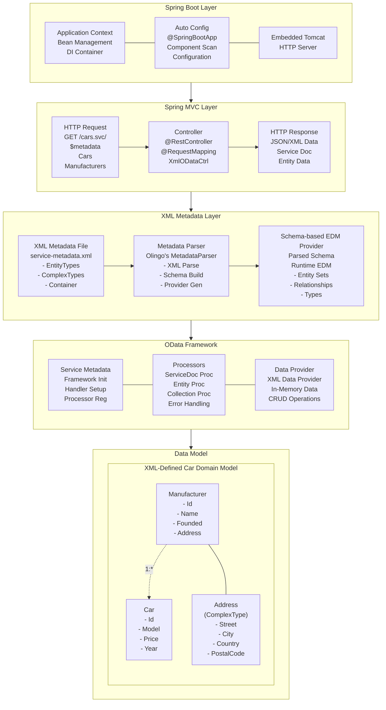
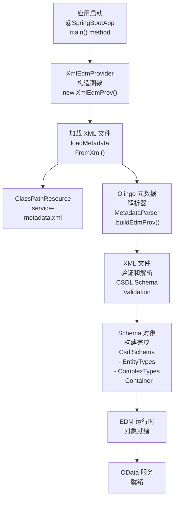
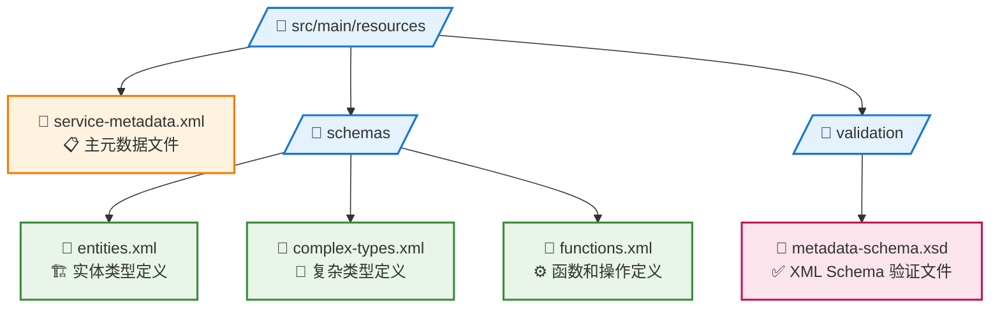

# OData Spring Boot XML 示例项目 (samples/spring-boot-odata-xml)

## 概览

`samples/spring-boot-odata-xml` 项目是一个 **基于 XML 元数据定义的 Spring Boot OData 服务**，演示了如何使用 Apache Olingo 的原生 XML 解析功能从 XML 文件直接加载 EDM (Entity Data Model)。该项目展示了不需要编程方式定义元数据的现代化 OData 服务实现。

## 学习目标

- 掌握基于 XML 的 EDM 定义方式
- 理解 Olingo 的原生 XML 解析能力
- 学会使用 MetadataParser 加载 XML 元数据
- 了解 XML 驱动的 OData 服务架构

## 核心架构

### XML-Driven OData 架构图



## 核心组件

### 1. service-metadata.xml - XML 元数据定义

```xml
<?xml version="1.0" encoding="UTF-8"?>
<edmx:Edmx xmlns:edmx="http://docs.oasis-open.org/odata/ns/edmx" Version="4.0">
  <edmx:DataServices>
    <Schema xmlns="http://docs.oasis-open.org/odata/ns/edm"
            Namespace="OData.Demo"
            Alias="Self">

      <!-- Complex Types -->
      <ComplexType Name="Address">
        <Property Name="Street" Type="Edm.String" MaxLength="100"/>
        <Property Name="City" Type="Edm.String" MaxLength="50"/>
        <Property Name="Country" Type="Edm.String" MaxLength="50"/>
        <Property Name="PostalCode" Type="Edm.String" MaxLength="10"/>
      </ComplexType>

      <!-- Entity Types -->
      <EntityType Name="Car">
        <Key>
          <PropertyRef Name="Id"/>
        </Key>
        <Property Name="Id" Type="Edm.Int32" Nullable="false"/>
        <Property Name="Model" Type="Edm.String" MaxLength="100"/>
        <Property Name="Price" Type="Edm.Decimal" Precision="19" Scale="2"/>
        <Property Name="Year" Type="Edm.Int32"/>
        <NavigationProperty Name="Manufacturer" Type="OData.Demo.Manufacturer" Partner="Cars"/>
      </EntityType>

      <EntityType Name="Manufacturer">
        <Key>
          <PropertyRef Name="Id"/>
        </Key>
        <Property Name="Id" Type="Edm.Int32" Nullable="false"/>
        <Property Name="Name" Type="Edm.String" MaxLength="100"/>
        <Property Name="Founded" Type="Edm.Int32"/>
        <Property Name="Address" Type="OData.Demo.Address"/>
        <NavigationProperty Name="Cars" Type="Collection(OData.Demo.Car)" Partner="Manufacturer"/>
      </EntityType>

      <!-- Entity Container -->
      <EntityContainer Name="Container">
        <EntitySet Name="Cars" EntityType="OData.Demo.Car">
          <NavigationPropertyBinding Path="Manufacturer" Target="Manufacturers"/>
        </EntitySet>
        <EntitySet Name="Manufacturers" EntityType="OData.Demo.Manufacturer">
          <NavigationPropertyBinding Path="Cars" Target="Cars"/>
        </EntitySet>
      </EntityContainer>

    </Schema>
  </edmx:DataServices>
</edmx:Edmx>
```

**XML 元数据特性**：
- **标准 CSDL**：完全符合 OData CSDL (Conceptual Schema Definition Language) 规范
- **复杂类型**：定义了 Address 复杂类型，展示嵌套数据结构
- **实体关系**：清晰的一对多关系定义和导航属性绑定
- **类型约束**：精确的数据类型、长度、精度和可空性定义

### 2. XmlEdmProvider - XML 元数据提供器

```java
/**
 * XML EDM Provider using Olingo's built-in XML parsing capabilities
 * 
 * This provider demonstrates how to use Olingo's native XML parsing capabilities
 * to load EDM directly from XML files without manual parsing or programmatic definition.
 * 
 * Key features:
 * - Uses Olingo's MetadataParser to parse XML directly
 * - Leverages SchemaBasedEdmProvider for XML-based EDM management
 * - No manual XML parsing or programmatic EDM definition required
 * - True "native" Olingo approach to XML metadata loading
 */
public class XmlEdmProvider extends SchemaBasedEdmProvider {

    // XML file path
    private static final String XML_METADATA_FILE = "service-metadata.xml";
    
    // Initialize the provider by loading XML metadata
    public XmlEdmProvider() {
        loadMetadataFromXml();
    }
    
    /**
     * Load EDM metadata from XML file using Olingo's native MetadataParser
     */
    private void loadMetadataFromXml() {
        try {
            // Load XML metadata file from classpath
            ClassPathResource resource = new ClassPathResource(XML_METADATA_FILE);
            
            if (!resource.exists()) {
                throw new IllegalStateException("XML metadata file not found: " + XML_METADATA_FILE);
            }
            
            // Create Olingo's MetadataParser
            MetadataParser parser = new MetadataParser();
            
            // Parse XML and build EDM provider
            try (Reader reader = new InputStreamReader(resource.getInputStream())) {
                SchemaBasedEdmProvider xmlProvider = parser.buildEdmProvider(reader);
                
                // Copy all schemas from XML-based provider to this provider
                List<CsdlSchema> schemas = xmlProvider.getSchemas();
                for (CsdlSchema schema : schemas) {
                    this.addSchema(schema);
                }
            }
            
        } catch (Exception e) {
            throw new RuntimeException("Failed to initialize XmlEdmProvider", e);
        }
    }
    
    /**
     * Get entity container - this is crucial for service document generation
     */
    @Override
    public CsdlEntityContainer getEntityContainer() throws ODataException {
        // Get the container from parent class
        CsdlEntityContainer container = super.getEntityContainer();
        
        if (container != null && container.getEntitySets() != null) {
            // Force all entity sets to be included in service document
            for (CsdlEntitySet entitySet : container.getEntitySets()) {
                entitySet.setIncludeInServiceDocument(true);
            }
        }
        
        return container;
    }
    
    /**
     * Get entity set - override to ensure IncludeInServiceDocument is true
     */
    @Override
    public CsdlEntitySet getEntitySet(FullQualifiedName entityContainer, String entitySetName) throws ODataException {
        CsdlEntitySet entitySet = super.getEntitySet(entityContainer, entitySetName);
        if (entitySet != null) {
            // Force IncludeInServiceDocument to true
            entitySet.setIncludeInServiceDocument(true);
        }
        return entitySet;
    }
}
```

**XML EDM 提供器特性**：
- **原生解析**：使用 Olingo 的 `MetadataParser` 直接解析 XML
- **模式继承**：继承 `SchemaBasedEdmProvider` 获得完整的 EDM 功能
- **自动加载**：构造函数中自动加载和解析 XML 元数据
- **服务文档支持**：确保实体集在服务文档中可见

### 3. XML 解析流程图



### 4. XmlODataController - XML 驱动控制器

```java
/**
 * OData Controller for XML Processing
 * 
 * This controller demonstrates how to use Olingo's native XML parsing capabilities
 * for loading EDM from XML files and processing OData requests.
 * 
 * Key features:
 * - Uses MetadataParser-based EDM provider
 * - Handles standard OData endpoints ($metadata, entity collections)
 * - Integrates with Spring Boot seamlessly
 */
@RestController
@RequestMapping("/cars.svc")
public class XmlODataController {
    
    private final XmlDataProvider dataProvider;
    private final XmlEdmProvider edmProvider;
    
    /**
     * Initialize OData controller with native XML-based EDM provider
     */
    public XmlODataController() {
        // Create EDM provider using native XML parsing
        edmProvider = new XmlEdmProvider();
        
        // Create data provider
        dataProvider = new XmlDataProvider();
    }
    
    /**
     * Handle all OData requests - similar to the original Spring Boot sample
     */
    @RequestMapping(value = "/**")
    public void handleODataRequest(HttpServletRequest request, HttpServletResponse response) {
        try {
            // Create OData framework components for each request (like original sample)
            OData odata = OData.newInstance();
            ServiceMetadata serviceMetadata = odata.createServiceMetadata(edmProvider, new ArrayList<>());
            
            // Create HTTP handler for this request
            ODataHttpHandler handler = odata.createHandler(serviceMetadata);
            
            // Register service document processor
            handler.register(new XmlServiceDocumentProcessor());
            
            // Register entity processor
            XmlEntityProcessor entityProcessor = new XmlEntityProcessor(dataProvider);
            handler.register(entityProcessor);
            
            // Create wrapper to provide correct servlet path and path info for OData framework
            HttpServletRequestWrapper wrapper = new HttpServletRequestWrapper(request);
            
            // Process the request
            handler.process(wrapper, response);
            
        } catch (Exception e) {
            // Send error response
            try {
                response.setStatus(HttpServletResponse.SC_INTERNAL_SERVER_ERROR);
                response.getWriter().write("Internal Server Error: " + e.getMessage());
            } catch (IOException ioException) {
                // Handle silently
            }
        }
    }
    
    /**
     * HttpServletRequest wrapper to handle servlet path mapping for OData
     */
    private static class HttpServletRequestWrapper extends javax.servlet.http.HttpServletRequestWrapper {
        
        public HttpServletRequestWrapper(HttpServletRequest request) {
            super(request);
        }
        
        @Override
        public String getServletPath() {
            // Return the servlet path that OData framework expects
            return "/cars.svc";
        }
        
        @Override
        public String getPathInfo() {
            // Extract the path info for OData processing
            String requestURI = getRequestURI();
            String contextPath = getContextPath();
            String servletPath = getServletPath();
            
            String fullPath = contextPath + servletPath;
            if (requestURI.startsWith(fullPath)) {
                String pathInfo = requestURI.substring(fullPath.length());
                return pathInfo.isEmpty() ? null : pathInfo;
            }
            
            return null;
        }
    }
}
```

**控制器特性**：
- **XML 驱动**：使用基于 XML 的 EDM 提供器
- **请求包装**：处理 Spring Boot 和 OData 框架之间的路径映射
- **处理器注册**：注册专门的 XML 处理器
- **错误处理**：统一的异常处理机制

### 5. XmlDataProvider - XML 数据提供器

```java
/**
 * Data provider for XML-based OData service
 * 
 * This provider manages the actual data for entities defined in XML metadata.
 * It demonstrates how data management works independently of metadata definition approach.
 */
@Component
public class XmlDataProvider {

    private final Map<String, EntityCollection> data = new ConcurrentHashMap<>();
    private final AtomicInteger carIdCounter = new AtomicInteger(1);
    private final AtomicInteger manufacturerIdCounter = new AtomicInteger(1);

    public XmlDataProvider() {
        initializeData();
    }

    private void initializeData() {
        initializeManufacturers();
        initializeCars();
    }

    private void initializeManufacturers() {
        EntityCollection manufacturerCollection = new EntityCollection();

        // BMW
        Entity bmw = new Entity()
            .addProperty(new Property(null, "Id", ValueType.PRIMITIVE, 1))
            .addProperty(new Property(null, "Name", ValueType.PRIMITIVE, "BMW"))
            .addProperty(new Property(null, "Founded", ValueType.PRIMITIVE, 1916));

        // Create Address complex value
        ComplexValue address = new ComplexValue();
        address.getValue().add(new Property(null, "Street", ValueType.PRIMITIVE, "Petuelring 130"));
        address.getValue().add(new Property(null, "City", ValueType.PRIMITIVE, "Munich"));
        address.getValue().add(new Property(null, "Country", ValueType.PRIMITIVE, "Germany"));
        address.getValue().add(new Property(null, "PostalCode", ValueType.PRIMITIVE, "80809"));
        bmw.addProperty(new Property(null, "Address", ValueType.COMPLEX, address));

        manufacturerCollection.getEntities().add(bmw);

        // Mercedes-Benz
        Entity mercedes = new Entity()
            .addProperty(new Property(null, "Id", ValueType.PRIMITIVE, 2))
            .addProperty(new Property(null, "Name", ValueType.PRIMITIVE, "Mercedes-Benz"))
            .addProperty(new Property(null, "Founded", ValueType.PRIMITIVE, 1926));

        ComplexValue mercedesAddress = new ComplexValue();
        mercedesAddress.getValue().add(new Property(null, "Street", ValueType.PRIMITIVE, "Mercedesstraße 120"));
        mercedesAddress.getValue().add(new Property(null, "City", ValueType.PRIMITIVE, "Stuttgart"));
        mercedesAddress.getValue().add(new Property(null, "Country", ValueType.PRIMITIVE, "Germany"));
        mercedesAddress.getValue().add(new Property(null, "PostalCode", ValueType.PRIMITIVE, "70372"));
        mercedes.addProperty(new Property(null, "Address", ValueType.COMPLEX, mercedesAddress));

        manufacturerCollection.getEntities().add(mercedes);

        data.put("Manufacturers", manufacturerCollection);
    }

    private void initializeCars() {
        EntityCollection carCollection = new EntityCollection();

        // BMW Cars
        Entity bmwCar1 = new Entity()
            .addProperty(new Property(null, "Id", ValueType.PRIMITIVE, 1))
            .addProperty(new Property(null, "Model", ValueType.PRIMITIVE, "F30"))
            .addProperty(new Property(null, "Price", ValueType.PRIMITIVE, new BigDecimal("31200.00")))
            .addProperty(new Property(null, "Year", ValueType.PRIMITIVE, 2012));
        carCollection.getEntities().add(bmwCar1);

        Entity bmwCar2 = new Entity()
            .addProperty(new Property(null, "Id", ValueType.PRIMITIVE, 2))
            .addProperty(new Property(null, "Model", ValueType.PRIMITIVE, "X5"))
            .addProperty(new Property(null, "Price", ValueType.PRIMITIVE, new BigDecimal("75000.00")))
            .addProperty(new Property(null, "Year", ValueType.PRIMITIVE, 2018));
        carCollection.getEntities().add(bmwCar2);

        // Mercedes Cars
        Entity mercedesCar1 = new Entity()
            .addProperty(new Property(null, "Id", ValueType.PRIMITIVE, 3))
            .addProperty(new Property(null, "Model", ValueType.PRIMITIVE, "C-Class"))
            .addProperty(new Property(null, "Price", ValueType.PRIMITIVE, new BigDecimal("45000.00")))
            .addProperty(new Property(null, "Year", ValueType.PRIMITIVE, 2020));
        carCollection.getEntities().add(mercedesCar1);

        data.put("Cars", carCollection);
    }

    // Data access methods
    public EntityCollection readEntitySetData(String entitySetName) throws ODataApplicationException {
        EntityCollection collection = data.get(entitySetName);
        if (collection == null) {
            throw new ODataApplicationException("Unknown entity set: " + entitySetName,
                HttpStatusCode.NOT_FOUND.getStatusCode(), Locale.ENGLISH);
        }
        return collection;
    }

    public Entity readEntityData(String entitySetName, List<UriParameter> keyParams) 
        throws ODataApplicationException {
        
        EntityCollection entitySet = readEntitySetData(entitySetName);
        
        // Find entity by key parameters
        for (Entity entity : entitySet.getEntities()) {
            boolean allMatched = true;
            for (UriParameter keyParam : keyParams) {
                Property property = entity.getProperty(keyParam.getName());
                if (property == null || !property.getValue().toString().equals(keyParam.getText())) {
                    allMatched = false;
                    break;
                }
            }
            if (allMatched) {
                return entity;
            }
        }
        
        throw new ODataApplicationException("Entity not found",
            HttpStatusCode.NOT_FOUND.getStatusCode(), Locale.ENGLISH);
    }

    // CRUD operations
    public Entity createEntity(String entitySetName, Entity entity) throws ODataApplicationException {
        EntityCollection entitySet = readEntitySetData(entitySetName);
        
        // Generate new ID
        int newId;
        if ("Cars".equals(entitySetName)) {
            newId = carIdCounter.getAndIncrement();
        } else if ("Manufacturers".equals(entitySetName)) {
            newId = manufacturerIdCounter.getAndIncrement();
        } else {
            throw new ODataApplicationException("Unknown entity set",
                HttpStatusCode.BAD_REQUEST.getStatusCode(), Locale.ENGLISH);
        }
        
        // Set ID property
        entity.getProperties().removeIf(p -> "Id".equals(p.getName()));
        entity.addProperty(new Property(null, "Id", ValueType.PRIMITIVE, newId));
        
        // Add to collection
        entitySet.getEntities().add(entity);
        
        return entity;
    }

    public Entity updateEntity(String entitySetName, List<UriParameter> keyParams, Entity updateEntity) 
        throws ODataApplicationException {
        
        Entity existingEntity = readEntityData(entitySetName, keyParams);
        
        // Update properties
        for (Property updateProperty : updateEntity.getProperties()) {
            existingEntity.getProperties().removeIf(p -> p.getName().equals(updateProperty.getName()));
            existingEntity.getProperties().add(updateProperty);
        }
        
        return existingEntity;
    }

    public void deleteEntity(String entitySetName, List<UriParameter> keyParams) 
        throws ODataApplicationException {
        
        EntityCollection entitySet = readEntitySetData(entitySetName);
        Entity entityToDelete = readEntityData(entitySetName, keyParams);
        
        entitySet.getEntities().remove(entityToDelete);
    }
}
```

**数据提供器特性**：
- **独立性**：数据管理与元数据定义方式无关
- **复杂类型支持**：正确处理 Address 复杂类型数据
- **精确数据类型**：使用 BigDecimal 处理精度要求
- **线程安全**：ConcurrentHashMap 和 AtomicInteger

### 6. XmlEntityProcessor - XML 实体处理器

```java
/**
 * Entity processor for XML-based OData service
 * 
 * This processor handles entity operations for services using XML-defined metadata.
 * It demonstrates how processors work independently of metadata definition approach.
 */
public class XmlEntityProcessor extends BaseXmlODataProcessor implements EntityCollectionProcessor, EntityProcessor {

    private final XmlDataProvider dataProvider;

    public XmlEntityProcessor(XmlDataProvider dataProvider) {
        this.dataProvider = dataProvider;
    }

    @Override
    public void readEntityCollection(ODataRequest request, ODataResponse response, UriInfo uriInfo,
        ContentType responseFormat) throws ODataApplicationException, ODataLibraryException {

        // Parse request path
        List<UriResource> resourceParts = uriInfo.getUriResourceParts();
        UriResourceEntitySet uriResourceEntitySet = (UriResourceEntitySet) resourceParts.get(0);
        EdmEntitySet edmEntitySet = uriResourceEntitySet.getEntitySet();

        // Read data from provider
        EntityCollection entitySet = dataProvider.readEntitySetData(edmEntitySet.getName());

        // Apply query options (filter, orderby, top, skip, etc.)
        entitySet = applyQueryOptions(entitySet, uriInfo);

        // Serialize response
        serializeEntityCollection(response, edmEntitySet, entitySet, responseFormat);
    }

    @Override
    public void readEntity(ODataRequest request, ODataResponse response, UriInfo uriInfo, ContentType responseFormat)
        throws ODataApplicationException, ODataLibraryException {

        // Parse request path and keys
        List<UriResource> resourceParts = uriInfo.getUriResourceParts();
        UriResourceEntitySet uriResourceEntitySet = (UriResourceEntitySet) resourceParts.get(0);
        EdmEntitySet edmEntitySet = uriResourceEntitySet.getEntitySet();
        List<UriParameter> keyPredicates = uriResourceEntitySet.getKeyPredicates();

        // Read entity from provider
        Entity entity = dataProvider.readEntityData(edmEntitySet.getName(), keyPredicates);

        // Serialize response
        serializeEntity(response, edmEntitySet, entity, responseFormat);
    }

    @Override
    public void createEntity(ODataRequest request, ODataResponse response, UriInfo uriInfo, 
        ContentType requestFormat, ContentType responseFormat) 
        throws ODataApplicationException, ODataLibraryException {

        // Parse request path
        List<UriResource> resourceParts = uriInfo.getUriResourceParts();
        UriResourceEntitySet uriResourceEntitySet = (UriResourceEntitySet) resourceParts.get(0);
        EdmEntitySet edmEntitySet = uriResourceEntitySet.getEntitySet();

        // Deserialize request body
        Entity entity = deserializeEntity(request, edmEntitySet, requestFormat);

        // Create entity
        Entity createdEntity = dataProvider.createEntity(edmEntitySet.getName(), entity);

        // Serialize response
        serializeEntity(response, edmEntitySet, createdEntity, responseFormat);
        response.setStatusCode(HttpStatusCode.CREATED.getStatusCode());
        
        // Set Location header
        String location = request.getRawODataPath() + "(" + getEntityKey(createdEntity) + ")";
        response.setHeader(HttpHeader.LOCATION, location);
    }

    @Override
    public void updateEntity(ODataRequest request, ODataResponse response, UriInfo uriInfo, 
        ContentType requestFormat, ContentType responseFormat) 
        throws ODataApplicationException, ODataLibraryException {

        // Parse request path and keys
        List<UriResource> resourceParts = uriInfo.getUriResourceParts();
        UriResourceEntitySet uriResourceEntitySet = (UriResourceEntitySet) resourceParts.get(0);
        EdmEntitySet edmEntitySet = uriResourceEntitySet.getEntitySet();
        List<UriParameter> keyPredicates = uriResourceEntitySet.getKeyPredicates();

        // Deserialize request body
        Entity updateEntity = deserializeEntity(request, edmEntitySet, requestFormat);

        // Update entity
        Entity updatedEntity = dataProvider.updateEntity(edmEntitySet.getName(), keyPredicates, updateEntity);

        // Return updated entity
        serializeEntity(response, edmEntitySet, updatedEntity, responseFormat);
    }

    @Override
    public void deleteEntity(ODataRequest request, ODataResponse response, UriInfo uriInfo) 
        throws ODataApplicationException {

        // Parse request path and keys
        List<UriResource> resourceParts = uriInfo.getUriResourceParts();
        UriResourceEntitySet uriResourceEntitySet = (UriResourceEntitySet) resourceParts.get(0);
        EdmEntitySet edmEntitySet = uriResourceEntitySet.getEntitySet();
        List<UriParameter> keyPredicates = uriResourceEntitySet.getKeyPredicates();

        // Delete entity
        dataProvider.deleteEntity(edmEntitySet.getName(), keyPredicates);

        // Return 204 No Content
        response.setStatusCode(HttpStatusCode.NO_CONTENT.getStatusCode());
    }

    // Query options processing
    private EntityCollection applyQueryOptions(EntityCollection entitySet, UriInfo uriInfo) {
        // Apply filtering
        FilterOption filterOption = uriInfo.getFilterOption();
        if (filterOption != null) {
            entitySet = applyFilter(entitySet, filterOption);
        }

        // Apply ordering
        OrderByOption orderByOption = uriInfo.getOrderByOption();
        if (orderByOption != null) {
            entitySet = applyOrderBy(entitySet, orderByOption);
        }

        // Apply paging
        TopOption topOption = uriInfo.getTopOption();
        SkipOption skipOption = uriInfo.getSkipOption();
        if (topOption != null || skipOption != null) {
            entitySet = applyPaging(entitySet, skipOption, topOption);
        }

        return entitySet;
    }

    // Helper methods for serialization and deserialization
    private void serializeEntityCollection(ODataResponse response, EdmEntitySet edmEntitySet, 
        EntityCollection entitySet, ContentType responseFormat) throws ODataLibraryException {
        
        ODataSerializer serializer = getOdata().createSerializer(responseFormat);
        
        EntityCollectionSerializerOptions options = EntityCollectionSerializerOptions.with()
            .contextURL(ContextURL.with().entitySet(edmEntitySet).build())
            .build();
        
        SerializerResult serializerResult = serializer.entityCollection(getServiceMetadata(), 
            edmEntitySet.getEntityType(), entitySet, options);
        
        response.setContent(serializerResult.getContent());
        response.setStatusCode(HttpStatusCode.OK.getStatusCode());
        response.setHeader(HttpHeader.CONTENT_TYPE, responseFormat.toContentTypeString());
    }

    private void serializeEntity(ODataResponse response, EdmEntitySet edmEntitySet, 
        Entity entity, ContentType responseFormat) throws ODataLibraryException {
        
        ODataSerializer serializer = getOdata().createSerializer(responseFormat);
        
        EntitySerializerOptions options = EntitySerializerOptions.with()
            .contextURL(ContextURL.with().entitySet(edmEntitySet).suffix(Suffix.ENTITY).build())
            .build();
        
        SerializerResult serializerResult = serializer.entity(getServiceMetadata(), 
            edmEntitySet.getEntityType(), entity, options);
        
        response.setContent(serializerResult.getContent());
        response.setStatusCode(HttpStatusCode.OK.getStatusCode());
        response.setHeader(HttpHeader.CONTENT_TYPE, responseFormat.toContentTypeString());
    }

    private Entity deserializeEntity(ODataRequest request, EdmEntitySet edmEntitySet, 
        ContentType requestFormat) throws ODataLibraryException {
        
        ODataDeserializer deserializer = getOdata().createDeserializer(requestFormat);
        DeserializerResult result = deserializer.entity(request.getBody(), edmEntitySet.getEntityType());
        
        return result.getEntity();
    }

    private String getEntityKey(Entity entity) {
        Property idProperty = entity.getProperty("Id");
        return idProperty != null ? idProperty.getValue().toString() : "";
    }
}
```

**实体处理器特性**：
- **XML 独立**：处理逻辑与 XML 元数据定义方式无关
- **完整 CRUD**：支持所有标准 OData 操作
- **查询选项**：支持 $filter、$orderby、$top、$skip 等
- **标准序列化**：使用 OData 框架的标准序列化机制

## XML 元数据的优势

### 1. 声明式定义

```xml
<!-- 声明式的实体类型定义 -->
<EntityType Name="Car">
  <Key>
    <PropertyRef Name="Id"/>
  </Key>
  <Property Name="Id" Type="Edm.Int32" Nullable="false"/>
  <Property Name="Model" Type="Edm.String" MaxLength="100"/>
  <Property Name="Price" Type="Edm.Decimal" Precision="19" Scale="2"/>
  <Property Name="Year" Type="Edm.Int32"/>
  <NavigationProperty Name="Manufacturer" Type="OData.Demo.Manufacturer" Partner="Cars"/>
</EntityType>
```

**优势**：
- **可读性强**：XML 格式直观易懂
- **工具支持**：IDE 提供语法高亮和验证
- **标准化**：完全符合 OData CSDL 标准
- **维护性好**：无需重新编译即可修改元数据

### 2. 版本控制友好

```bash
# XML 元数据的版本控制差异清晰可见
git diff service-metadata.xml

--- a/service-metadata.xml
+++ b/service-metadata.xml
@@ -15,6 +15,7 @@
       <Property Name="Model" Type="Edm.String" MaxLength="100"/>
       <Property Name="Price" Type="Edm.Decimal" Precision="19" Scale="2"/>
       <Property Name="Year" Type="Edm.Int32"/>
+      <Property Name="Color" Type="Edm.String" MaxLength="50"/>
       <NavigationProperty Name="Manufacturer" Type="OData.Demo.Manufacturer" Partner="Cars"/>
     </EntityType>
```

### 3. 设计时工具集成

```xml
<!-- XML Schema 验证 -->
<xs:schema xmlns:xs="http://www.w3.org/2001/XMLSchema"
           targetNamespace="http://docs.oasis-open.org/odata/ns/edm"
           elementFormDefault="qualified">
  
  <!-- IDE 可以提供实时验证和自动完成 -->
  <xs:element name="EntityType">
    <xs:complexType>
      <xs:sequence>
        <xs:element name="Key" minOccurs="0"/>
        <xs:element name="Property" minOccurs="0" maxOccurs="unbounded"/>
        <xs:element name="NavigationProperty" minOccurs="0" maxOccurs="unbounded"/>
      </xs:sequence>
    </xs:complexType>
  </xs:element>
</xs:schema>
```

## API 使用示例

### 1. 服务发现

```bash
# 获取服务根
GET http://localhost:8080/cars.svc/

# 预期响应：服务文档
{
  "@odata.context": "$metadata",
  "value": [
    {
      "name": "Cars",
      "kind": "EntitySet",
      "url": "Cars"
    },
    {
      "name": "Manufacturers", 
      "kind": "EntitySet",
      "url": "Manufacturers"
    }
  ]
}

# 获取元数据
GET http://localhost:8080/cars.svc/$metadata

# 预期响应：XML 元数据文档
```

### 2. 实体集合操作

```bash
# 获取所有汽车
GET http://localhost:8080/cars.svc/Cars

# 预期响应
{
  "@odata.context": "$metadata#Cars",
  "value": [
    {
      "Id": 1,
      "Model": "F30",
      "Price": 31200.00,
      "Year": 2012
    },
    {
      "Id": 2,
      "Model": "X5",
      "Price": 75000.00,
      "Year": 2018
    }
  ]
}

# 获取所有制造商
GET http://localhost:8080/cars.svc/Manufacturers

# 预期响应
{
  "@odata.context": "$metadata#Manufacturers",
  "value": [
    {
      "Id": 1,
      "Name": "BMW",
      "Founded": 1916,
      "Address": {
        "Street": "Petuelring 130",
        "City": "Munich",
        "Country": "Germany",
        "PostalCode": "80809"
      }
    }
  ]
}
```

### 3. 复杂类型查询

```bash
# 查询包含复杂类型的制造商
GET http://localhost:8080/cars.svc/Manufacturers(1)

# 预期响应显示完整的 Address 复杂类型
{
  "@odata.context": "$metadata#Manufacturers/$entity",
  "Id": 1,
  "Name": "BMW",
  "Founded": 1916,
  "Address": {
    "Street": "Petuelring 130",
    "City": "Munich",
    "Country": "Germany",
    "PostalCode": "80809"
  }
}

# 只查询地址信息
GET http://localhost:8080/cars.svc/Manufacturers(1)/Address

# 预期响应
{
  "@odata.context": "$metadata#Manufacturers(1)/Address",
  "Street": "Petuelring 130",
  "City": "Munich", 
  "Country": "Germany",
  "PostalCode": "80809"
}
```

### 4. 精确数值查询

```bash
# 价格范围查询（使用精确的 Decimal 类型）
GET http://localhost:8080/cars.svc/Cars?$filter=Price ge 30000.00 and Price le 50000.00

# 精确价格查询
GET http://localhost:8080/cars.svc/Cars?$filter=Price eq 31200.00

# 预期响应包含精确的小数值
{
  "@odata.context": "$metadata#Cars",
  "value": [
    {
      "Id": 1,
      "Model": "F30",
      "Price": 31200.00,
      "Year": 2012
    }
  ]
}
```

### 5. 创建包含复杂类型的实体

```bash
# 创建新制造商（包含 Address 复杂类型）
POST http://localhost:8080/cars.svc/Manufacturers
Content-Type: application/json

{
  "Name": "Audi",
  "Founded": 1910,
  "Address": {
    "Street": "Auto-Union-Straße 1",
    "City": "Ingolstadt",
    "Country": "Germany",
    "PostalCode": "85057"
  }
}

# 预期响应：201 Created，包含生成的 ID
{
  "@odata.context": "$metadata#Manufacturers/$entity",
  "Id": 3,
  "Name": "Audi",
  "Founded": 1910,
  "Address": {
    "Street": "Auto-Union-Straße 1",
    "City": "Ingolstadt",
    "Country": "Germany",
    "PostalCode": "85057"
  }
}
```

## 部署和运行

### 1. 开发模式运行

```bash
# Maven 运行
mvn spring-boot:run

# IDE 运行
# 直接运行 ODataXmlSpringBootApplication.main() 方法

# 验证服务
curl http://localhost:8080/cars.svc/
curl http://localhost:8080/cars.svc/$metadata
```

### 2. 配置文件

```properties
# application.properties
server.port=8080
server.servlet.context-path=/

# 日志配置
logging.level.org.apache.olingo=DEBUG
logging.level.org.springframework=INFO

# XML 解析相关配置
spring.application.name=OData XML Spring Boot Service
```

### 3. Maven 依赖

```xml
<dependencies>
    <!-- Spring Boot Web Starter -->
    <dependency>
        <groupId>org.springframework.boot</groupId>
        <artifactId>spring-boot-starter-web</artifactId>
    </dependency>

    <!-- Apache Olingo OData Server -->
    <dependency>
        <groupId>org.apache.olingo</groupId>
        <artifactId>odata-server-api</artifactId>
        <version>${olingo.version}</version>
    </dependency>
    
    <dependency>
        <groupId>org.apache.olingo</groupId>
        <artifactId>odata-server-core</artifactId>
        <version>${olingo.version}</version>
    </dependency>
    
    <!-- Olingo Commons -->
    <dependency>
        <groupId>org.apache.olingo</groupId>
        <artifactId>odata-commons-api</artifactId>
        <version>${olingo.version}</version>
    </dependency>
    
    <dependency>
        <groupId>org.apache.olingo</groupId>
        <artifactId>odata-commons-core</artifactId>
        <version>${olingo.version}</version>
    </dependency>
</dependencies>
```

## XML 元数据的最佳实践

### 1. 元数据文件组织



### 2. 元数据版本控制

```xml
<!-- 在 XML 中包含版本信息 -->
<edmx:Edmx xmlns:edmx="http://docs.oasis-open.org/odata/ns/edmx" Version="4.0">
  <edmx:DataServices>
    <Schema xmlns="http://docs.oasis-open.org/odata/ns/edm"
            Namespace="OData.Demo.v1"
            Alias="Self">
      
      <!-- 添加版本注解 -->
      <Annotation Term="Core.Description" String="OData Demo Service v1.0"/>
      <Annotation Term="Core.SchemaVersion" String="1.0.0"/>
      
      <!-- 实体定义... -->
    </Schema>
  </edmx:DataServices>
</edmx:Edmx>
```

### 3. 元数据验证

```java
// 元数据验证类
@Component
public class MetadataValidator {

    public void validateMetadata(String xmlPath) throws Exception {
        // 使用 XML Schema 验证
        SchemaFactory factory = SchemaFactory.newInstance(XMLConstants.W3C_XML_SCHEMA_NS_URI);
        Schema schema = factory.newSchema(new File("metadata-schema.xsd"));
        
        Validator validator = schema.newValidator();
        validator.validate(new StreamSource(new File(xmlPath)));
    }

    public void validateODataCompliance(String xmlPath) throws Exception {
        // 使用 Olingo 验证 OData 合规性
        MetadataParser parser = new MetadataParser();
        try (FileReader reader = new FileReader(xmlPath)) {
            SchemaBasedEdmProvider provider = parser.buildEdmProvider(reader);
            // 验证成功，元数据符合 OData 规范
        }
    }
}
```

### 4. 动态元数据加载

```java
// 支持运行时重新加载元数据
@Service
public class DynamicMetadataService {

    private volatile XmlEdmProvider currentProvider;
    
    @PostConstruct
    public void initialize() {
        loadMetadata();
    }
    
    public void reloadMetadata() {
        loadMetadata();
    }
    
    private void loadMetadata() {
        try {
            currentProvider = new XmlEdmProvider();
        } catch (Exception e) {
            // 保持当前提供器，记录错误
            log.error("Failed to reload metadata", e);
        }
    }
    
    public XmlEdmProvider getProvider() {
        return currentProvider;
    }
}
```

## 总结

`samples/spring-boot-odata-xml` 项目展示了基于 XML 元数据的现代化 OData 服务：

### 核心特性
- ✅ **XML 驱动**：使用 XML 文件定义 EDM，无需编程
- ✅ **原生解析**：使用 Olingo 的 MetadataParser 直接解析 XML
- ✅ **标准合规**：完全符合 OData CSDL 规范
- ✅ **Spring Boot 集成**：现代化的 Spring Boot 架构
- ✅ **复杂类型支持**：完整的复杂类型和导航属性支持

### 技术亮点
- **声明式**：XML 元数据声明式定义，可读性强
- **工具友好**：IDE 支持语法验证和自动完成
- **版本控制**：XML 文件便于版本控制和差异比较
- **运行时更新**：可支持运行时元数据重新加载

### 适用场景
该 XML 驱动的 OData 服务特别适合：
- **元数据驱动**：需要频繁修改元数据的应用
- **标准化环境**：严格遵循 OData 标准的企业环境
- **团队协作**：多团队协作的大型项目
- **配置管理**：需要外部化元数据配置的系统
