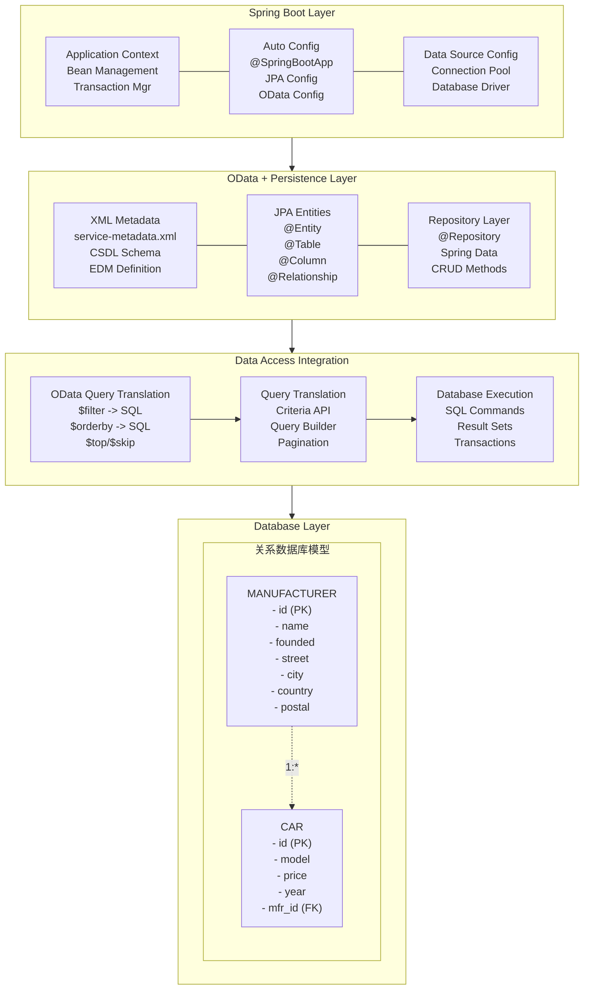

# OData Spring Boot XML 数据库集成项目 (samples/spring-boot-odata-xml-db)

## 概览

`samples/spring-boot-odata-xml-db` 项目是 **spring-boot-odata-xml 项目的数据库集成版本**，展示了如何将基于 XML 元数据的 OData 服务与真实数据库进行集成。该项目在 XML 驱动的 OData 架构基础上，添加了完整的数据库持久化支持。

## 学习目标

- 掌握 XML 元数据与数据库的集成模式
- 理解 OData 服务的数据库持久化
- 学会 Spring Data JPA 与 OData 的集成
- 了解事务管理和数据一致性

## 核心架构

### XML + Database 架构图



## 核心组件

### 1. JPA 实体类

```java
/**
 * Car JPA Entity
 */
@Entity
@Table(name = "cars")
public class CarEntity {
    
    @Id
    @GeneratedValue(strategy = GenerationType.IDENTITY)
    private Integer id;
    
    @Column(name = "model", length = 100)
    private String model;
    
    @Column(name = "price", precision = 19, scale = 2)
    private BigDecimal price;
    
    @Column(name = "year")
    private Integer year;
    
    @ManyToOne(fetch = FetchType.LAZY)
    @JoinColumn(name = "manufacturer_id")
    private ManufacturerEntity manufacturer;
    
    // Constructors, getters, setters...
}

/**
 * Manufacturer JPA Entity
 */
@Entity
@Table(name = "manufacturers")
public class ManufacturerEntity {
    
    @Id
    @GeneratedValue(strategy = GenerationType.IDENTITY)
    private Integer id;
    
    @Column(name = "name", length = 100, nullable = false)
    private String name;
    
    @Column(name = "founded")
    private Integer founded;
    
    @Embedded
    private AddressEmbeddable address;
    
    @OneToMany(mappedBy = "manufacturer", fetch = FetchType.LAZY)
    private List<CarEntity> cars = new ArrayList<>();
    
    // Constructors, getters, setters...
}

/**
 * Address Embeddable
 */
@Embeddable
public class AddressEmbeddable {
    
    @Column(name = "street", length = 100)
    private String street;
    
    @Column(name = "city", length = 50)
    private String city;
    
    @Column(name = "country", length = 50)
    private String country;
    
    @Column(name = "postal_code", length = 10)
    private String postalCode;
    
    // Constructors, getters, setters...
}
```

### 2. Spring Data Repository

```java
/**
 * Car Repository
 */
@Repository
public interface CarRepository extends JpaRepository<CarEntity, Integer>, JpaSpecificationExecutor<CarEntity> {
    
    // Custom query methods
    List<CarEntity> findByManufacturerId(Integer manufacturerId);
    
    List<CarEntity> findByPriceBetween(BigDecimal minPrice, BigDecimal maxPrice);
    
    List<CarEntity> findByYearGreaterThanEqual(Integer year);
    
    @Query("SELECT c FROM CarEntity c WHERE c.model LIKE %:model%")
    List<CarEntity> findByModelContaining(@Param("model") String model);
}

/**
 * Manufacturer Repository
 */
@Repository
public interface ManufacturerRepository extends JpaRepository<ManufacturerEntity, Integer>, JpaSpecificationExecutor<ManufacturerEntity> {
    
    // Custom query methods
    Optional<ManufacturerEntity> findByNameIgnoreCase(String name);
    
    List<ManufacturerEntity> findByFoundedBetween(Integer startYear, Integer endYear);
    
    @Query("SELECT m FROM ManufacturerEntity m WHERE m.address.country = :country")
    List<ManufacturerEntity> findByCountry(@Param("country") String country);
}
```

### 3. Database Data Provider

```java
/**
 * Database-backed Data Provider
 */
@Component
@Transactional
public class DatabaseXmlDataProvider {

    @Autowired
    private CarRepository carRepository;
    
    @Autowired
    private ManufacturerRepository manufacturerRepository;
    
    @Autowired
    private EntityMapper entityMapper;

    // Read operations
    @Transactional(readOnly = true)
    public EntityCollection readEntitySetData(String entitySetName) throws ODataApplicationException {
        switch (entitySetName) {
            case "Cars":
                return readCars();
            case "Manufacturers":
                return readManufacturers();
            default:
                throw new ODataApplicationException("Unknown entity set: " + entitySetName,
                    HttpStatusCode.NOT_FOUND.getStatusCode(), Locale.ENGLISH);
        }
    }

    @Transactional(readOnly = true)
    public Entity readEntityData(String entitySetName, List<UriParameter> keyParams) 
        throws ODataApplicationException {
        
        Integer id = extractIdFromKeyParams(keyParams);
        
        switch (entitySetName) {
            case "Cars":
                return carRepository.findById(id)
                    .map(entityMapper::mapCarToOData)
                    .orElseThrow(() -> new ODataApplicationException("Car not found",
                        HttpStatusCode.NOT_FOUND.getStatusCode(), Locale.ENGLISH));
                        
            case "Manufacturers":
                return manufacturerRepository.findById(id)
                    .map(entityMapper::mapManufacturerToOData)
                    .orElseThrow(() -> new ODataApplicationException("Manufacturer not found",
                        HttpStatusCode.NOT_FOUND.getStatusCode(), Locale.ENGLISH));
                        
            default:
                throw new ODataApplicationException("Unknown entity set: " + entitySetName,
                    HttpStatusCode.NOT_FOUND.getStatusCode(), Locale.ENGLISH);
        }
    }

    // Create operations
    public Entity createEntity(String entitySetName, Entity entity) throws ODataApplicationException {
        switch (entitySetName) {
            case "Cars":
                CarEntity carEntity = entityMapper.mapODataToCar(entity);
                CarEntity savedCar = carRepository.save(carEntity);
                return entityMapper.mapCarToOData(savedCar);
                
            case "Manufacturers":
                ManufacturerEntity manufacturerEntity = entityMapper.mapODataToManufacturer(entity);
                ManufacturerEntity savedManufacturer = manufacturerRepository.save(manufacturerEntity);
                return entityMapper.mapManufacturerToOData(savedManufacturer);
                
            default:
                throw new ODataApplicationException("Unknown entity set: " + entitySetName,
                    HttpStatusCode.BAD_REQUEST.getStatusCode(), Locale.ENGLISH);
        }
    }

    // Update operations
    public Entity updateEntity(String entitySetName, List<UriParameter> keyParams, Entity updateEntity) 
        throws ODataApplicationException {
        
        Integer id = extractIdFromKeyParams(keyParams);
        
        switch (entitySetName) {
            case "Cars":
                CarEntity existingCar = carRepository.findById(id)
                    .orElseThrow(() -> new ODataApplicationException("Car not found",
                        HttpStatusCode.NOT_FOUND.getStatusCode(), Locale.ENGLISH));
                
                entityMapper.updateCarFromOData(existingCar, updateEntity);
                CarEntity updatedCar = carRepository.save(existingCar);
                return entityMapper.mapCarToOData(updatedCar);
                
            case "Manufacturers":
                ManufacturerEntity existingManufacturer = manufacturerRepository.findById(id)
                    .orElseThrow(() -> new ODataApplicationException("Manufacturer not found",
                        HttpStatusCode.NOT_FOUND.getStatusCode(), Locale.ENGLISH));
                
                entityMapper.updateManufacturerFromOData(existingManufacturer, updateEntity);
                ManufacturerEntity updatedManufacturer = manufacturerRepository.save(existingManufacturer);
                return entityMapper.mapManufacturerToOData(updatedManufacturer);
                
            default:
                throw new ODataApplicationException("Unknown entity set: " + entitySetName,
                    HttpStatusCode.BAD_REQUEST.getStatusCode(), Locale.ENGLISH);
        }
    }

    // Delete operations
    public void deleteEntity(String entitySetName, List<UriParameter> keyParams) 
        throws ODataApplicationException {
        
        Integer id = extractIdFromKeyParams(keyParams);
        
        switch (entitySetName) {
            case "Cars":
                if (!carRepository.existsById(id)) {
                    throw new ODataApplicationException("Car not found",
                        HttpStatusCode.NOT_FOUND.getStatusCode(), Locale.ENGLISH);
                }
                carRepository.deleteById(id);
                break;
                
            case "Manufacturers":
                if (!manufacturerRepository.existsById(id)) {
                    throw new ODataApplicationException("Manufacturer not found",
                        HttpStatusCode.NOT_FOUND.getStatusCode(), Locale.ENGLISH);
                }
                manufacturerRepository.deleteById(id);
                break;
                
            default:
                throw new ODataApplicationException("Unknown entity set: " + entitySetName,
                    HttpStatusCode.BAD_REQUEST.getStatusCode(), Locale.ENGLISH);
        }
    }

    // Query operations with database optimization
    @Transactional(readOnly = true)
    public EntityCollection readEntitySetDataWithQuery(String entitySetName, UriInfo uriInfo) 
        throws ODataApplicationException {
        
        switch (entitySetName) {
            case "Cars":
                return readCarsWithQuery(uriInfo);
            case "Manufacturers":
                return readManufacturersWithQuery(uriInfo);
            default:
                throw new ODataApplicationException("Unknown entity set: " + entitySetName,
                    HttpStatusCode.NOT_FOUND.getStatusCode(), Locale.ENGLISH);
        }
    }

    private EntityCollection readCars() {
        List<CarEntity> cars = carRepository.findAll();
        EntityCollection collection = new EntityCollection();
        cars.forEach(car -> collection.getEntities().add(entityMapper.mapCarToOData(car)));
        return collection;
    }

    private EntityCollection readManufacturers() {
        List<ManufacturerEntity> manufacturers = manufacturerRepository.findAll();
        EntityCollection collection = new EntityCollection();
        manufacturers.forEach(manufacturer -> 
            collection.getEntities().add(entityMapper.mapManufacturerToOData(manufacturer)));
        return collection;
    }

    private EntityCollection readCarsWithQuery(UriInfo uriInfo) {
        // Build JPA Specification from OData query options
        Specification<CarEntity> spec = buildCarSpecification(uriInfo);
        
        // Apply pagination
        Pageable pageable = buildPageable(uriInfo);
        
        Page<CarEntity> carPage = carRepository.findAll(spec, pageable);
        
        EntityCollection collection = new EntityCollection();
        carPage.getContent().forEach(car -> 
            collection.getEntities().add(entityMapper.mapCarToOData(car)));
            
        return collection;
    }

    private Specification<CarEntity> buildCarSpecification(UriInfo uriInfo) {
        Specification<CarEntity> spec = Specification.where(null);
        
        // Apply filter options
        FilterOption filterOption = uriInfo.getFilterOption();
        if (filterOption != null) {
            spec = spec.and(buildFilterSpecification(filterOption));
        }
        
        return spec;
    }

    private Pageable buildPageable(UriInfo uriInfo) {
        int page = 0;
        int size = 20; // default page size
        
        SkipOption skipOption = uriInfo.getSkipOption();
        if (skipOption != null) {
            page = skipOption.getValue() / size;
        }
        
        TopOption topOption = uriInfo.getTopOption();
        if (topOption != null) {
            size = topOption.getValue();
        }
        
        // Apply ordering
        Sort sort = Sort.unsorted();
        OrderByOption orderByOption = uriInfo.getOrderByOption();
        if (orderByOption != null) {
            sort = buildSort(orderByOption);
        }
        
        return PageRequest.of(page, size, sort);
    }

    private Integer extractIdFromKeyParams(List<UriParameter> keyParams) throws ODataApplicationException {
        if (keyParams.isEmpty()) {
            throw new ODataApplicationException("Missing key parameter",
                HttpStatusCode.BAD_REQUEST.getStatusCode(), Locale.ENGLISH);
        }
        
        UriParameter keyParam = keyParams.get(0);
        try {
            return Integer.parseInt(keyParam.getText());
        } catch (NumberFormatException e) {
            throw new ODataApplicationException("Invalid key parameter",
                HttpStatusCode.BAD_REQUEST.getStatusCode(), Locale.ENGLISH);
        }
    }
}
```

### 4. Entity Mapper

```java
/**
 * Entity Mapper between JPA entities and OData entities
 */
@Component
public class EntityMapper {

    // Car mapping
    public Entity mapCarToOData(CarEntity carEntity) {
        Entity entity = new Entity()
            .addProperty(new Property(null, "Id", ValueType.PRIMITIVE, carEntity.getId()))
            .addProperty(new Property(null, "Model", ValueType.PRIMITIVE, carEntity.getModel()))
            .addProperty(new Property(null, "Price", ValueType.PRIMITIVE, carEntity.getPrice()))
            .addProperty(new Property(null, "Year", ValueType.PRIMITIVE, carEntity.getYear()));
        
        return entity;
    }

    public CarEntity mapODataToCar(Entity entity) {
        CarEntity carEntity = new CarEntity();
        
        Property modelProp = entity.getProperty("Model");
        if (modelProp != null) {
            carEntity.setModel((String) modelProp.getValue());
        }
        
        Property priceProp = entity.getProperty("Price");
        if (priceProp != null) {
            carEntity.setPrice(new BigDecimal(priceProp.getValue().toString()));
        }
        
        Property yearProp = entity.getProperty("Year");
        if (yearProp != null) {
            carEntity.setYear((Integer) yearProp.getValue());
        }
        
        return carEntity;
    }

    public void updateCarFromOData(CarEntity carEntity, Entity updateEntity) {
        Property modelProp = updateEntity.getProperty("Model");
        if (modelProp != null) {
            carEntity.setModel((String) modelProp.getValue());
        }
        
        Property priceProp = updateEntity.getProperty("Price");
        if (priceProp != null) {
            carEntity.setPrice(new BigDecimal(priceProp.getValue().toString()));
        }
        
        Property yearProp = updateEntity.getProperty("Year");
        if (yearProp != null) {
            carEntity.setYear((Integer) yearProp.getValue());
        }
    }

    // Manufacturer mapping
    public Entity mapManufacturerToOData(ManufacturerEntity manufacturerEntity) {
        Entity entity = new Entity()
            .addProperty(new Property(null, "Id", ValueType.PRIMITIVE, manufacturerEntity.getId()))
            .addProperty(new Property(null, "Name", ValueType.PRIMITIVE, manufacturerEntity.getName()))
            .addProperty(new Property(null, "Founded", ValueType.PRIMITIVE, manufacturerEntity.getFounded()));
        
        // Map embedded address
        if (manufacturerEntity.getAddress() != null) {
            ComplexValue address = mapAddressToOData(manufacturerEntity.getAddress());
            entity.addProperty(new Property(null, "Address", ValueType.COMPLEX, address));
        }
        
        return entity;
    }

    public ManufacturerEntity mapODataToManufacturer(Entity entity) {
        ManufacturerEntity manufacturerEntity = new ManufacturerEntity();
        
        Property nameProp = entity.getProperty("Name");
        if (nameProp != null) {
            manufacturerEntity.setName((String) nameProp.getValue());
        }
        
        Property foundedProp = entity.getProperty("Founded");
        if (foundedProp != null) {
            manufacturerEntity.setFounded((Integer) foundedProp.getValue());
        }
        
        Property addressProp = entity.getProperty("Address");
        if (addressProp != null && addressProp.getValue() instanceof ComplexValue) {
            AddressEmbeddable address = mapODataToAddress((ComplexValue) addressProp.getValue());
            manufacturerEntity.setAddress(address);
        }
        
        return manufacturerEntity;
    }

    private ComplexValue mapAddressToOData(AddressEmbeddable address) {
        ComplexValue complexValue = new ComplexValue();
        complexValue.getValue().add(new Property(null, "Street", ValueType.PRIMITIVE, address.getStreet()));
        complexValue.getValue().add(new Property(null, "City", ValueType.PRIMITIVE, address.getCity()));
        complexValue.getValue().add(new Property(null, "Country", ValueType.PRIMITIVE, address.getCountry()));
        complexValue.getValue().add(new Property(null, "PostalCode", ValueType.PRIMITIVE, address.getPostalCode()));
        return complexValue;
    }

    private AddressEmbeddable mapODataToAddress(ComplexValue complexValue) {
        AddressEmbeddable address = new AddressEmbeddable();
        
        for (Property property : complexValue.getValue()) {
            switch (property.getName()) {
                case "Street":
                    address.setStreet((String) property.getValue());
                    break;
                case "City":
                    address.setCity((String) property.getValue());
                    break;
                case "Country":
                    address.setCountry((String) property.getValue());
                    break;
                case "PostalCode":
                    address.setPostalCode((String) property.getValue());
                    break;
            }
        }
        
        return address;
    }
}
```

## 数据库配置

### 1. application.properties

```properties
# Database Configuration
spring.datasource.url=jdbc:h2:mem:odatadb
spring.datasource.driver-class-name=org.h2.Driver
spring.datasource.username=sa
spring.datasource.password=

# JPA Configuration
spring.jpa.hibernate.ddl-auto=create-drop
spring.jpa.show-sql=true
spring.jpa.properties.hibernate.format_sql=true
spring.jpa.database-platform=org.hibernate.dialect.H2Dialect

# H2 Console (for development)
spring.h2.console.enabled=true
spring.h2.console.path=/h2-console

# Connection Pool
spring.datasource.hikari.minimum-idle=5
spring.datasource.hikari.maximum-pool-size=20
spring.datasource.hikari.idle-timeout=300000
spring.datasource.hikari.connection-timeout=20000

# OData Configuration
server.port=8080
logging.level.org.apache.olingo=DEBUG
```

### 2. SQL 初始化脚本

```sql
-- data.sql
-- Initialize manufacturers
INSERT INTO manufacturers (id, name, founded, street, city, country, postal_code) VALUES
(1, 'BMW', 1916, 'Petuelring 130', 'Munich', 'Germany', '80809'),
(2, 'Mercedes-Benz', 1926, 'Mercedesstraße 120', 'Stuttgart', 'Germany', '70372'),
(3, 'Audi', 1910, 'Auto-Union-Straße 1', 'Ingolstadt', 'Germany', '85057');

-- Initialize cars
INSERT INTO cars (id, model, price, year, manufacturer_id) VALUES
(1, 'F30', 31200.00, 2012, 1),
(2, 'X5', 75000.00, 2018, 1),
(3, 'C-Class', 45000.00, 2020, 2),
(4, 'S-Class', 95000.00, 2021, 2),
(5, 'A4', 40000.00, 2019, 3),
(6, 'Q7', 80000.00, 2020, 3);
```

## API 使用示例

### 1. 数据库支持的查询

```bash
# 基本查询（从数据库加载）
GET http://localhost:8080/cars.svc/Cars

# 预期响应：从数据库加载的真实数据
{
  "@odata.context": "$metadata#Cars",
  "value": [
    {
      "Id": 1,
      "Model": "F30",
      "Price": 31200.00,
      "Year": 2012
    }
  ]
}

# 高效的数据库过滤
GET http://localhost:8080/cars.svc/Cars?$filter=Price gt 50000

# 数据库级别的排序和分页
GET http://localhost:8080/cars.svc/Cars?$orderby=Price desc&$top=5&$skip=0
```

### 2. 事务性操作

```bash
# 创建操作（数据库事务）
POST http://localhost:8080/cars.svc/Cars
Content-Type: application/json

{
  "Model": "i8",
  "Price": 150000.00,
  "Year": 2023
}

# 预期：数据持久化到数据库，自动生成 ID
```

### 3. 复杂查询支持

```bash
# 关联查询（利用数据库 JOIN）
GET http://localhost:8080/cars.svc/Cars?$expand=Manufacturer

# 复杂过滤（转换为 SQL WHERE 子句）
GET http://localhost:8080/cars.svc/Manufacturers?$filter=Founded gt 1920 and Address/Country eq 'Germany'
```

## 总结

`samples/spring-boot-odata-xml-db` 项目展示了 XML 元数据与数据库的完美集成：

### 核心特性
- ✅ **XML 元数据**：继承 XML 驱动的 EDM 定义优势
- ✅ **数据库持久化**：真实的数据库存储和事务支持
- ✅ **JPA 集成**：完整的 Spring Data JPA 集成
- ✅ **查询优化**：OData 查询转换为高效的 SQL 查询
- ✅ **事务管理**：完整的数据库事务支持

### 技术亮点
- **最佳实践**：XML 元数据 + 数据库持久化的理想组合
- **性能优化**：数据库级别的查询、排序、分页
- **数据一致性**：事务保证和数据完整性约束
- **扩展性**：支持复杂的关系数据库模型

### 适用场景
该项目特别适合：
- **生产环境**：需要真实数据库支持的生产级 OData 服务
- **企业应用**：具有复杂数据关系的企业级应用
- **高性能需求**：需要数据库级别查询优化的高性能系统
- **数据一致性**：要求严格事务管理的业务系统
