# OData Spring Boot XML 导入项目 (samples/spring-boot-odata-xml-import)

## 概览

`samples/spring-boot-odata-xml-import` 项目展示了 **高级 XML 元数据导入和处理功能**，专门用于处理复杂的、来自外部系统的 XML 元数据文件。该项目提供了完整的 XML 元数据验证、转换、导入和管理功能。

## 学习目标

- 掌握外部 XML 元数据的导入处理
- 理解 XML 元数据验证和转换机制
- 学会处理复杂的 XML Schema 结构
- 了解元数据版本管理和兼容性

## 核心架构

### XML 导入处理架构图

```mermaid
flowchart TD
    subgraph SOURCE_LAYER ["Import Source Layer"]
        EXTERNAL["External<br/>Systems<br/>SAP OData<br/>SharePoint<br/>Web Services"]
        LEGACY["Legacy<br/>Systems<br/>Custom XML<br/>Schema Files<br/>Database Meta"]
        THIRDPARTY["Third-party<br/>APIs<br/>External EDM<br/>API Metadata<br/>Standard CSDL"]
    end
    
    subgraph PROCESS_LAYER ["Import Processing Layer"]
        XML_VALID["XML<br/>Validation<br/>Schema Valid<br/>CSDL Compliance<br/>Structure Check"]
        SCHEMA_TRANS["Schema<br/>Transformation<br/>XSLT Transform<br/>Format Convert<br/>Namespace Map"]
        META_ENRICH["Metadata<br/>Enrichment<br/>Add Annotations<br/>Default Values<br/>Validation Rule"]
    end
    
    subgraph MGMT_LAYER ["Metadata Management"]
        VERSION_CTRL["Version<br/>Control<br/>Semantic Ver<br/>Change Track<br/>Compatibility"]
        CONFLICT_RES["Conflict<br/>Resolution<br/>Merge Strategy<br/>Override Rules<br/>Diff Analysis"]
        BACKUP_REC["Backup &<br/>Recovery<br/>Metadata Store<br/>Rollback Mgmt<br/>History Track"]
    end
    
    subgraph RUNTIME_LAYER ["Runtime Integration"]
        DYNAMIC_LOAD["Dynamic<br/>Loading<br/>Runtime Import<br/>Lazy Loading<br/>Cache Strategy"]
        HOT_RELOAD["Hot Reload<br/>Support<br/>Zero Downtime<br/>Config Refresh<br/>Service Restart"]
        SERVICE_DISC["Service<br/>Discovery<br/>Auto Register<br/>Endpoint Gen<br/>Client Update"]
    end
    
    SOURCE_LAYER --> PROCESS_LAYER
    PROCESS_LAYER --> MGMT_LAYER
    MGMT_LAYER --> RUNTIME_LAYER
```



## 核心组件

### 1. XML 导入服务

```java
/**
 * Advanced XML Metadata Import Service
 * 
 * This service handles complex XML metadata import scenarios,
 * including validation, transformation, and integration.
 */
@Service
@Transactional
public class XmlMetadataImportService {

    @Autowired
    private MetadataValidator metadataValidator;
    
    @Autowired
    private MetadataTransformer metadataTransformer;
    
    @Autowired
    private MetadataRepository metadataRepository;
    
    @Autowired
    private MetadataVersionManager versionManager;

    /**
     * Import XML metadata from external source
     */
    public ImportResult importMetadata(ImportRequest request) throws ImportException {
        try {
            // Step 1: Load and validate source XML
            XMLMetadata sourceMetadata = loadSourceMetadata(request.getSource());
            ValidationResult validation = metadataValidator.validate(sourceMetadata);
            
            if (!validation.isValid()) {
                throw new ImportException("Metadata validation failed: " + validation.getErrors());
            }

            // Step 2: Transform metadata if needed
            XMLMetadata transformedMetadata = applyTransformations(sourceMetadata, request.getTransformations());

            // Step 3: Check for conflicts with existing metadata
            ConflictAnalysis conflicts = analyzeConflicts(transformedMetadata);
            if (conflicts.hasConflicts() && !request.isForceOverride()) {
                throw new ImportException("Metadata conflicts detected: " + conflicts.getConflicts());
            }

            // Step 4: Backup current metadata
            MetadataBackup backup = createBackup();

            try {
                // Step 5: Import new metadata
                MetadataVersion newVersion = versionManager.createNewVersion(transformedMetadata);
                
                // Step 6: Update runtime EDM provider
                updateRuntimeProvider(newVersion);
                
                // Step 7: Verify successful import
                verifyImport(newVersion);
                
                return ImportResult.success(newVersion, backup);
                
            } catch (Exception e) {
                // Rollback on failure
                rollbackImport(backup);
                throw new ImportException("Import failed, rolled back: " + e.getMessage(), e);
            }

        } catch (Exception e) {
            log.error("Metadata import failed", e);
            throw new ImportException("Import operation failed", e);
        }
    }

    /**
     * Import from URL source
     */
    public ImportResult importFromUrl(String url, ImportOptions options) throws ImportException {
        try {
            // Download metadata from URL
            String xmlContent = downloadMetadata(url);
            
            // Create import request
            ImportRequest request = ImportRequest.builder()
                .source(new UrlMetadataSource(url, xmlContent))
                .options(options)
                .build();
                
            return importMetadata(request);
            
        } catch (Exception e) {
            throw new ImportException("Failed to import from URL: " + url, e);
        }
    }

    /**
     * Import from file
     */
    public ImportResult importFromFile(MultipartFile file, ImportOptions options) throws ImportException {
        try {
            String xmlContent = new String(file.getBytes(), StandardCharsets.UTF_8);
            
            ImportRequest request = ImportRequest.builder()
                .source(new FileMetadataSource(file.getOriginalFilename(), xmlContent))
                .options(options)
                .build();
                
            return importMetadata(request);
            
        } catch (Exception e) {
            throw new ImportException("Failed to import from file", e);
        }
    }

    /**
     * Import with custom transformations
     */
    public ImportResult importWithTransformations(String xmlContent, List<MetadataTransformation> transformations) 
        throws ImportException {
        
        ImportRequest request = ImportRequest.builder()
            .source(new StringMetadataSource(xmlContent))
            .transformations(transformations)
            .build();
            
        return importMetadata(request);
    }

    // Private helper methods
    private XMLMetadata loadSourceMetadata(MetadataSource source) throws ImportException {
        try {
            return XMLMetadata.parse(source.getContent());
        } catch (Exception e) {
            throw new ImportException("Failed to parse source metadata", e);
        }
    }

    private XMLMetadata applyTransformations(XMLMetadata metadata, List<MetadataTransformation> transformations) 
        throws ImportException {
        
        if (transformations == null || transformations.isEmpty()) {
            return metadata;
        }

        XMLMetadata result = metadata;
        for (MetadataTransformation transformation : transformations) {
            result = metadataTransformer.transform(result, transformation);
        }
        
        return result;
    }

    private ConflictAnalysis analyzeConflicts(XMLMetadata newMetadata) {
        XMLMetadata currentMetadata = getCurrentMetadata();
        return ConflictAnalyzer.analyze(currentMetadata, newMetadata);
    }

    private MetadataBackup createBackup() {
        XMLMetadata currentMetadata = getCurrentMetadata();
        return metadataRepository.createBackup(currentMetadata);
    }

    private void updateRuntimeProvider(MetadataVersion version) throws ImportException {
        try {
            // Update the EDM provider with new metadata
            XmlEdmProvider provider = ApplicationContextHolder.getBean(XmlEdmProvider.class);
            provider.reloadMetadata(version.getMetadata());
            
        } catch (Exception e) {
            throw new ImportException("Failed to update runtime provider", e);
        }
    }

    private void verifyImport(MetadataVersion version) throws ImportException {
        try {
            // Verify that the service can start with new metadata
            OData odata = OData.newInstance();
            ServiceMetadata serviceMetadata = odata.createServiceMetadata(
                new XmlEdmProvider(version.getMetadata()), new ArrayList<>());
            
            // Basic smoke test
            serviceMetadata.getEdm().getEntityContainer();
            
        } catch (Exception e) {
            throw new ImportException("Import verification failed", e);
        }
    }

    private void rollbackImport(MetadataBackup backup) {
        try {
            metadataRepository.restore(backup);
            updateRuntimeProvider(backup.getVersion());
        } catch (Exception e) {
            log.error("Rollback failed", e);
        }
    }

    private String downloadMetadata(String url) throws ImportException {
        try {
            RestTemplate restTemplate = new RestTemplate();
            return restTemplate.getForObject(url, String.class);
        } catch (Exception e) {
            throw new ImportException("Failed to download metadata from: " + url, e);
        }
    }

    private XMLMetadata getCurrentMetadata() {
        return metadataRepository.getCurrentMetadata();
    }
}
```

### 2. 元数据验证器

```java
/**
 * Comprehensive XML Metadata Validator
 */
@Component
public class MetadataValidator {

    private final XMLSchemaValidator schemaValidator;
    private final CSDLValidator csdlValidator;
    private final BusinessRuleValidator businessRuleValidator;

    public ValidationResult validate(XMLMetadata metadata) {
        ValidationResult result = new ValidationResult();
        
        // XML Schema validation
        result.merge(validateXMLSchema(metadata));
        
        // CSDL compliance validation
        result.merge(validateCSDLCompliance(metadata));
        
        // Business rule validation
        result.merge(validateBusinessRules(metadata));
        
        // Custom validation rules
        result.merge(validateCustomRules(metadata));
        
        return result;
    }

    private ValidationResult validateXMLSchema(XMLMetadata metadata) {
        try {
            return schemaValidator.validate(metadata.getXmlContent());
        } catch (Exception e) {
            return ValidationResult.error("XML Schema validation failed: " + e.getMessage());
        }
    }

    private ValidationResult validateCSDLCompliance(XMLMetadata metadata) {
        try {
            // Use Olingo's built-in validation
            MetadataParser parser = new MetadataParser();
            parser.buildEdmProvider(new StringReader(metadata.getXmlContent()));
            
            return ValidationResult.success();
        } catch (Exception e) {
            return ValidationResult.error("CSDL compliance validation failed: " + e.getMessage());
        }
    }

    private ValidationResult validateBusinessRules(XMLMetadata metadata) {
        return businessRuleValidator.validate(metadata);
    }

    private ValidationResult validateCustomRules(XMLMetadata metadata) {
        ValidationResult result = new ValidationResult();
        
        // Check for required annotations
        if (!hasRequiredAnnotations(metadata)) {
            result.addWarning("Missing recommended annotations");
        }
        
        // Check for performance considerations
        if (hasTooManyEntities(metadata)) {
            result.addWarning("Large number of entities may impact performance");
        }
        
        // Check for naming conventions
        if (!followsNamingConventions(metadata)) {
            result.addWarning("Entity names don't follow recommended conventions");
        }
        
        return result;
    }

    private boolean hasRequiredAnnotations(XMLMetadata metadata) {
        // Check for Core.Description, Core.LongDescription, etc.
        return metadata.getXmlContent().contains("Core.Description");
    }

    private boolean hasTooManyEntities(XMLMetadata metadata) {
        // Count entity types
        String content = metadata.getXmlContent();
        return StringUtils.countMatches(content, "<EntityType") > 50;
    }

    private boolean followsNamingConventions(XMLMetadata metadata) {
        // Check PascalCase for entity names, etc.
        // Implementation depends on specific conventions
        return true;
    }
}
```

### 3. 元数据转换器

```java
/**
 * XML Metadata Transformer
 * 
 * Handles various transformations like namespace changes,
 * property mappings, and format conversions.
 */
@Component
public class MetadataTransformer {

    private final XSLTProcessor xsltProcessor;
    private final NamespaceMapper namespaceMapper;

    public XMLMetadata transform(XMLMetadata source, MetadataTransformation transformation) 
        throws TransformationException {
        
        switch (transformation.getType()) {
            case NAMESPACE_MAPPING:
                return transformNamespaces(source, (NamespaceTransformation) transformation);
                
            case PROPERTY_MAPPING:
                return transformProperties(source, (PropertyTransformation) transformation);
                
            case XSLT_TRANSFORMATION:
                return applyXSLT(source, (XSLTTransformation) transformation);
                
            case ANNOTATION_ENRICHMENT:
                return enrichWithAnnotations(source, (AnnotationTransformation) transformation);
                
            default:
                throw new TransformationException("Unsupported transformation type: " + transformation.getType());
        }
    }

    private XMLMetadata transformNamespaces(XMLMetadata source, NamespaceTransformation transformation) 
        throws TransformationException {
        
        try {
            String content = source.getXmlContent();
            
            // Apply namespace mappings
            for (Map.Entry<String, String> mapping : transformation.getMappings().entrySet()) {
                String oldNamespace = mapping.getKey();
                String newNamespace = mapping.getValue();
                
                content = content.replaceAll(
                    "Namespace=\"" + Pattern.quote(oldNamespace) + "\"",
                    "Namespace=\"" + newNamespace + "\""
                );
                
                content = content.replaceAll(
                    "Type=\"" + Pattern.quote(oldNamespace) + "\\.",
                    "Type=\"" + newNamespace + "."
                );
            }
            
            return XMLMetadata.parse(content);
            
        } catch (Exception e) {
            throw new TransformationException("Namespace transformation failed", e);
        }
    }

    private XMLMetadata transformProperties(XMLMetadata source, PropertyTransformation transformation) 
        throws TransformationException {
        
        try {
            Document doc = parseXML(source.getXmlContent());
            
            // Apply property mappings
            NodeList properties = doc.getElementsByTagName("Property");
            for (int i = 0; i < properties.getLength(); i++) {
                Element property = (Element) properties.item(i);
                String propertyName = property.getAttribute("Name");
                
                if (transformation.getMappings().containsKey(propertyName)) {
                    PropertyMapping mapping = transformation.getMappings().get(propertyName);
                    
                    // Update property name
                    if (mapping.getNewName() != null) {
                        property.setAttribute("Name", mapping.getNewName());
                    }
                    
                    // Update property type
                    if (mapping.getNewType() != null) {
                        property.setAttribute("Type", mapping.getNewType());
                    }
                    
                    // Update other attributes
                    mapping.getAttributes().forEach(property::setAttribute);
                }
            }
            
            return XMLMetadata.parse(documentToString(doc));
            
        } catch (Exception e) {
            throw new TransformationException("Property transformation failed", e);
        }
    }

    private XMLMetadata applyXSLT(XMLMetadata source, XSLTTransformation transformation) 
        throws TransformationException {
        
        try {
            String xsltContent = transformation.getXsltContent();
            String transformedContent = xsltProcessor.transform(source.getXmlContent(), xsltContent);
            
            return XMLMetadata.parse(transformedContent);
            
        } catch (Exception e) {
            throw new TransformationException("XSLT transformation failed", e);
        }
    }

    private XMLMetadata enrichWithAnnotations(XMLMetadata source, AnnotationTransformation transformation) 
        throws TransformationException {
        
        try {
            Document doc = parseXML(source.getXmlContent());
            
            // Add annotations to entity types
            NodeList entityTypes = doc.getElementsByTagName("EntityType");
            for (int i = 0; i < entityTypes.getLength(); i++) {
                Element entityType = (Element) entityTypes.item(i);
                String entityName = entityType.getAttribute("Name");
                
                if (transformation.getEntityAnnotations().containsKey(entityName)) {
                    List<AnnotationElement> annotations = transformation.getEntityAnnotations().get(entityName);
                    addAnnotations(doc, entityType, annotations);
                }
            }
            
            return XMLMetadata.parse(documentToString(doc));
            
        } catch (Exception e) {
            throw new TransformationException("Annotation enrichment failed", e);
        }
    }

    private Document parseXML(String xmlContent) throws Exception {
        DocumentBuilderFactory factory = DocumentBuilderFactory.newInstance();
        factory.setNamespaceAware(true);
        DocumentBuilder builder = factory.newDocumentBuilder();
        return builder.parse(new ByteArrayInputStream(xmlContent.getBytes(StandardCharsets.UTF_8)));
    }

    private String documentToString(Document doc) throws Exception {
        TransformerFactory transformerFactory = TransformerFactory.newInstance();
        Transformer transformer = transformerFactory.newTransformer();
        transformer.setOutputProperty(OutputKeys.INDENT, "yes");
        
        StringWriter writer = new StringWriter();
        transformer.transform(new DOMSource(doc), new StreamResult(writer));
        
        return writer.toString();
    }

    private void addAnnotations(Document doc, Element parent, List<AnnotationElement> annotations) {
        for (AnnotationElement annotation : annotations) {
            Element annotationElement = doc.createElement("Annotation");
            annotationElement.setAttribute("Term", annotation.getTerm());
            
            if (annotation.getValue() != null) {
                annotationElement.setAttribute("String", annotation.getValue());
            }
            
            parent.appendChild(annotationElement);
        }
    }
}
```

### 4. 版本管理器

```java
/**
 * Metadata Version Manager
 * 
 * Handles metadata versioning, compatibility checking, and rollback support.
 */
@Service
public class MetadataVersionManager {

    @Autowired
    private MetadataRepository metadataRepository;
    
    @Autowired
    private CompatibilityChecker compatibilityChecker;

    public MetadataVersion createNewVersion(XMLMetadata metadata) throws VersionException {
        try {
            MetadataVersion currentVersion = getCurrentVersion();
            
            // Check compatibility
            CompatibilityResult compatibility = compatibilityChecker.check(currentVersion, metadata);
            
            // Determine version increment
            VersionIncrement increment = determineVersionIncrement(compatibility);
            
            // Create new version
            String newVersionNumber = calculateNewVersion(currentVersion.getVersionNumber(), increment);
            
            MetadataVersion newVersion = MetadataVersion.builder()
                .versionNumber(newVersionNumber)
                .metadata(metadata)
                .previousVersion(currentVersion)
                .compatibility(compatibility)
                .createdAt(Instant.now())
                .build();
            
            // Save version
            metadataRepository.saveVersion(newVersion);
            
            // Update current version pointer
            metadataRepository.updateCurrentVersion(newVersion);
            
            return newVersion;
            
        } catch (Exception e) {
            throw new VersionException("Failed to create new version", e);
        }
    }

    public List<MetadataVersion> getVersionHistory() {
        return metadataRepository.getAllVersions();
    }

    public MetadataVersion getVersion(String versionNumber) throws VersionException {
        return metadataRepository.getVersion(versionNumber)
            .orElseThrow(() -> new VersionException("Version not found: " + versionNumber));
    }

    public void rollbackToVersion(String versionNumber) throws VersionException {
        try {
            MetadataVersion targetVersion = getVersion(versionNumber);
            
            // Create rollback version
            MetadataVersion rollbackVersion = MetadataVersion.builder()
                .versionNumber(calculateRollbackVersion())
                .metadata(targetVersion.getMetadata())
                .previousVersion(getCurrentVersion())
                .isRollback(true)
                .rollbackTarget(targetVersion)
                .createdAt(Instant.now())
                .build();
            
            // Save rollback version
            metadataRepository.saveVersion(rollbackVersion);
            
            // Update current version
            metadataRepository.updateCurrentVersion(rollbackVersion);
            
        } catch (Exception e) {
            throw new VersionException("Rollback failed", e);
        }
    }

    private MetadataVersion getCurrentVersion() {
        return metadataRepository.getCurrentVersion()
            .orElse(MetadataVersion.initial());
    }

    private VersionIncrement determineVersionIncrement(CompatibilityResult compatibility) {
        if (compatibility.hasBreakingChanges()) {
            return VersionIncrement.MAJOR;
        } else if (compatibility.hasNewFeatures()) {
            return VersionIncrement.MINOR;
        } else {
            return VersionIncrement.PATCH;
        }
    }

    private String calculateNewVersion(String currentVersion, VersionIncrement increment) {
        // Semantic versioning: MAJOR.MINOR.PATCH
        String[] parts = currentVersion.split("\\.");
        int major = Integer.parseInt(parts[0]);
        int minor = Integer.parseInt(parts[1]);
        int patch = Integer.parseInt(parts[2]);
        
        switch (increment) {
            case MAJOR:
                return (major + 1) + ".0.0";
            case MINOR:
                return major + "." + (minor + 1) + ".0";
            case PATCH:
                return major + "." + minor + "." + (patch + 1);
            default:
                throw new IllegalArgumentException("Unknown increment: " + increment);
        }
    }

    private String calculateRollbackVersion() {
        String currentVersion = getCurrentVersion().getVersionNumber();
        return currentVersion + "-rollback-" + System.currentTimeMillis();
    }
}
```

## REST API 端点

### 1. 导入控制器

```java
@RestController
@RequestMapping("/api/metadata")
public class MetadataImportController {

    @Autowired
    private XmlMetadataImportService importService;

    @PostMapping("/import/file")
    public ResponseEntity<ImportResult> importFromFile(
            @RequestParam("file") MultipartFile file,
            @RequestParam(value = "options", required = false) String optionsJson) {
        
        try {
            ImportOptions options = parseOptions(optionsJson);
            ImportResult result = importService.importFromFile(file, options);
            
            return ResponseEntity.ok(result);
        } catch (ImportException e) {
            return ResponseEntity.badRequest().body(ImportResult.error(e.getMessage()));
        }
    }

    @PostMapping("/import/url")
    public ResponseEntity<ImportResult> importFromUrl(
            @RequestBody UrlImportRequest request) {
        
        try {
            ImportResult result = importService.importFromUrl(request.getUrl(), request.getOptions());
            return ResponseEntity.ok(result);
        } catch (ImportException e) {
            return ResponseEntity.badRequest().body(ImportResult.error(e.getMessage()));
        }
    }

    @GetMapping("/versions")
    public ResponseEntity<List<MetadataVersion>> getVersionHistory() {
        List<MetadataVersion> versions = importService.getVersionHistory();
        return ResponseEntity.ok(versions);
    }

    @PostMapping("/rollback/{version}")
    public ResponseEntity<String> rollback(@PathVariable String version) {
        try {
            importService.rollbackToVersion(version);
            return ResponseEntity.ok("Rolled back to version: " + version);
        } catch (VersionException e) {
            return ResponseEntity.badRequest().body("Rollback failed: " + e.getMessage());
        }
    }
}
```

## 总结

`samples/spring-boot-odata-xml-import` 项目提供了企业级的 XML 元数据管理解决方案：

### 核心特性
- ✅ **高级导入**：支持多种数据源的 XML 元数据导入
- ✅ **完整验证**：XML Schema、CSDL 合规性、业务规则验证
- ✅ **智能转换**：XSLT、命名空间映射、属性转换
- ✅ **版本管理**：语义化版本控制、兼容性检查、回滚支持
- ✅ **热更新**：零停机时间的元数据更新

### 适用场景
- **企业集成**：与外部系统的元数据集成
- **数据治理**：统一的元数据管理和版本控制
- **系统迁移**：遗留系统到 OData 的迁移
- **API 管理**：大规模 API 元数据的统一管理
