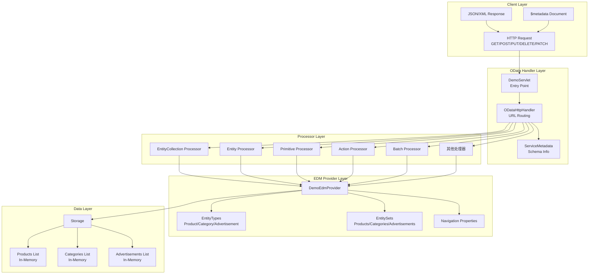
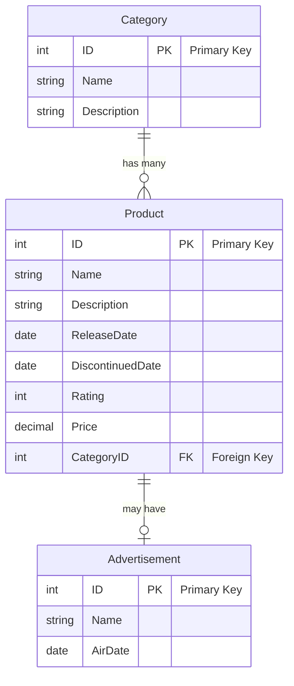
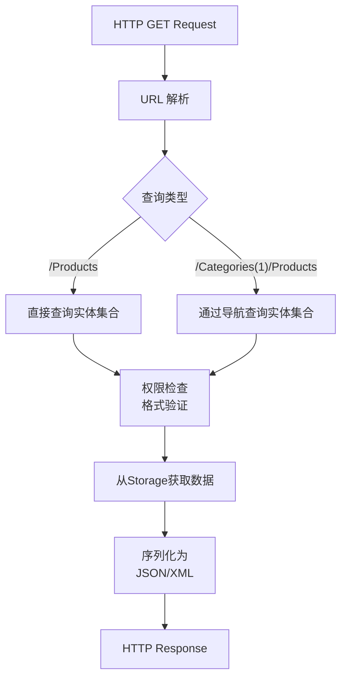
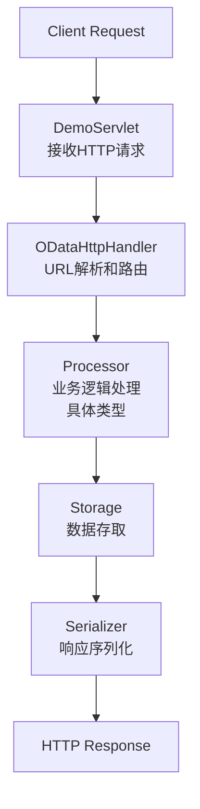

# OData Tutorial 00 - 完整功能演示 (p0_all)

## 概览

`p0_all` 项目是Apache Olingo OData V4教程的完整演示项目，展示了OData服务的所有核心功能，包括实体操作、导航、查询选项、操作（Actions）、函数（Functions）、批处理（Batch）等全部特性。

## 核心架构

### 系统架构图



## 核心组件

### 1. DemoServlet - 服务入口

**功能**：作为HTTP请求的入口点，初始化OData服务并配置所有处理器。

**关键代码流程**：
```java
@Override
protected void service(HttpServletRequest req, HttpServletResponse resp) {
    // 1. 创建OData实例
    OData odata = OData.newInstance();
    
    // 2. 创建服务元数据
    ServiceMetadata edm = odata.createServiceMetadata(new DemoEdmProvider(), 
                                                     new ArrayList<EdmxReference>());
    
    // 3. 获取或创建存储
    Storage storage = getOrCreateStorage(session, odata, edm);
    
    // 4. 创建处理器并注册所有功能
    ODataHttpHandler handler = odata.createHandler(edm);
    handler.register(new DemoEntityCollectionProcessor(storage));
    handler.register(new DemoEntityProcessor(storage));
    handler.register(new DemoPrimitiveProcessor(storage));
    handler.register(new DemoActionProcessor(storage));        // Actions支持
    handler.register(new DemoBatchProcessor(storage));         // 批处理支持
    
    // 5. 处理请求
    handler.process(req, resp);
}
```

### 2. DemoEdmProvider - 元数据提供者

**功能**：定义OData服务的完整数据模型，包括实体类型、关系、操作等。

**数据模型图**：


**关键特性**：
- **实体类型**：Product、Category、Advertisement
- **导航属性**：Product ↔ Category 双向关联
- **操作**：Reset Action（重置数据）
- **函数**：CountCategories Function（统计分类数量）

### 3. 处理器组件

#### EntityCollectionProcessor - 实体集合处理器
**功能**：处理实体集合的GET请求，支持导航查询。

**处理流程图**：


#### EntityProcessor - 单实体处理器
**功能**：处理单个实体的CRUD操作，支持导航。

**支持的操作**：
- **CREATE** (POST): 创建新实体
- **READ** (GET): 读取单个实体或通过导航读取
- **UPDATE** (PUT/PATCH): 更新实体
- **DELETE** (DELETE): 删除实体

#### ActionProcessor - 操作处理器
**功能**：执行自定义业务操作。

**示例**：Reset操作重置数据集
```java
public void processAction(ODataRequest request, ODataResponse response, UriInfo uriInfo, 
                         ContentType requestFormat, ContentType responseFormat) {
    // 1. 解析操作参数
    Map<String, Parameter> parameters = readActionParameters(request, requestFormat);
    
    // 2. 执行业务逻辑
    if (ACTION_RESET.equals(actionName)) {
        int amount = (Integer) parameters.get(PARAMETER_AMOUNT).getValue();
        storage.resetDataSet(amount);
    }
    
    // 3. 返回响应
    response.setStatusCode(HttpStatusCode.OK.getStatusCode());
}
```

#### BatchProcessor - 批处理器
**功能**：支持在单个HTTP请求中执行多个操作。

## 关键步骤详解

### 步骤1：服务初始化
1. **Servlet启动**：DemoServlet接收HTTP请求
2. **OData实例创建**：初始化Olingo框架
3. **元数据构建**：DemoEdmProvider定义数据模型
4. **存储初始化**：创建内存数据存储
5. **处理器注册**：注册各种业务处理器

### 步骤2：请求处理流程


### 步骤3：数据模型定义
```java
// 实体类型定义示例
public CsdlEntityType getEntityType(FullQualifiedName entityTypeName) {
    if (entityTypeName.equals(ET_PRODUCT_FQN)) {
        // 创建属性列表
        CsdlProperty id = new CsdlProperty().setName("ID")
                          .setType(EdmPrimitiveTypeKind.Int32.getFullQualifiedName());
        CsdlProperty name = new CsdlProperty().setName("Name")
                           .setType(EdmPrimitiveTypeKind.String.getFullQualifiedName());
        
        // 创建导航属性
        CsdlNavigationProperty navProp = new CsdlNavigationProperty()
                                          .setName("Category")
                                          .setType(ET_CATEGORY_FQN);
        
        // 组装实体类型
        return new CsdlEntityType()
                .setName(ET_PRODUCT_NAME)
                .setProperties(Arrays.asList(id, name))
                .setNavigationProperties(Arrays.asList(navProp))
                .setKey(Collections.singletonList(new CsdlPropertyRef().setName("ID")));
    }
    return null;
}
```

## 支持的功能特性

### 1. 基础CRUD操作
- ✅ 创建实体 (POST /Products)
- ✅ 读取实体集合 (GET /Products) 
- ✅ 读取单个实体 (GET /Products(1))
- ✅ 更新实体 (PUT/PATCH /Products(1))
- ✅ 删除实体 (DELETE /Products(1))

### 2. 导航操作
- ✅ 实体到实体导航 (GET /Products(1)/Category)
- ✅ 实体到实体集合导航 (GET /Categories(1)/Products)
- ✅ 导航属性值访问 (GET /Products(1)/Category/Name)

### 3. 查询选项
- ✅ $top, $skip (分页)
- ✅ $count (计数)
- ✅ $orderby (排序)
- ✅ $filter (过滤)
- ✅ $select (字段选择)
- ✅ $expand (导航展开)

### 4. 高级功能
- ✅ Actions (自定义操作)
- ✅ Functions (自定义函数)
- ✅ Batch Processing (批处理)
- ✅ Deep Insert (深度插入)
- ✅ Media Entities (媒体实体)

## 示例请求

### 基础查询
```http
# 获取所有产品
GET /DemoService.svc/Products

# 获取特定产品
GET /DemoService.svc/Products(1)

# 获取产品的分类
GET /DemoService.svc/Products(1)/Category

# 获取分类下的所有产品
GET /DemoService.svc/Categories(1)/Products
```

### 查询选项示例
```http
# 分页查询前5个产品
GET /DemoService.svc/Products?$top=5&$skip=0

# 按价格排序
GET /DemoService.svc/Products?$orderby=Price desc

# 过滤查询
GET /DemoService.svc/Products?$filter=Price gt 100

# 展开导航属性
GET /DemoService.svc/Products?$expand=Category
```

### 操作示例
```http
# 执行重置操作
POST /DemoService.svc/Reset
Content-Type: application/json

{
  "Amount": 10
}

# 调用计数函数
GET /DemoService.svc/CountCategories()
```

## 技术要点

### 关键设计模式
1. **提供者模式**：DemoEdmProvider实现元数据提供
2. **处理器模式**：不同Processor处理不同类型请求
3. **工厂模式**：OData.newInstance()创建服务实例
4. **会话模式**：HttpSession管理用户状态

### 扩展点
1. **自定义处理器**：实现特定业务逻辑
2. **元数据扩展**：添加新的实体类型和关系
3. **存储后端**：替换内存存储为数据库
4. **认证授权**：添加安全机制

## 部署运行

### 环境要求
- Java 8+
- Maven 3+
- Servlet容器 (Tomcat, Jetty等)

### 运行步骤
1. 编译项目：`mvn clean compile`
2. 启动服务器：`mvn jetty:run`
3. 访问服务：`http://localhost:8080/DemoService.svc/`
4. 查看元数据：`http://localhost:8080/DemoService.svc/$metadata`

## 总结

`p0_all` 项目展示了一个完整的OData V4服务实现，包含了从基础CRUD到高级功能的所有特性。它是学习OData服务开发的最佳参考实现，展示了：

- **完整的架构设计**：从HTTP层到数据层的完整实现
- **丰富的功能特性**：涵盖OData V4的所有主要功能
- **最佳实践示例**：标准的代码结构和设计模式
- **扩展友好性**：易于扩展和定制的架构设计

这个项目为后续的专题教程（p1-p12, pe）提供了功能基础，每个专题教程都专注于某个特定功能的详细实现。
