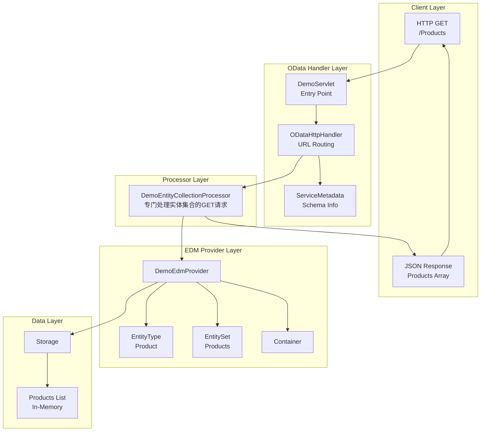
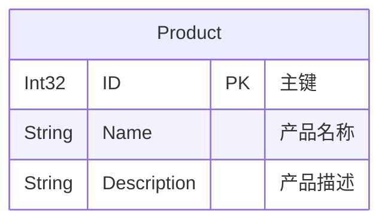
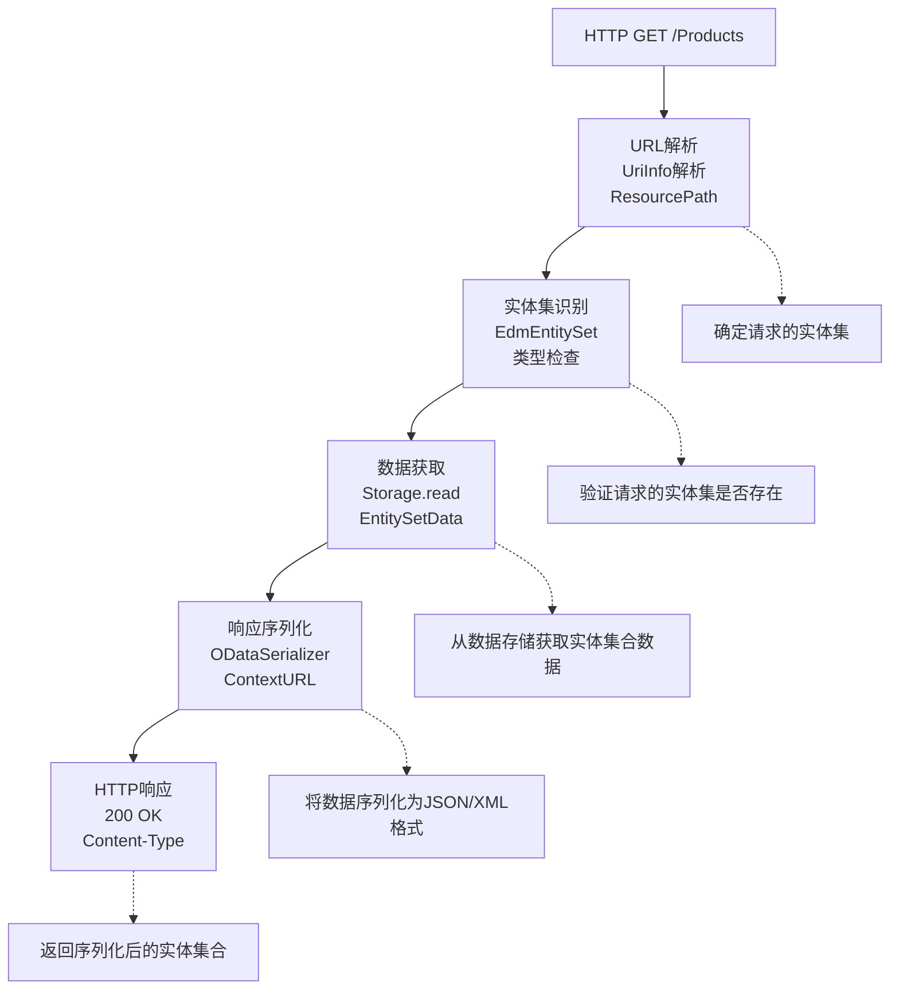

# OData Tutorial 01 - 读取实体集合 (p1_read)

## 概览

`p1_read` 项目是Apache Olingo OData V4教程的第一课，专注于实现最基础的OData功能：**读取实体集合**。这是构建OData服务的起点，展示了如何创建一个最小化的OData服务来提供实体集合的查询功能。

## 学习目标

- 理解OData服务的基本架构
- 掌握EDM（实体数据模型）的定义方法
- 学会实现EntityCollectionProcessor
- 了解OData URL约定和响应格式

## 核心架构

### 系统架构图



## 核心组件详解

### 1. DemoServlet - HTTP服务入口

**功能**：作为Web应用的入口点，配置最基础的OData服务。

**实现重点**：
```java
public class DemoServlet extends HttpServlet {
    
    @Override
    protected void service(HttpServletRequest req, HttpServletResponse resp) 
            throws ServletException, IOException {
        try {
            // 1. 创建OData实例
            OData odata = OData.newInstance();
            
            // 2. 创建服务元数据（仅包含EDM Provider）
            ServiceMetadata edm = odata.createServiceMetadata(
                new DemoEdmProvider(), 
                new ArrayList<EdmxReference>()
            );
            
            // 3. 创建处理器并只注册EntityCollectionProcessor
            ODataHttpHandler handler = odata.createHandler(edm);
            handler.register(new DemoEntityCollectionProcessor());  // 仅此一个处理器
            
            // 4. 处理请求
            handler.process(req, resp);
        } catch (RuntimeException e) {
            LOG.error("Server Error occurred in ExampleServlet", e);
            throw new ServletException(e);
        }
    }
}
```

**关键点**：
- 只注册了`EntityCollectionProcessor`，这是读取实体集合的最小配置
- 没有单实体读取、写入等其他功能

### 2. DemoEdmProvider - 数据模型定义

**功能**：定义最简单的实体数据模型，只包含Product实体。

**数据模型图**：


**实现细节**：

#### 实体类型定义
```java
@Override
public CsdlEntityType getEntityType(FullQualifiedName entityTypeName) throws ODataException {
    // 检查是否是Product实体类型
    if (entityTypeName.equals(ET_PRODUCT_FQN)) {
        
        // 1. 创建属性
        CsdlProperty id = new CsdlProperty().setName("ID")
                          .setType(EdmPrimitiveTypeKind.Int32.getFullQualifiedName());
        CsdlProperty name = new CsdlProperty().setName("Name")
                           .setType(EdmPrimitiveTypeKind.String.getFullQualifiedName());
        CsdlProperty description = new CsdlProperty().setName("Description")
                                  .setType(EdmPrimitiveTypeKind.String.getFullQualifiedName());
        
        // 2. 设置主键
        CsdlPropertyRef propertyRef = new CsdlPropertyRef();
        propertyRef.setName("ID");
        
        // 3. 创建并返回实体类型
        return new CsdlEntityType()
                .setName(ET_PRODUCT_NAME)
                .setProperties(Arrays.asList(id, name, description))
                .setKey(Collections.singletonList(propertyRef));
    }
    return null;
}
```

#### 实体集定义
```java
@Override
public CsdlEntitySet getEntitySet(FullQualifiedName entityContainer, String entitySetName) {
    if (entitySetName.equals(ES_PRODUCTS_NAME)) {
        CsdlEntitySet entitySet = new CsdlEntitySet();
        entitySet.setName(ES_PRODUCTS_NAME);
        entitySet.setType(ET_PRODUCT_FQN);  // 关联到Product实体类型
        return entitySet;
    }
    return null;
}
```

#### 容器定义
```java
@Override
public CsdlEntityContainer getEntityContainer() throws ODataException {
    // 创建实体集列表
    List<CsdlEntitySet> entitySets = new ArrayList<CsdlEntitySet>();
    entitySets.add(getEntitySet(CONTAINER, ES_PRODUCTS_NAME));
    
    // 创建容器
    CsdlEntityContainer entityContainer = new CsdlEntityContainer();
    entityContainer.setName(CONTAINER_NAME);
    entityContainer.setEntitySets(entitySets);
    
    return entityContainer;
}
```

### 3. DemoEntityCollectionProcessor - 实体集合处理器

**功能**：处理对实体集合的HTTP GET请求，是本教程的核心组件。

**处理流程图**：


**核心实现**：
```java
@Override
public void readEntityCollection(ODataRequest request, ODataResponse response, 
                                UriInfo uriInfo, ContentType responseFormat)
        throws ODataApplicationException, SerializerException {
    
    // 1. 获取请求的实体集信息
    List<UriResource> resourcePaths = uriInfo.getUriResourceParts();
    UriResourceEntitySet uriResourceEntitySet = (UriResourceEntitySet) resourcePaths.get(0);
    EdmEntitySet edmEntitySet = uriResourceEntitySet.getEntitySet();
    
    // 2. 从数据存储获取数据
    EntityCollection entitySet = getData(edmEntitySet);
    
    // 3. 序列化数据
    ODataSerializer serializer = this.odata.createSerializer(responseFormat);
    
    EdmEntityType edmEntityType = edmEntitySet.getEntityType();
    ContextURL contextUrl = ContextURL.with()
                           .entitySet(edmEntitySet)
                           .build();
    
    final String id = request.getRawBaseUri() + "/" + edmEntitySet.getName();
    EntityCollectionSerializerOptions opts = EntityCollectionSerializerOptions.with()
                                            .id(id)
                                            .contextURL(contextUrl)
                                            .build();
    
    SerializerResult serializerResult = serializer.entityCollection(
        serviceMetadata, edmEntityType, entitySet, opts);
    
    // 4. 设置响应
    response.setContent(serializerResult.getContent());
    response.setStatusCode(HttpStatusCode.OK.getStatusCode());
    response.setHeader(HttpHeader.CONTENT_TYPE, responseFormat.toContentTypeString());
}
```

### 4. Storage - 数据存储

**功能**：提供内存中的数据存储，初始化示例数据。

**数据初始化**：
```java
public class Storage {
    private List<Entity> productList;
    
    public Storage() {
        productList = new ArrayList<Entity>();
        initSampleData();
    }
    
    private void initSampleData() {
        // 产品1
        Entity product1 = new Entity()
            .addProperty(new Property(null, "ID", ValueType.PRIMITIVE, 1))
            .addProperty(new Property(null, "Name", ValueType.PRIMITIVE, "Notebook Basic 15"))
            .addProperty(new Property(null, "Description", ValueType.PRIMITIVE, 
                        "Notebook Basic, 1.7GHz - 15 XGA - 1024MB DDR2 SDRAM - 40GB"));
        product1.setId(createId("Products", 1));
        productList.add(product1);
        
        // 产品2
        Entity product2 = new Entity()
            .addProperty(new Property(null, "ID", ValueType.PRIMITIVE, 2))
            .addProperty(new Property(null, "Name", ValueType.PRIMITIVE, "1UMTS PDA"))
            .addProperty(new Property(null, "Description", ValueType.PRIMITIVE, 
                        "Ultrafast 3G UMTS/HSDPA Pocket PC, 240 x 320 LCD"));
        product2.setId(createId("Products", 2));
        productList.add(product2);
        
        // 产品3
        Entity product3 = new Entity()
            .addProperty(new Property(null, "ID", ValueType.PRIMITIVE, 3))
            .addProperty(new Property(null, "Name", ValueType.PRIMITIVE, "Ergo Screen"))
            .addProperty(new Property(null, "Description", ValueType.PRIMITIVE, 
                        "19 Optimum Resolution 1024 x 768 @ 85Hz, resolution 1280 x 960"));
        product3.setId(createId("Products", 3));
        productList.add(product3);
    }
}
```

## 关键技术点

### 1. OData URL约定

本教程支持的URL格式：
```http
# 基础服务文档
GET /DemoService.svc/

# 元数据文档
GET /DemoService.svc/$metadata

# 实体集合查询（本教程重点）
GET /DemoService.svc/Products
```

### 2. 响应格式

**JSON格式响应示例**：
```json
{
    "@odata.context": "$metadata#Products",
    "value": [
        {
            "ID": 1,
            "Name": "Notebook Basic 15",
            "Description": "Notebook Basic, 1.7GHz - 15 XGA - 1024MB DDR2 SDRAM - 40GB"
        },
        {
            "ID": 2,
            "Name": "1UMTS PDA", 
            "Description": "Ultrafast 3G UMTS/HSDPA Pocket PC, 240 x 320 LCD"
        },
        {
            "ID": 3,
            "Name": "Ergo Screen",
            "Description": "19 Optimum Resolution 1024 x 768 @ 85Hz, resolution 1280 x 960"
        }
    ]
}
```

### 3. 内容协商

OData支持多种响应格式：
- **JSON** (application/json) - 默认和推荐格式
- **XML** (application/xml) - 传统格式
- **Atom** (application/atom+xml) - 基于Atom的格式

### 4. 错误处理

基本的错误处理模式：
```java
try {
    // OData处理逻辑
    handler.process(req, resp);
} catch (RuntimeException e) {
    LOG.error("Server Error occurred in ExampleServlet", e);
    throw new ServletException(e);
}
```

## 实现步骤详解

### 步骤1：创建Servlet入口
1. 继承HttpServlet
2. 重写service方法
3. 创建OData实例和ServiceMetadata
4. 注册EntityCollectionProcessor
5. 处理HTTP请求

### 步骤2：定义数据模型
1. 创建DemoEdmProvider类
2. 定义实体类型（Product）
3. 定义实体集（Products）
4. 创建实体容器
5. 返回完整的Schema

### 步骤3：实现处理器
1. 实现EntityCollectionProcessor接口
2. 解析URI信息
3. 获取数据
4. 序列化响应
5. 设置HTTP响应头

### 步骤4：准备数据存储
1. 创建Storage类
2. 初始化示例数据
3. 提供数据访问方法

## 测试验证

### 基础功能测试

1. **启动服务**：
   ```bash
   mvn jetty:run
   ```

2. **测试请求**：
   ```bash
   # 获取服务文档
   curl http://localhost:8080/DemoService.svc/
   
   # 获取元数据
   curl http://localhost:8080/DemoService.svc/$metadata
   
   # 获取产品列表
   curl http://localhost:8080/DemoService.svc/Products
   ```

3. **验证响应**：
   - 检查HTTP状态码为200
   - 验证Content-Type为application/json
   - 确认响应包含@odata.context
   - 验证数据结构正确

## 局限性说明

本教程是最基础版本，具有以下局限性：

❌ **不支持的功能**：
- 单实体查询 (GET /Products(1))
- 创建、更新、删除操作
- 查询选项 ($filter, $orderby等)
- 导航属性
- 复杂类型
- 操作和函数

✅ **支持的功能**：
- 实体集合查询
- 基础元数据
- JSON/XML响应格式
- OData协议基础

## 后续扩展方向

1. **p2_readep**：添加单实体读取功能
2. **p3_write**：添加写入操作支持
3. **p4_navigation**：添加导航属性支持
4. **p5-p8**：添加查询选项支持
5. **p9+**：添加操作、函数、批处理等高级功能

## 总结

`p1_read` 教程建立了OData服务的基础：

- **架构基础**：展示了OData服务的基本组件和交互
- **最小实现**：实现了读取实体集合的最小功能集
- **标准遵循**：遵循OData V4协议规范
- **扩展准备**：为后续功能扩展奠定基础

这是学习OData服务开发的第一步，掌握了实体集合查询的核心机制，为理解更复杂的OData功能打下了坚实基础。
