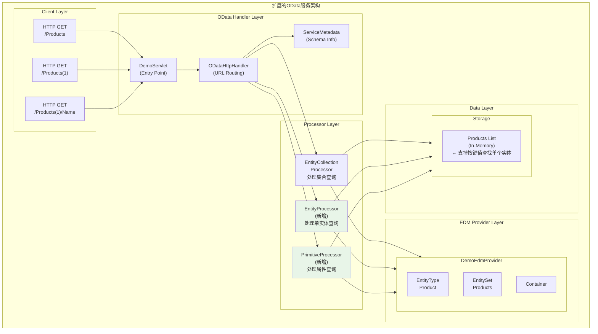
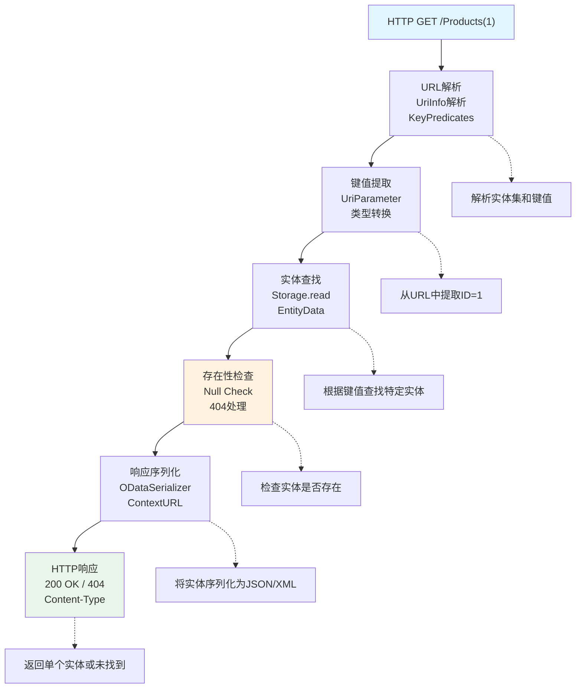

# OData Tutorial 02 - 读取单个实体 (p2_readep)

## 概览

`p2_readep` 项目是Apache Olingo OData V4教程的第二课，在p1_read的基础上扩展了**读取单个实体**的功能。本教程展示了如何处理带有键值的URL请求，以及如何读取实体的属性值。

## 学习目标

- 学会实现EntityProcessor接口
- 掌握URI键值解析技术
- 理解PrimitiveProcessor的作用
- 学会处理实体属性访问

## 功能对比

| 功能 | p1_read | p2_readep |
|------|---------|-----------|
| 读取实体集合 | ✅ | ✅ |
| 读取单个实体 | ❌ | ✅ |
| 读取实体属性 | ❌ | ✅ |
| 键值解析 | ❌ | ✅ |

## 核心架构

### 系统架构图



## 新增组件详解

### 1. DemoEntityProcessor - 单实体处理器

**功能**：处理对单个实体的HTTP GET请求，支持键值解析。

**处理流程图**：


**核心实现**：
```java
@Override
public void readEntity(ODataRequest request, ODataResponse response, UriInfo uriInfo, 
                      ContentType responseFormat) throws ODataApplicationException, SerializerException {
    
    // 1. 获取请求的实体集信息
    List<UriResource> resourcePaths = uriInfo.getUriResourceParts();
    UriResourceEntitySet uriResourceEntitySet = (UriResourceEntitySet) resourcePaths.get(0);
    EdmEntitySet edmEntitySet = uriResourceEntitySet.getEntitySet();
    
    // 2. 提取键值参数
    List<UriParameter> keyPredicates = uriResourceEntitySet.getKeyPredicates();
    
    // 3. 根据键值查找实体
    Entity entity = storage.readEntityData(edmEntitySet, keyPredicates);
    
    if (entity == null) {
        // 4. 如果实体不存在，返回404
        throw new ODataApplicationException("Entity not found", 
                                          HttpStatusCode.NOT_FOUND.getStatusCode(), 
                                          Locale.ENGLISH);
    }
    
    // 5. 序列化实体
    ODataSerializer serializer = odata.createSerializer(responseFormat);
    
    EdmEntityType edmEntityType = edmEntitySet.getEntityType();
    ContextURL contextUrl = ContextURL.with()
                           .entitySet(edmEntitySet)
                           .suffix(Suffix.ENTITY)
                           .build();
    
    EntitySerializerOptions options = EntitySerializerOptions.with()
                                     .contextURL(contextUrl)
                                     .build();
    
    SerializerResult serializerResult = serializer.entity(serviceMetadata, 
                                                          edmEntityType, entity, options);
    
    // 6. 设置响应
    response.setContent(serializerResult.getContent());
    response.setStatusCode(HttpStatusCode.OK.getStatusCode());
    response.setHeader(HttpHeader.CONTENT_TYPE, responseFormat.toContentTypeString());
}
```

### 2. DemoPrimitiveProcessor - 属性值处理器

**功能**：处理对实体属性的HTTP GET请求，返回特定属性的值。

**处理流程图**：
```mermaid
flowchart TD
    A["HTTP GET /Products(1)/Name"] --> B["URL解析<br/>UriInfo解析<br/>ResourceParts"]
    B --> C["实体查找<br/>Entity by Key"]
    C --> D["属性提取<br/>Property Value<br/>Type Check"]
    D --> E["值序列化<br/>Primitive<br/>Serializer"]
    E --> F["HTTP响应<br/>200 OK<br/>{\"value\": \"...\"}"]
    
    B -.-> B1["解析实体集、键值和属性名"]
    C -.-> C1["先找到目标实体"]
    D -.-> D1["从实体中提取指定属性值"]
    E -.-> E1["将属性值序列化为JSON格式"]
    F -.-> F1["返回属性值"]
    
    style A fill:#e1f5fe
    style D fill:#fff3e0
    style F fill:#e8f5e8
```

**核心实现**：
```java
@Override
public void readPrimitive(ODataRequest request, ODataResponse response, UriInfo uriInfo, 
                         ContentType responseFormat) throws ODataApplicationException, SerializerException {
    
    // 1. 解析URI路径 
    List<UriResource> resourceParts = uriInfo.getUriResourceParts();
    
    // 第一部分：实体集和键值
    UriResourceEntitySet uriResourceEntitySet = (UriResourceEntitySet) resourceParts.get(0);
    EdmEntitySet edmEntitySet = uriResourceEntitySet.getEntitySet();
    List<UriParameter> keyPredicates = uriResourceEntitySet.getKeyPredicates();
    
    // 第二部分：属性名
    UriResourceProperty uriProperty = (UriResourceProperty) resourceParts.get(1);
    EdmProperty edmProperty = uriProperty.getProperty();
    String propertyName = edmProperty.getName();
    
    // 2. 查找实体
    Entity entity = storage.readEntityData(edmEntitySet, keyPredicates);
    if (entity == null) {
        throw new ODataApplicationException("Entity not found", 
                                          HttpStatusCode.NOT_FOUND.getStatusCode(), 
                                          Locale.ENGLISH);
    }
    
    // 3. 获取属性值
    Property property = entity.getProperty(propertyName);
    if (property == null) {
        throw new ODataApplicationException("Property not found", 
                                          HttpStatusCode.NOT_FOUND.getStatusCode(), 
                                          Locale.ENGLISH);
    }
    
    // 4. 序列化属性值
    Object value = property.getValue();
    ODataSerializer serializer = odata.createSerializer(responseFormat);
    
    ContextURL contextUrl = ContextURL.with()
                           .entitySet(edmEntitySet)
                           .keyPath(Util.getKeyPredicatesAsString(keyPredicates))
                           .navOrPropertyPath(propertyName)
                           .build();
    
    PrimitiveSerializerOptions options = PrimitiveSerializerOptions.with()
                                        .contextURL(contextUrl)
                                        .build();
    
    SerializerResult serializerResult = serializer.primitive(serviceMetadata, 
                                                            (EdmPrimitiveType) edmProperty.getType(), 
                                                            property, options);
    
    // 5. 设置响应
    response.setContent(serializerResult.getContent());
    response.setStatusCode(HttpStatusCode.OK.getStatusCode());
    response.setHeader(HttpHeader.CONTENT_TYPE, responseFormat.toContentTypeString());
}
```

### 3. Storage扩展 - 键值查找支持

**功能**：扩展数据存储以支持根据键值查找单个实体。

**实现对比**：

#### p1_read版本（仅支持集合查询）：
```java
public EntityCollection readEntitySetData(EdmEntitySet edmEntitySet) {
    if (edmEntitySet.getName().equals(DemoEdmProvider.ES_PRODUCTS_NAME)) {
        return getProducts();  // 返回所有产品
    }
    return null;
}
```

#### p2_readep版本（新增单实体查询）：
```java
public Entity readEntityData(EdmEntitySet edmEntitySet, List<UriParameter> keyParams) 
        throws ODataApplicationException {
    
    EdmEntityType edmEntityType = edmEntitySet.getEntityType();
    
    // 检查实体类型
    if (edmEntityType.getName().equals(DemoEdmProvider.ET_PRODUCT_NAME)) {
        return getProduct(edmEntityType, keyParams);
    }
    
    return null;
}

private Entity getProduct(EdmEntityType edmEntityType, List<UriParameter> keyParams) 
        throws ODataApplicationException {
    
    // 1. 获取实体的键属性
    List<EdmKeyPropertyRef> keyPropertyRefs = edmEntityType.getKeyPropertyRefs();
    
    // 2. 从URL参数中提取键值
    EdmKeyPropertyRef keyPropertyRef = keyPropertyRefs.get(0); // 假设只有一个键
    String keyPropertyName = keyPropertyRef.getName();
    UriParameter keyParam = keyParams.get(0);
    
    // 3. 转换键值类型
    String keyText = keyParam.getText();
    if (keyParam.getAlias() != null) {
        keyText = keyParam.getAlias();
    }
    
    Object keyValue;
    try {
        EdmProperty keyProperty = (EdmProperty) keyPropertyRef.getProperty();
        EdmPrimitiveType keyType = (EdmPrimitiveType) keyProperty.getType();
        keyValue = keyType.valueOfString(keyText, keyProperty.isNullable(), 
                                        keyProperty.getMaxLength(), 
                                        keyProperty.getPrecision(), 
                                        keyProperty.getScale(), 
                                        true, Integer.class);
    } catch (EdmPrimitiveTypeException e) {
        throw new ODataApplicationException("Invalid key", 
                                          HttpStatusCode.BAD_REQUEST.getStatusCode(), 
                                          Locale.ENGLISH);
    }
    
    // 4. 在数据列表中查找匹配的实体
    for (Entity productEntity : productList) {
        Object idValue = productEntity.getProperty("ID").getValue();
        if (idValue.equals(keyValue)) {
            return productEntity;
        }
    }
    
    return null; // 未找到匹配的实体
}
```

## 支持的URL模式

### 新增的URL支持

| URL模式 | 说明 | 响应 |
|---------|------|------|
| `/Products(1)` | 获取ID为1的产品 | 单个产品实体 |
| `/Products(2)` | 获取ID为2的产品 | 单个产品实体 |
| `/Products(999)` | 获取不存在的产品 | HTTP 404 |
| `/Products(1)/Name` | 获取产品1的名称 | 属性值 |
| `/Products(1)/Description` | 获取产品1的描述 | 属性值 |

### 响应格式示例

#### 单实体响应
```json
{
    "@odata.context": "$metadata#Products/$entity",
    "ID": 1,
    "Name": "Notebook Basic 15",
    "Description": "Notebook Basic, 1.7GHz - 15 XGA - 1024MB DDR2 SDRAM - 40GB"
}
```

#### 属性值响应
```json
{
    "@odata.context": "$metadata#Products(1)/Name",
    "value": "Notebook Basic 15"
}
```

#### 404错误响应
```json
{
    "error": {
        "code": null,
        "message": "Entity not found"
    }
}
```

## 关键技术点

### 1. URI解析机制

OData框架通过`UriInfo`提供了强大的URI解析能力：

```java
// URI: /Products(1)/Name
List<UriResource> resourceParts = uriInfo.getUriResourceParts();

// resourceParts[0]: UriResourceEntitySet - Products(1)
UriResourceEntitySet entitySetResource = (UriResourceEntitySet) resourceParts.get(0);
EdmEntitySet edmEntitySet = entitySetResource.getEntitySet(); // Products
List<UriParameter> keyPredicates = entitySetResource.getKeyPredicates(); // (1)

// resourceParts[1]: UriResourceProperty - Name  
UriResourceProperty propertyResource = (UriResourceProperty) resourceParts.get(1);
EdmProperty edmProperty = propertyResource.getProperty(); // Name
```

### 2. 键值类型转换

OData支持多种键值类型，需要正确的类型转换：

```java
// 字符串键值转换为目标类型
EdmPrimitiveType keyType = (EdmPrimitiveType) keyProperty.getType();
Object keyValue = keyType.valueOfString(
    keyText,                    // 原始字符串值
    keyProperty.isNullable(),   // 是否可为空
    keyProperty.getMaxLength(), // 最大长度
    keyProperty.getPrecision(), // 精度
    keyProperty.getScale(),     // 小数位数
    true,                       // 是否Unicode
    Integer.class               // 目标Java类型
);
```

### 3. 上下文URL构建

不同类型的请求需要不同的上下文URL：

```java
// 单实体请求: Products(1)
ContextURL contextUrl = ContextURL.with()
                       .entitySet(edmEntitySet)
                       .suffix(Suffix.ENTITY)
                       .build();
// 结果: $metadata#Products/$entity

// 属性请求: Products(1)/Name  
ContextURL contextUrl = ContextURL.with()
                       .entitySet(edmEntitySet)
                       .keyPath("1")
                       .navOrPropertyPath("Name")
                       .build();
// 结果: $metadata#Products(1)/Name
```

## 实现步骤详解

### 步骤1：更新Servlet配置
```java
// 在DemoServlet中注册新的处理器
ODataHttpHandler handler = odata.createHandler(edm);
handler.register(new DemoEntityCollectionProcessor(storage)); // 原有
handler.register(new DemoEntityProcessor(storage));           // 新增
handler.register(new DemoPrimitiveProcessor(storage));        // 新增
```

### 步骤2：实现EntityProcessor
1. 实现`EntityProcessor`接口
2. 重写`readEntity`方法
3. 解析键值参数
4. 查找对应实体
5. 序列化响应

### 步骤3：实现PrimitiveProcessor
1. 实现`PrimitiveProcessor`接口
2. 重写`readPrimitive`方法
3. 解析实体和属性路径
4. 提取属性值
5. 序列化属性值

### 步骤4：扩展Storage类
1. 添加`readEntityData`方法
2. 实现键值解析逻辑
3. 实现实体查找算法
4. 处理类型转换和错误情况

## 测试验证

### 功能测试用例

1. **单实体查询测试**：
   ```bash
   # 正常情况
   curl http://localhost:8080/DemoService.svc/Products(1)
   # 应返回200和完整实体
   
   # 不存在的实体
   curl http://localhost:8080/DemoService.svc/Products(999)
   # 应返回404错误
   ```

2. **属性值查询测试**：
   ```bash
   # 获取产品名称
   curl http://localhost:8080/DemoService.svc/Products(1)/Name
   # 应返回200和属性值
   
   # 获取产品描述
   curl http://localhost:8080/DemoService.svc/Products(2)/Description
   # 应返回200和属性值
   ```

3. **错误处理测试**：
   ```bash
   # 无效键值
   curl http://localhost:8080/DemoService.svc/Products(abc)
   # 应返回400错误
   
   # 不存在的属性
   curl http://localhost:8080/DemoService.svc/Products(1)/InvalidProperty
   # 应返回404错误
   ```

## 与p1_read的比较

| 方面 | p1_read | p2_readep |
|------|---------|-----------|
| **支持的URL** | `/Products` | `/Products`, `/Products(1)`, `/Products(1)/Name` |
| **处理器** | EntityCollectionProcessor | + EntityProcessor, PrimitiveProcessor |
| **数据访问** | 集合查询 | 集合查询 + 键值查询 |
| **错误处理** | 基础错误 | + 404未找到, 400无效键值 |
| **响应类型** | 实体集合 | 实体集合 + 单实体 + 属性值 |

## 后续扩展

`p2_readep`为后续教程奠定了基础：

1. **p3_write**：在单实体查询基础上添加写入操作
2. **p4_navigation**：扩展实体关系和导航
3. **p5-p8**：添加查询选项到单实体查询
4. **p9+**：添加复杂操作和函数

## 总结

`p2_readep`教程扩展了OData服务的核心读取能力：

- **单实体访问**：支持通过键值访问特定实体
- **属性值访问**：支持直接获取实体属性值
- **键值解析**：实现了完整的键值类型转换机制
- **错误处理**：添加了适当的HTTP状态码处理
- **架构完善**：为后续功能扩展提供了坚实基础

这是构建完整OData服务的重要一步，掌握了实体访问的核心机制。
