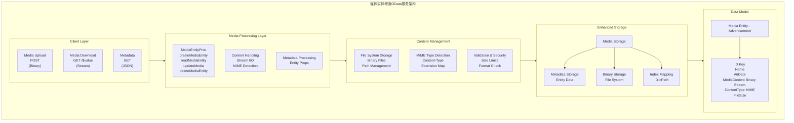

# OData Tutorial 10 - 媒体实体(Media Entity) (p10_media)

## 概览

`p10_media` 项目是Apache Olingo OData V4教程的第十课，专门讲解**媒体实体(Media Entity)**功能的实现。媒体实体是OData中处理二进制内容（如图片、文档、视频等）的标准方式，它将媒体数据与实体元数据分离，提供了高效的媒体内容管理机制。

## 学习目标

- 理解媒体实体的概念和应用场景
- 掌握MediaEntityProcessor的实现方法
- 学会处理媒体内容的上传、下载和更新
- 了解媒体实体的元数据管理和内容类型处理

## 媒体实体概念

### 媒体实体特性
- **二进制内容**：专门处理非结构化的二进制数据
- **元数据分离**：媒体内容与实体属性分开存储和管理
- **流式处理**：支持大文件的流式传输
- **MIME类型**：自动处理和识别媒体内容类型

### 媒体实体操作
| 操作 | HTTP方法 | 描述 |
|------|----------|------|
| **上传媒体** | POST | 创建新的媒体实体 |
| **读取媒体** | GET | 获取媒体内容或元数据 |
| **更新媒体** | PUT | 替换媒体内容 |
| **删除媒体** | DELETE | 删除媒体实体 |

## 核心架构

### 媒体实体架构图



## EDM 媒体实体定义

### 1. 媒体实体类型定义
```java
public class DemoEdmProvider extends CsdlAbstractEdmProvider {
    
    // 媒体实体集名称
    public static final String ES_ADVERTISEMENTS = "Advertisements";
    
    // 媒体实体类型名称
    public static final String ET_ADVERTISEMENT = "Advertisement";
    
    @Override
    public CsdlEntityType getEntityType(FullQualifiedName entityTypeName) {
        if (entityTypeName.equals(ET_ADVERTISEMENT_FQN)) {
            return getAdvertisementEntityType();
        }
        // ... 处理其他实体类型
        return null;
    }
    
    private CsdlEntityType getAdvertisementEntityType() {
        // 创建属性
        CsdlProperty id = new CsdlProperty().setName("ID")
                                           .setType(EdmPrimitiveTypeKind.String.getFullQualifiedName())
                                           .setNullable(false);
        
        CsdlProperty name = new CsdlProperty().setName("Name")
                                             .setType(EdmPrimitiveTypeKind.String.getFullQualifiedName())
                                             .setNullable(false);
        
        CsdlProperty airDate = new CsdlProperty().setName("AirDate")
                                                .setType(EdmPrimitiveTypeKind.DateTimeOffset.getFullQualifiedName())
                                                .setNullable(true);
        
        // 媒体相关属性
        CsdlProperty contentType = new CsdlProperty().setName("ContentType")
                                                    .setType(EdmPrimitiveTypeKind.String.getFullQualifiedName())
                                                    .setNullable(true);
        
        CsdlProperty fileSize = new CsdlProperty().setName("FileSize")
                                                 .setType(EdmPrimitiveTypeKind.Int64.getFullQualifiedName())
                                                 .setNullable(true);
        
        // 创建主键
        CsdlPropertyRef propertyRef = new CsdlPropertyRef();
        propertyRef.setName("ID");
        
        // 组装实体类型
        CsdlEntityType entityType = new CsdlEntityType();
        entityType.setName(ET_ADVERTISEMENT);
        entityType.setProperties(Arrays.asList(id, name, airDate, contentType, fileSize));
        entityType.setKey(Collections.singletonList(propertyRef));
        
        // 关键：标记为媒体实体类型
        entityType.setHasStream(true);
        
        return entityType;
    }
    
    @Override
    public CsdlEntitySet getEntitySet(FullQualifiedName entityContainer, String entitySetName) {
        if (entitySetName.equals(ES_ADVERTISEMENTS)) {
            CsdlEntitySet entitySet = new CsdlEntitySet();
            entitySet.setName(ES_ADVERTISEMENTS);
            entitySet.setType(ET_ADVERTISEMENT_FQN);
            return entitySet;
        }
        // ... 处理其他实体集
        return null;
    }
}
```

## 媒体实体处理器

### 1. MediaEntityProcessor 核心实现
```java
public class DemoMediaEntityProcessor implements MediaEntityProcessor {
    
    private Storage storage;
    private OData odata;
    private ServiceMetadata serviceMetadata;
    
    public DemoMediaEntityProcessor(Storage storage) {
        this.storage = storage;
    }
    
    @Override
    public void init(OData odata, ServiceMetadata serviceMetadata) {
        this.odata = odata;
        this.serviceMetadata = serviceMetadata;
    }
    
    @Override
    public void createMediaEntity(ODataRequest request, ODataResponse response, UriInfo uriInfo, 
                                ContentType requestFormat, ContentType responseFormat)
            throws ODataApplicationException, ODataLibraryException {
        
        // 获取目标实体集
        EdmEntitySet edmEntitySet = Util.getEdmEntitySet(uriInfo);
        
        if (!DemoEdmProvider.ES_ADVERTISEMENTS.equals(edmEntitySet.getName())) {
            throw new ODataApplicationException("Media entity operations only supported for Advertisements",
                                              HttpStatusCode.BAD_REQUEST.getStatusCode(),
                                              Locale.ROOT);
        }
        
        try {
            // 读取媒体内容
            InputStream mediaContent = request.getBody();
            String contentType = request.getHeader(HttpHeader.CONTENT_TYPE);
            
            // 创建媒体实体
            Entity createdEntity = storage.createMediaEntity(mediaContent, contentType);
            
            // 构建响应
            buildMediaEntityResponse(response, edmEntitySet, createdEntity, responseFormat);
            
        } catch (Exception e) {
            throw new ODataApplicationException("Failed to create media entity",
                                              HttpStatusCode.INTERNAL_SERVER_ERROR.getStatusCode(),
                                              Locale.ROOT, e);
        }
    }
    
    @Override
    public void readMediaEntity(ODataRequest request, ODataResponse response, UriInfo uriInfo, 
                              ContentType responseFormat)
            throws ODataApplicationException, ODataLibraryException {
        
        // 获取实体键
        EdmEntitySet edmEntitySet = Util.getEdmEntitySet(uriInfo);
        List<UriParameter> keyPredicates = uriInfo.getKeyPredicates();
        
        // 提取实体ID
        String entityId = keyPredicates.get(0).getText().replace("'", "");
        
        // 检查是否请求媒体内容（$value）
        if (uriInfo.getUriResourceParts().get(uriInfo.getUriResourceParts().size() - 1) 
                instanceof UriResourceValue) {
            // 返回媒体内容
            returnMediaContent(response, entityId);
        } else {
            // 返回实体元数据
            returnEntityMetadata(response, edmEntitySet, entityId, responseFormat);
        }
    }
    
    @Override
    public void updateMediaEntity(ODataRequest request, ODataResponse response, UriInfo uriInfo, 
                                ContentType requestFormat, ContentType responseFormat)
            throws ODataApplicationException, ODataLibraryException {
        
        // 获取实体键
        List<UriParameter> keyPredicates = uriInfo.getKeyPredicates();
        String entityId = keyPredicates.get(0).getText().replace("'", "");
        
        try {
            // 读取新的媒体内容
            InputStream newMediaContent = request.getBody();
            String contentType = request.getHeader(HttpHeader.CONTENT_TYPE);
            
            // 更新媒体内容
            storage.updateMediaContent(entityId, newMediaContent, contentType);
            
            // 返回成功响应
            response.setStatusCode(HttpStatusCode.NO_CONTENT.getStatusCode());
            
        } catch (Exception e) {
            throw new ODataApplicationException("Failed to update media entity",
                                              HttpStatusCode.INTERNAL_SERVER_ERROR.getStatusCode(),
                                              Locale.ROOT, e);
        }
    }
    
    @Override
    public void deleteMediaEntity(ODataRequest request, ODataResponse response, UriInfo uriInfo)
            throws ODataApplicationException, ODataLibraryException {
        
        // 获取实体键
        List<UriParameter> keyPredicates = uriInfo.getKeyPredicates();
        String entityId = keyPredicates.get(0).getText().replace("'", "");
        
        try {
            // 删除媒体实体
            storage.deleteMediaEntity(entityId);
            
            // 返回成功响应
            response.setStatusCode(HttpStatusCode.NO_CONTENT.getStatusCode());
            
        } catch (Exception e) {
            throw new ODataApplicationException("Failed to delete media entity",
                                              HttpStatusCode.INTERNAL_SERVER_ERROR.getStatusCode(),
                                              Locale.ROOT, e);
        }
    }
    
    private void returnMediaContent(ODataResponse response, String entityId) 
            throws ODataApplicationException {
        
        MediaInfo mediaInfo = storage.getMediaContent(entityId);
        
        if (mediaInfo == null) {
            throw new ODataApplicationException("Media entity not found",
                                              HttpStatusCode.NOT_FOUND.getStatusCode(),
                                              Locale.ROOT);
        }
        
        // 设置响应头
        response.setStatusCode(HttpStatusCode.OK.getStatusCode());
        response.setHeader(HttpHeader.CONTENT_TYPE, mediaInfo.getContentType());
        response.setHeader(HttpHeader.CONTENT_LENGTH, String.valueOf(mediaInfo.getFileSize()));
        
        // 设置媒体内容
        response.setContent(mediaInfo.getContentStream());
    }
    
    private void returnEntityMetadata(ODataResponse response, EdmEntitySet edmEntitySet, 
                                    String entityId, ContentType responseFormat) 
            throws ODataApplicationException, ODataLibraryException {
        
        Entity entity = storage.getMediaEntityMetadata(entityId);
        
        if (entity == null) {
            throw new ODataApplicationException("Media entity not found",
                                              HttpStatusCode.NOT_FOUND.getStatusCode(),
                                              Locale.ROOT);
        }
        
        // 序列化实体元数据
        ODataSerializer serializer = odata.createSerializer(responseFormat);
        
        EntitySerializerOptions options = EntitySerializerOptions.with()
                .contextURL(ContextURL.with()
                           .entitySet(edmEntitySet)
                           .suffix(Suffix.ENTITY)
                           .build())
                .build();
        
        SerializerResult serializerResult = serializer.entity(serviceMetadata, 
                                                             edmEntitySet.getEntityType(), 
                                                             entity, 
                                                             options);
        
        // 设置响应
        response.setStatusCode(HttpStatusCode.OK.getStatusCode());
        response.setContent(serializerResult.getContent());
        response.setHeader(HttpHeader.CONTENT_TYPE, responseFormat.toContentTypeString());
    }
    
    private void buildMediaEntityResponse(ODataResponse response, EdmEntitySet edmEntitySet, 
                                        Entity createdEntity, ContentType responseFormat) 
            throws ODataApplicationException, ODataLibraryException {
        
        // 设置响应状态
        response.setStatusCode(HttpStatusCode.CREATED.getStatusCode());
        
        // 创建序列化器
        ODataSerializer serializer = odata.createSerializer(responseFormat);
        
        // 序列化创建的实体
        EntitySerializerOptions options = EntitySerializerOptions.with()
                .contextURL(ContextURL.with()
                           .entitySet(edmEntitySet)
                           .suffix(Suffix.ENTITY)
                           .build())
                .build();
        
        SerializerResult serializerResult = serializer.entity(serviceMetadata, 
                                                             edmEntitySet.getEntityType(), 
                                                             createdEntity, 
                                                             options);
        
        // 设置响应内容
        response.setContent(serializerResult.getContent());
        response.setHeader(HttpHeader.CONTENT_TYPE, responseFormat.toContentTypeString());
        
        // 设置Location头
        String entityId = (String) createdEntity.getProperty("ID").getValue();
        String location = request.getRawBaseUri() + "/" + 
                         edmEntitySet.getName() + "('" + entityId + "')";
        response.setHeader(HttpHeader.LOCATION, location);
    }
}
```

## 媒体存储实现

### 1. Storage 媒体支持
```java
public class Storage {
    
    // 媒体实体元数据存储
    private List<Entity> advertisementList = new ArrayList<>();
    
    // 媒体文件存储路径
    private static final String MEDIA_STORAGE_PATH = "media_storage";
    
    // 媒体信息映射
    private Map<String, MediaInfo> mediaInfoMap = new HashMap<>();
    
    // ID生成器
    private int nextAdvertisementID = 1;
    
    public Storage() {
        // 确保媒体存储目录存在
        initializeMediaStorage();
        
        // 初始化示例数据
        initializeAdvertisements();
    }
    
    public Entity createMediaEntity(InputStream mediaContent, String contentType) 
            throws ODataApplicationException {
        
        try {
            // 生成实体ID
            String entityId = "AD" + nextAdvertisementID++;
            
            // 检测MIME类型
            String detectedContentType = detectContentType(mediaContent, contentType);
            
            // 保存媒体文件
            String fileName = saveMediaFile(entityId, mediaContent, detectedContentType);
            
            // 获取文件大小
            File mediaFile = new File(MEDIA_STORAGE_PATH, fileName);
            long fileSize = mediaFile.length();
            
            // 创建实体元数据
            Entity entity = new Entity();
            entity.addProperty(new Property(null, "ID", ValueType.PRIMITIVE, entityId));
            entity.addProperty(new Property(null, "Name", ValueType.PRIMITIVE, "Advertisement " + entityId));
            entity.addProperty(new Property(null, "AirDate", ValueType.PRIMITIVE, 
                                          Timestamp.valueOf(LocalDateTime.now())));
            entity.addProperty(new Property(null, "ContentType", ValueType.PRIMITIVE, detectedContentType));
            entity.addProperty(new Property(null, "FileSize", ValueType.PRIMITIVE, fileSize));
            
            // 保存实体元数据
            advertisementList.add(entity);
            
            // 保存媒体信息映射
            MediaInfo mediaInfo = new MediaInfo(fileName, detectedContentType, fileSize);
            mediaInfoMap.put(entityId, mediaInfo);
            
            return entity;
            
        } catch (Exception e) {
            throw new ODataApplicationException("Failed to create media entity",
                                              HttpStatusCode.INTERNAL_SERVER_ERROR.getStatusCode(),
                                              Locale.ROOT, e);
        }
    }
    
    public MediaInfo getMediaContent(String entityId) {
        MediaInfo mediaInfo = mediaInfoMap.get(entityId);
        if (mediaInfo == null) {
            return null;
        }
        
        try {
            // 创建文件输入流
            File mediaFile = new File(MEDIA_STORAGE_PATH, mediaInfo.getFileName());
            FileInputStream contentStream = new FileInputStream(mediaFile);
            
            return new MediaInfo(mediaInfo.getFileName(), 
                               mediaInfo.getContentType(), 
                               mediaInfo.getFileSize(), 
                               contentStream);
            
        } catch (FileNotFoundException e) {
            return null;
        }
    }
    
    public Entity getMediaEntityMetadata(String entityId) {
        return advertisementList.stream()
                               .filter(entity -> entityId.equals(entity.getProperty("ID").getValue()))
                               .findFirst()
                               .orElse(null);
    }
    
    public void updateMediaContent(String entityId, InputStream newMediaContent, String contentType) 
            throws ODataApplicationException {
        
        // 检查实体是否存在
        Entity entity = getMediaEntityMetadata(entityId);
        if (entity == null) {
            throw new ODataApplicationException("Media entity not found",
                                              HttpStatusCode.NOT_FOUND.getStatusCode(),
                                              Locale.ROOT);
        }
        
        try {
            // 删除旧文件
            MediaInfo oldMediaInfo = mediaInfoMap.get(entityId);
            if (oldMediaInfo != null) {
                File oldFile = new File(MEDIA_STORAGE_PATH, oldMediaInfo.getFileName());
                oldFile.delete();
            }
            
            // 检测MIME类型
            String detectedContentType = detectContentType(newMediaContent, contentType);
            
            // 保存新文件
            String fileName = saveMediaFile(entityId, newMediaContent, detectedContentType);
            
            // 获取文件大小
            File mediaFile = new File(MEDIA_STORAGE_PATH, fileName);
            long fileSize = mediaFile.length();
            
            // 更新实体元数据
            entity.getProperty("ContentType").setValue(detectedContentType);
            entity.getProperty("FileSize").setValue(fileSize);
            
            // 更新媒体信息映射
            MediaInfo newMediaInfo = new MediaInfo(fileName, detectedContentType, fileSize);
            mediaInfoMap.put(entityId, newMediaInfo);
            
        } catch (Exception e) {
            throw new ODataApplicationException("Failed to update media content",
                                              HttpStatusCode.INTERNAL_SERVER_ERROR.getStatusCode(),
                                              Locale.ROOT, e);
        }
    }
    
    public void deleteMediaEntity(String entityId) throws ODataApplicationException {
        
        // 删除实体元数据
        boolean removed = advertisementList.removeIf(entity -> 
                entityId.equals(entity.getProperty("ID").getValue()));
        
        if (!removed) {
            throw new ODataApplicationException("Media entity not found",
                                              HttpStatusCode.NOT_FOUND.getStatusCode(),
                                              Locale.ROOT);
        }
        
        // 删除媒体文件
        MediaInfo mediaInfo = mediaInfoMap.remove(entityId);
        if (mediaInfo != null) {
            File mediaFile = new File(MEDIA_STORAGE_PATH, mediaInfo.getFileName());
            mediaFile.delete();
        }
    }
    
    // 辅助方法
    private void initializeMediaStorage() {
        File storageDir = new File(MEDIA_STORAGE_PATH);
        if (!storageDir.exists()) {
            storageDir.mkdirs();
        }
    }
    
    private String detectContentType(InputStream mediaContent, String providedContentType) {
        // 如果提供了内容类型，进行验证
        if (providedContentType != null && !providedContentType.trim().isEmpty()) {
            return providedContentType.trim();
        }
        
        // 简单的MIME类型检测（实际应用中可以使用更复杂的检测逻辑）
        return "application/octet-stream"; // 默认二进制类型
    }
    
    private String saveMediaFile(String entityId, InputStream mediaContent, String contentType) 
            throws IOException {
        
        // 根据内容类型确定文件扩展名
        String extension = getFileExtensionFromContentType(contentType);
        String fileName = entityId + extension;
        
        // 保存文件
        File mediaFile = new File(MEDIA_STORAGE_PATH, fileName);
        try (FileOutputStream outputStream = new FileOutputStream(mediaFile)) {
            byte[] buffer = new byte[8192];
            int bytesRead;
            while ((bytesRead = mediaContent.read(buffer)) != -1) {
                outputStream.write(buffer, 0, bytesRead);
            }
        }
        
        return fileName;
    }
    
    private String getFileExtensionFromContentType(String contentType) {
        switch (contentType.toLowerCase()) {
            case "image/jpeg":
            case "image/jpg":
                return ".jpg";
            case "image/png":
                return ".png";
            case "image/gif":
                return ".gif";
            case "text/plain":
                return ".txt";
            case "application/pdf":
                return ".pdf";
            case "video/mp4":
                return ".mp4";
            default:
                return ".bin"; // 默认二进制文件
        }
    }
    
    private void initializeAdvertisements() {
        // 可以初始化一些示例广告实体（不包含媒体内容）
        Entity ad1 = new Entity();
        ad1.addProperty(new Property(null, "ID", ValueType.PRIMITIVE, "AD001"));
        ad1.addProperty(new Property(null, "Name", ValueType.PRIMITIVE, "Summer Sale Campaign"));
        ad1.addProperty(new Property(null, "AirDate", ValueType.PRIMITIVE, 
                                    Timestamp.valueOf(LocalDateTime.now().minusDays(10))));
        ad1.addProperty(new Property(null, "ContentType", ValueType.PRIMITIVE, null));
        ad1.addProperty(new Property(null, "FileSize", ValueType.PRIMITIVE, null));
        
        advertisementList.add(ad1);
    }
}

// 媒体信息类
class MediaInfo {
    private String fileName;
    private String contentType;
    private long fileSize;
    private InputStream contentStream;
    
    public MediaInfo(String fileName, String contentType, long fileSize) {
        this.fileName = fileName;
        this.contentType = contentType;
        this.fileSize = fileSize;
    }
    
    public MediaInfo(String fileName, String contentType, long fileSize, InputStream contentStream) {
        this(fileName, contentType, fileSize);
        this.contentStream = contentStream;
    }
    
    // Getters
    public String getFileName() { return fileName; }
    public String getContentType() { return contentType; }
    public long getFileSize() { return fileSize; }
    public InputStream getContentStream() { return contentStream; }
}
```

## 媒体实体操作示例

### 1. 上传媒体内容
```bash
# 上传图片文件
curl -X POST http://localhost:8080/DemoService.svc/Advertisements \
     -H "Content-Type: image/jpeg" \
     --data-binary @sample_image.jpg

# 预期响应
{
    "@odata.context": "$metadata#Advertisements/$entity",
    "ID": "AD1",
    "Name": "Advertisement AD1",
    "AirDate": "2024-01-20T10:30:00Z",
    "ContentType": "image/jpeg",
    "FileSize": 245678
}
```

### 2. 获取媒体实体元数据
```bash
# 获取实体元数据
curl -X GET http://localhost:8080/DemoService.svc/Advertisements\(\'AD1\'\)

# 预期响应
{
    "@odata.context": "$metadata#Advertisements/$entity",
    "ID": "AD1",
    "Name": "Advertisement AD1",
    "AirDate": "2024-01-20T10:30:00Z",
    "ContentType": "image/jpeg",
    "FileSize": 245678,
    "@odata.mediaReadLink": "Advertisements('AD1')/$value"
}
```

### 3. 下载媒体内容
```bash
# 下载媒体内容
curl -X GET http://localhost:8080/DemoService.svc/Advertisements\(\'AD1\'\)/\$value \
     --output downloaded_image.jpg

# 服务器返回二进制内容，保存为文件
```

### 4. 更新媒体内容
```bash
# 更新媒体内容
curl -X PUT http://localhost:8080/DemoService.svc/Advertisements\(\'AD1\'\)/\$value \
     -H "Content-Type: image/png" \
     --data-binary @new_image.png

# 预期响应：204 No Content
```

### 5. 删除媒体实体
```bash
# 删除媒体实体
curl -X DELETE http://localhost:8080/DemoService.svc/Advertisements\(\'AD1\'\)

# 预期响应：204 No Content
```

## 高级特性

### 1. 媒体类型验证
```java
private void validateMediaContent(String contentType, InputStream content) 
        throws ODataApplicationException {
    
    // 检查允许的媒体类型
    List<String> allowedTypes = Arrays.asList(
        "image/jpeg", "image/png", "image/gif",
        "application/pdf", "text/plain"
    );
    
    if (!allowedTypes.contains(contentType.toLowerCase())) {
        throw new ODataApplicationException("Unsupported media type: " + contentType,
                                          HttpStatusCode.UNSUPPORTED_MEDIA_TYPE.getStatusCode(),
                                          Locale.ROOT);
    }
    
    // 检查文件大小限制（例如：10MB）
    try {
        int maxSize = 10 * 1024 * 1024; // 10MB
        if (content.available() > maxSize) {
            throw new ODataApplicationException("File size exceeds limit",
                                              HttpStatusCode.PAYLOAD_TOO_LARGE.getStatusCode(),
                                              Locale.ROOT);
        }
    } catch (IOException e) {
        // 处理异常
    }
}
```

### 2. 媒体内容缓存
```java
public class MediaCache {
    
    private Map<String, CachedMedia> cache = new ConcurrentHashMap<>();
    private final long CACHE_EXPIRY = 3600000; // 1小时
    
    public InputStream getCachedContent(String entityId) {
        CachedMedia cached = cache.get(entityId);
        
        if (cached != null && !cached.isExpired()) {
            return new ByteArrayInputStream(cached.getContent());
        }
        
        return null;
    }
    
    public void cacheContent(String entityId, byte[] content) {
        cache.put(entityId, new CachedMedia(content, System.currentTimeMillis()));
    }
    
    private static class CachedMedia {
        private byte[] content;
        private long timestamp;
        
        public CachedMedia(byte[] content, long timestamp) {
            this.content = content;
            this.timestamp = timestamp;
        }
        
        public boolean isExpired() {
            return System.currentTimeMillis() - timestamp > CACHE_EXPIRY;
        }
        
        public byte[] getContent() { return content; }
    }
}
```

### 3. 流式处理
```java
private void streamMediaContent(ODataResponse response, String entityId) 
        throws ODataApplicationException {
    
    MediaInfo mediaInfo = storage.getMediaContent(entityId);
    
    if (mediaInfo == null) {
        throw new ODataApplicationException("Media not found",
                                          HttpStatusCode.NOT_FOUND.getStatusCode(),
                                          Locale.ROOT);
    }
    
    // 设置响应头支持流式传输
    response.setHeader(HttpHeader.CONTENT_TYPE, mediaInfo.getContentType());
    response.setHeader(HttpHeader.CONTENT_LENGTH, String.valueOf(mediaInfo.getFileSize()));
    response.setHeader("Accept-Ranges", "bytes");
    
    // 支持断点续传
    String rangeHeader = request.getHeader("Range");
    if (rangeHeader != null) {
        handleRangeRequest(response, mediaInfo, rangeHeader);
    } else {
        response.setContent(mediaInfo.getContentStream());
    }
}
```

## 总结

`p10_media`教程实现了OData媒体实体的核心功能：

### 新增能力
- ✅ **媒体实体**：专门处理二进制内容的实体类型
- ✅ **流式上传**：支持大文件的流式上传
- ✅ **流式下载**：高效的媒体内容下载
- ✅ **MIME检测**：自动检测和处理媒体类型
- ✅ **文件管理**：完整的媒体文件生命周期管理

### 技术亮点
- **元数据分离**：媒体内容与实体属性分开管理
- **类型安全**：严格的MIME类型验证和处理
- **存储效率**：文件系统存储优化
- **流式处理**：支持大文件的高效传输

### 架构价值
- **内容管理**：提供了完整的媒体内容管理解决方案
- **性能优化**：流式处理和缓存机制提升性能
- **扩展性**：支持多种媒体类型和自定义验证
- **标准遵循**：完全符合OData V4媒体实体规范

媒体实体功能是构建内容管理系统、文档管理系统和多媒体应用的重要基础，它提供了标准化的二进制内容处理机制。
