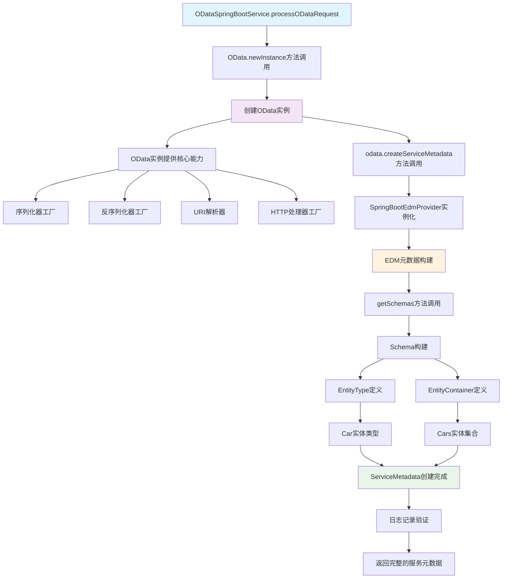
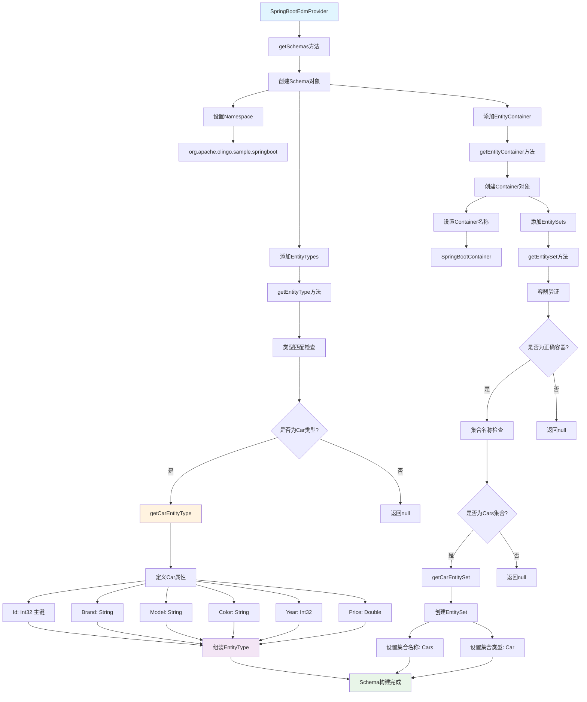
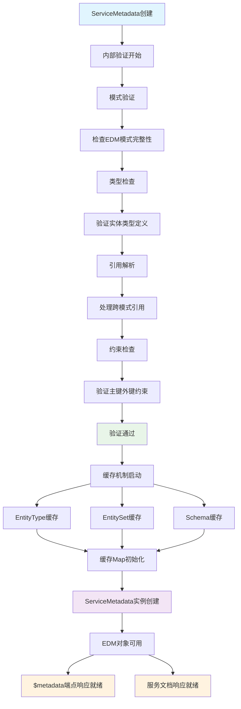
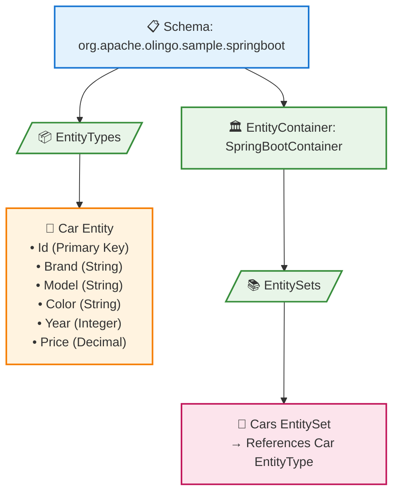
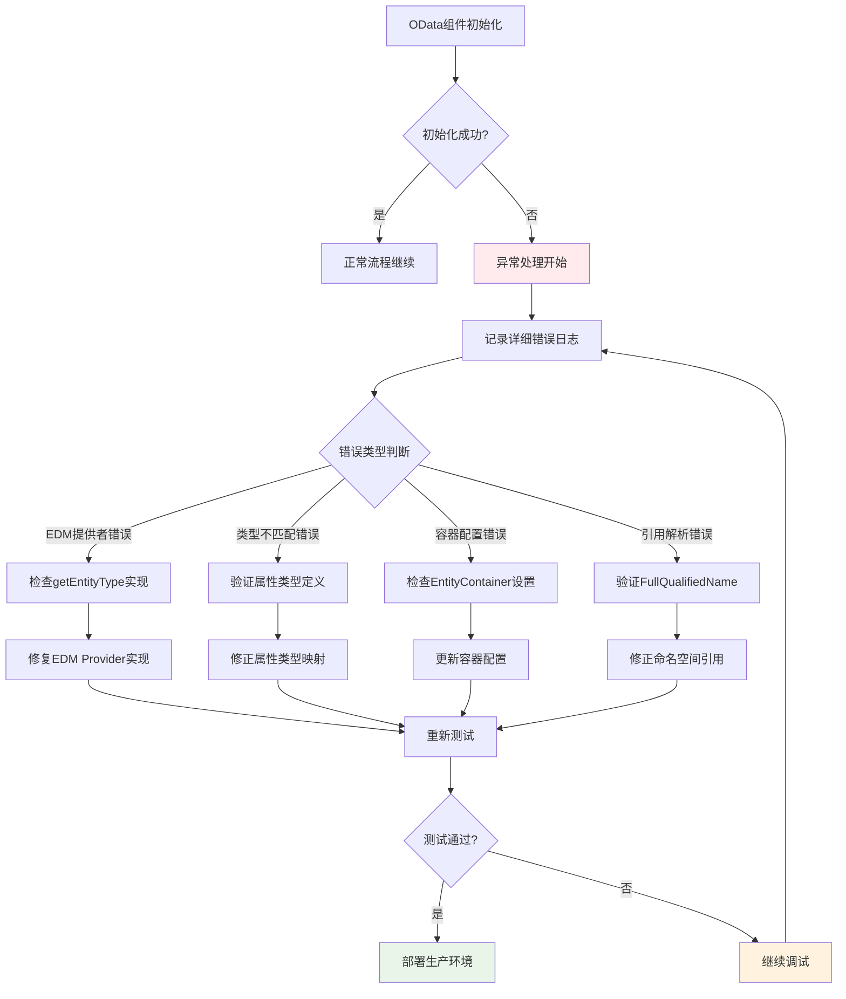
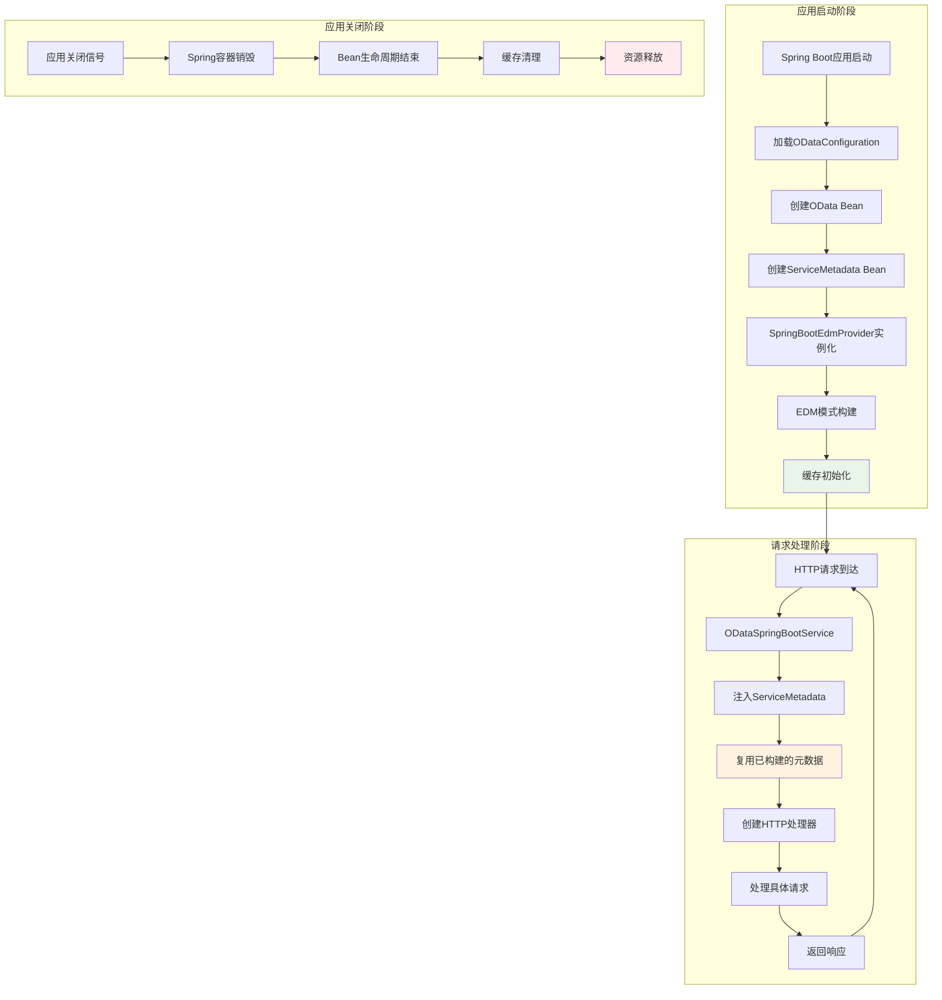
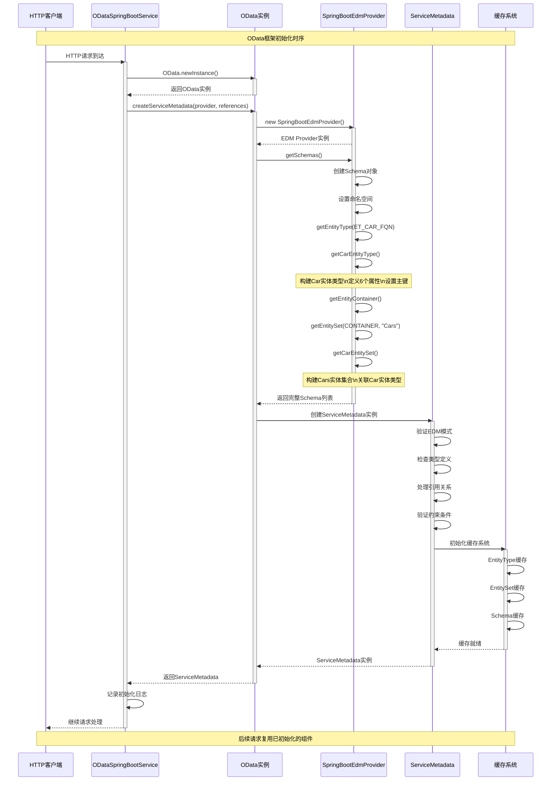
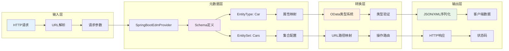
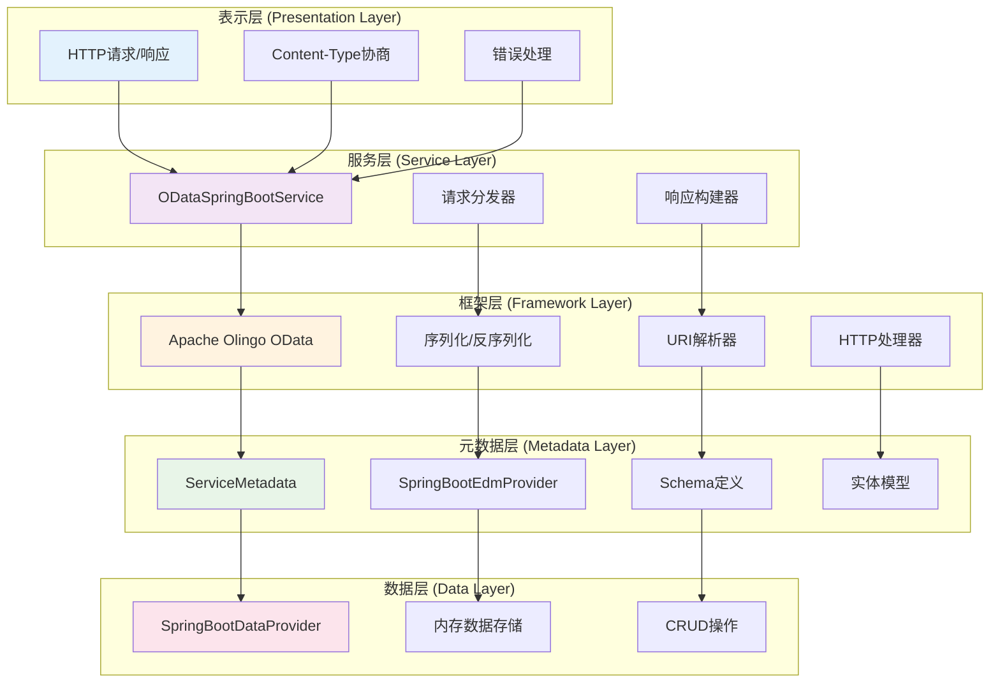

# OData框架核心组件初始化 - 深度解析

## 核心流程图

### 1. 整体初始化流程



### 2. SpringBootEdmProvider详细流程



### 3. 元数据验证和缓存流程



### 4. 性能优化流程对比

```mermaid
graph TD
    subgraph "当前实现 (性能问题)"
        A1[每次请求] --> B1[OData.newInstance]
        B1 --> C1[创建新的OData实例]
        C1 --> D1[createServiceMetadata]
        D1 --> E1[重复EDM构建]
        E1 --> F1[性能开销]
    end
    
    subgraph "单例模式优化"
        A2[应用启动] --> B2[static final OData实例]
        B2 --> C2[ServiceMetadata单例]
        A3[每次请求] --> D2[复用静态实例]
        C2 --> D2
        D2 --> E2[避免重复构建]
        E2 --> F2[性能提升]
    end
    
    subgraph "Spring Bean优化"
        A4[@Configuration] --> B4[@Bean OData]
        B4 --> C4[@Bean ServiceMetadata]
        C4 --> D4[@Autowired注入]
        D4 --> E4[Spring容器管理]
        E4 --> F4[生命周期优化]
    end
    
    style F1 fill:#ffebee
    style F2 fill:#e8f5e8
    style F4 fill:#e8f5e8
```

## 概述

在`ODataSpringBootService.processODataRequest()`方法中，OData框架核心组件初始化是整个请求处理流程的关键步骤。这个过程包含两个核心组件的创建：**OData实例**和**ServiceMetadata服务元数据**。

```java
// OData framework initialization - same pattern as CarsServlet
OData odata = OData.newInstance();
ServiceMetadata serviceMetadata = odata.createServiceMetadata(
    new SpringBootEdmProvider(), 
    new ArrayList<>()
);
```

## 第一步：OData实例创建

### 1.1 OData.newInstance() 详细分析

```java
OData odata = OData.newInstance();
```

**核心作用**：
- **工厂方法模式**：通过静态工厂方法创建OData框架的核心入口点
- **单例保证**：确保OData实例的统一性和资源管理
- **框架初始化**：初始化Apache Olingo OData框架的核心组件

**内部机制**：
```java
// Apache Olingo框架内部实现逻辑（简化版）
public static OData newInstance() {
    return new ODataImpl();
}
```

**提供的核心能力**：

#### 1.1.1 序列化器工厂
```java
// JSON序列化器
ODataSerializer jsonSerializer = odata.createSerializer(ContentType.JSON);

// XML序列化器  
ODataSerializer xmlSerializer = odata.createSerializer(ContentType.APPLICATION_XML);

// ATOM序列化器
ODataSerializer atomSerializer = odata.createSerializer(ContentType.APPLICATION_ATOM_XML);
```

#### 1.1.2 反序列化器工厂
```java
// 请求体反序列化
ODataDeserializer deserializer = odata.createDeserializer(ContentType.JSON);
```

#### 1.1.3 URI解析器
```java
// OData URI解析和验证
UriInfo uriInfo = odata.createUriHelper().parseUri(uri, serviceMetadata);
```

#### 1.1.4 HTTP处理器工厂
```java
// HTTP请求处理器创建
ODataHttpHandler handler = odata.createHandler(serviceMetadata);
```

### 1.2 OData实例的生命周期管理

**当前实现的问题**：
```java
// 每次请求都创建新实例 - 性能开销
OData odata = OData.newInstance();
```

**优化建议**：
```java
@Service
public class ODataSpringBootService {
    // 单例模式 - 类级别共享
    private static final OData ODATA_INSTANCE = OData.newInstance();
    
    public void processODataRequest(...) {
        // 复用实例
        OData odata = ODATA_INSTANCE;
        // ...
    }
}
```

## 第二步：ServiceMetadata服务元数据创建

### 2.1 createServiceMetadata() 方法分析

```java
ServiceMetadata serviceMetadata = odata.createServiceMetadata(
    new SpringBootEdmProvider(),  // EDM提供者
    new ArrayList<>()             // 引用列表
);
```

**参数详解**：

#### 2.1.1 SpringBootEdmProvider - 实体数据模型提供者

**核心职责**：
- 定义OData服务的数据结构（Schema）
- 描述实体类型（EntityType）
- 配置实体集合（EntitySet）
- 建立实体容器（EntityContainer）

**继承关系**：
```java
SpringBootEdmProvider extends CsdlAbstractEdmProvider
```

#### 2.1.2 引用列表 - new ArrayList<>()

**作用**：
- 用于复杂场景下的元数据引用管理
- 支持跨服务的元数据引用
- 在简单场景下为空列表

### 2.2 SpringBootEdmProvider 深度解析

#### 2.2.1 命名空间和标识符定义

```java
public static final String NAMESPACE = "org.apache.olingo.sample.springboot";
public static final String CONTAINER_NAME = "SpringBootContainer";
public static final FullQualifiedName CONTAINER = new FullQualifiedName(NAMESPACE, CONTAINER_NAME);

// 实体类型
public static final String ET_CAR_NAME = "Car";
public static final FullQualifiedName ET_CAR_FQN = new FullQualifiedName(NAMESPACE, ET_CAR_NAME);

// 实体集合
public static final String ES_CARS_NAME = "Cars";
```

**设计意义**：
- **全局唯一性**：通过命名空间避免名称冲突
- **类型安全**：使用FullQualifiedName确保类型引用正确
- **可维护性**：集中管理所有标识符常量

#### 2.2.2 核心方法实现分析

##### A. getEntityType() - 实体类型定义

```java
@Override
public CsdlEntityType getEntityType(FullQualifiedName entityTypeName) throws ODataException {
    if (entityTypeName.equals(ET_CAR_FQN)) {
        return getCarEntityType();
    }
    return null;
}
```

**执行流程**：
1. **类型匹配**：检查请求的实体类型是否为Car
2. **委托处理**：调用私有方法构建具体的实体类型
3. **返回结果**：返回完整的CSDL实体类型定义

**Car实体类型的详细构建**：
```java
private CsdlEntityType getCarEntityType() {
    // 1. 定义属性
    CsdlProperty id = new CsdlProperty().setName("Id")
        .setType(EdmPrimitiveTypeKind.Int32.getFullQualifiedName());
    CsdlProperty brand = new CsdlProperty().setName("Brand")
        .setType(EdmPrimitiveTypeKind.String.getFullQualifiedName());
    CsdlProperty model = new CsdlProperty().setName("Model")
        .setType(EdmPrimitiveTypeKind.String.getFullQualifiedName());
    CsdlProperty color = new CsdlProperty().setName("Color")
        .setType(EdmPrimitiveTypeKind.String.getFullQualifiedName());
    CsdlProperty year = new CsdlProperty().setName("Year")
        .setType(EdmPrimitiveTypeKind.Int32.getFullQualifiedName());
    CsdlProperty price = new CsdlProperty().setName("Price")
        .setType(EdmPrimitiveTypeKind.Double.getFullQualifiedName());

    // 2. 定义主键
    CsdlPropertyRef propertyRef = new CsdlPropertyRef();
    propertyRef.setName("Id");

    // 3. 组装实体类型
    CsdlEntityType entityType = new CsdlEntityType();
    entityType.setName(ET_CAR_NAME);
    entityType.setProperties(Arrays.asList(id, brand, model, color, year, price));
    entityType.setKey(Collections.singletonList(propertyRef));

    return entityType;
}
```

**属性映射对照表**：

| 属性名 | OData类型 | Java类型 | 说明 |
|--------|-----------|----------|------|
| Id | Int32 | Integer | 主键，唯一标识 |
| Brand | String | String | 品牌名称 |
| Model | String | String | 车型型号 |
| Color | String | String | 颜色信息 |
| Year | Int32 | Integer | 生产年份 |
| Price | Double | Double | 价格信息 |

##### B. getEntitySet() - 实体集合定义

```java
@Override
public CsdlEntitySet getEntitySet(FullQualifiedName entityContainer, String entitySetName) throws ODataException {
    if (entityContainer.equals(CONTAINER)) {
        if (entitySetName.equals(ES_CARS_NAME)) {
            return getCarEntitySet();
        }
    }
    return null;
}
```

**执行逻辑**：
1. **容器验证**：确认请求来自正确的实体容器
2. **集合匹配**：检查实体集合名称是否为"Cars"
3. **构建集合**：创建Car实体集合定义

**实体集合构建**：
```java
private CsdlEntitySet getCarEntitySet() {
    CsdlEntitySet entitySet = new CsdlEntitySet();
    entitySet.setName(ES_CARS_NAME);        // 集合名称：Cars
    entitySet.setType(ET_CAR_FQN);          // 集合类型：Car实体类型
    return entitySet;
}
```

##### C. getEntityContainer() - 实体容器定义

```java
@Override
public CsdlEntityContainer getEntityContainer() throws ODataException {
    // 创建实体容器
    CsdlEntityContainer entityContainer = new CsdlEntityContainer();
    entityContainer.setName(CONTAINER_NAME);
    
    // 添加实体集合
    List<CsdlEntitySet> entitySets = new ArrayList<>();
    entitySets.add(getEntitySet(CONTAINER, ES_CARS_NAME));
    entityContainer.setEntitySets(entitySets);

    return entityContainer;
}
```

**容器作用**：
- **集合管理**：管理所有实体集合
- **服务入口**：作为OData服务的根容器
- **URL映射**：建立URL路径与实体集合的映射关系

##### D. getSchemas() - 模式定义

```java
@Override
public List<CsdlSchema> getSchemas() throws ODataException {
    List<CsdlSchema> schemas = new ArrayList<>();
    CsdlSchema schema = new CsdlSchema();
    schema.setNamespace(NAMESPACE);

    // 添加实体类型
    List<CsdlEntityType> entityTypes = new ArrayList<>();
    entityTypes.add(getEntityType(ET_CAR_FQN));
    schema.setEntityTypes(entityTypes);

    // 添加实体容器
    schema.setEntityContainer(getEntityContainer());
    
    schemas.add(schema);
    return schemas;
}
```

**模式结构**：


### 2.3 ServiceMetadata的内部构建过程

#### 2.3.1 元数据验证

```java
ServiceMetadata serviceMetadata = odata.createServiceMetadata(edmProvider, references);
```

**内部验证步骤**：
1. **模式验证**：检查EDM模式的完整性和一致性
2. **类型检查**：验证所有实体类型定义的正确性
3. **引用解析**：处理跨模式的引用关系
4. **约束检查**：验证主键、外键等约束定义

#### 2.3.2 缓存机制

```java
// Olingo内部缓存机制（简化描述）
public class ServiceMetadataImpl implements ServiceMetadata {
    private final Map<String, CsdlEntityType> entityTypeCache = new HashMap<>();
    private final Map<String, CsdlEntitySet> entitySetCache = new HashMap<>();
    
    // 缓存提高性能
    public CsdlEntityType getEntityType(String name) {
        return entityTypeCache.computeIfAbsent(name, this::loadEntityType);
    }
}
```

### 2.4 生成的元数据结构

#### 2.4.1 $metadata端点响应示例

当访问 `http://localhost:8080/cars.svc/$metadata` 时，会返回：

```xml
<?xml version="1.0" encoding="UTF-8"?>
<edmx:Edmx Version="4.0" xmlns:edmx="http://docs.oasis-open.org/odata/ns/edmx">
    <edmx:DataServices>
        <Schema Namespace="org.apache.olingo.sample.springboot"
                xmlns="http://docs.oasis-open.org/odata/ns/edm">
            
            <!-- 实体类型定义 -->
            <EntityType Name="Car">
                <Key>
                    <PropertyRef Name="Id"/>
                </Key>
                <Property Name="Id" Type="Edm.Int32"/>
                <Property Name="Brand" Type="Edm.String"/>
                <Property Name="Model" Type="Edm.String"/>
                <Property Name="Color" Type="Edm.String"/>
                <Property Name="Year" Type="Edm.Int32"/>
                <Property Name="Price" Type="Edm.Double"/>
            </EntityType>
            
            <!-- 实体容器定义 -->
            <EntityContainer Name="SpringBootContainer">
                <EntitySet Name="Cars" EntityType="org.apache.olingo.sample.springboot.Car"/>
            </EntityContainer>
            
        </Schema>
    </edmx:DataServices>
</edmx:Edmx>
```

#### 2.4.2 服务文档结构

访问 `http://localhost:8080/cars.svc/` 时的服务文档：

```json
{
    "@odata.context": "$metadata",
    "value": [
        {
            "name": "Cars",
            "kind": "EntitySet",
            "url": "Cars"
        }
    ]
}
```

## 第三步：日志记录和验证

```java
LOG.info("Created ServiceMetadata with EDM provider: {}", 
    serviceMetadata.getEdm().getEntityContainer().getFullQualifiedName());
```

**验证内容**：
- **EDM获取**：通过`serviceMetadata.getEdm()`获取实体数据模型
- **容器检查**：验证实体容器是否正确创建
- **名称确认**：输出完全限定名进行确认

**预期日志输出**：
```
Created ServiceMetadata with EDM provider: org.apache.olingo.sample.springboot.SpringBootContainer
```

## 性能优化建议

### 1. 单例模式优化

```java
@Service
public class ODataSpringBootService {
    // 静态单例 - 类级别共享
    private static final OData ODATA_INSTANCE = OData.newInstance();
    private static volatile ServiceMetadata SERVICE_METADATA;
    
    private ServiceMetadata getServiceMetadata() {
        if (SERVICE_METADATA == null) {
            synchronized (ODataSpringBootService.class) {
                if (SERVICE_METADATA == null) {
                    SERVICE_METADATA = ODATA_INSTANCE.createServiceMetadata(
                        new SpringBootEdmProvider(), 
                        new ArrayList<>()
                    );
                }
            }
        }
        return SERVICE_METADATA;
    }
}
```

### 2. Spring Bean配置优化

```java
@Configuration
public class ODataConfiguration {
    
    @Bean
    @Singleton
    public OData oDataInstance() {
        return OData.newInstance();
    }
    
    @Bean
    @Singleton
    public ServiceMetadata serviceMetadata(OData odata) {
        return odata.createServiceMetadata(
            new SpringBootEdmProvider(),
            new ArrayList<>()
        );
    }
}
```

### 3. 懒加载优化

```java
@Service
public class ODataSpringBootService {
    
    @Lazy
    @Autowired
    private ServiceMetadata serviceMetadata;
    
    @Lazy
    @Autowired
    private OData odata;
}
```

## 错误处理和调试

### 1. 常见错误类型

#### 1.1 EDM提供者错误
```java
// 错误示例：实体类型未定义
@Override
public CsdlEntityType getEntityType(FullQualifiedName entityTypeName) {
    // 忘记实现返回null，导致"Entity type not found"错误
    return null;
}
```

#### 1.2 类型不匹配错误
```java
// 错误示例：类型引用错误
CsdlProperty id = new CsdlProperty().setName("Id")
    .setType(EdmPrimitiveTypeKind.String.getFullQualifiedName()); // 应该是Int32
```

### 2. 调试技巧

```java
public void processODataRequest(...) {
    try {
        OData odata = OData.newInstance();
        LOG.debug("OData instance created: {}", odata.getClass().getName());
        
        ServiceMetadata serviceMetadata = odata.createServiceMetadata(
            new SpringBootEdmProvider(), 
            new ArrayList<>()
        );
        
        // 详细验证
        LOG.debug("Schema count: {}", serviceMetadata.getEdm().getSchemas().size());
        LOG.debug("Entity container: {}", 
            serviceMetadata.getEdm().getEntityContainer().getFullQualifiedName());
        
        // 验证实体类型
        serviceMetadata.getEdm().getSchemas().forEach(schema -> {
            LOG.debug("Schema namespace: {}", schema.getNamespace());
            schema.getEntityTypes().forEach(entityType -> {
                LOG.debug("Entity type: {} with {} properties", 
                    entityType.getName(), entityType.getProperties().size());
            });
        });
        
    } catch (Exception e) {
        LOG.error("Failed to initialize OData components", e);
        throw new ServletException("OData initialization failed", e);
    }
}
```

### 5. 错误处理和调试流程



### 6. 实际URL映射流程

```mermaid
graph TD
    A[HTTP请求] --> B{URL路径分析}
    B -->|/cars.svc/$metadata| C[元数据端点]
    B -->|/cars.svc/| D[服务文档端点]
    B -->|/cars.svc/Cars| E[实体集合端点]
    B -->|/cars.svc/Cars(1)| F[单个实体端点]
    
    C --> G[返回CSDL XML]
    G --> H[包含EntityType定义]
    G --> I[包含EntityContainer定义]
    
    D --> J[返回JSON服务文档]
    J --> K[列出所有EntitySet]
    
    E --> L[Cars集合操作]
    L --> M[GET: 查询所有Car]
    L --> N[POST: 创建新Car]
    
    F --> O[单个Car操作]
    O --> P[GET: 查询特定Car]
    O --> Q[PUT: 更新Car]
    O --> R[DELETE: 删除Car]
    
    H --> S[Schema: org.apache.olingo.sample.springboot]
    I --> T[Container: SpringBootContainer]
    K --> U[EntitySet: Cars]
    
    style C fill:#e3f2fd
    style D fill:#f3e5f5
    style E fill:#fff3e0
    style F fill:#e8f5e8
```

### 7. 组件生命周期管理



## 总结

OData框架核心组件初始化是整个OData服务的基础，它完成了以下关键任务：

1. **框架初始化**：创建OData核心实例，提供序列化、URI解析等基础能力
2. **元数据构建**：通过EDM提供者定义完整的数据模型结构
3. **服务配置**：建立URL路径与数据操作的映射关系
4. **类型系统**：建立强类型的实体定义和验证机制

这个过程为后续的HTTP处理器创建和请求处理奠定了坚实的基础，是OData服务能够正确响应各种请求的前提条件。

## 组件交互时序图



## 数据流转换图



## 架构层次图



## 流程图总结与应用指南

通过以上10个详细的流程图，我们可以清晰地看到OData框架核心组件初始化的完整过程：

### 关键流程要点

1. **整体初始化流程**：从OData实例创建到ServiceMetadata构建的完整链路
2. **SpringBootEdmProvider详细流程**：EDM元数据构建的核心逻辑和方法调用顺序
3. **元数据验证和缓存流程**：确保数据一致性和提升性能的关键机制
4. **性能优化流程对比**：不同实现方案的性能差异和优化策略
5. **错误处理和调试流程**：问题诊断和解决的系统化方法
6. **实际URL映射流程**：从HTTP请求到具体操作的路由机制
7. **组件生命周期管理**：从应用启动到关闭的完整生命周期
8. **组件交互时序图**：各组件间的时间顺序和交互关系
9. **数据流转换图**：数据在各层间的流转和转换过程
10. **架构层次图**：整个系统的分层架构和职责划分

### 实际应用建议

**开发阶段**：
- 参考流程图1和2理解核心初始化逻辑
- 使用流程图5进行错误诊断和调试
- 根据流程图8理解组件交互时序

**性能优化**：
- 采用流程图4中的优化方案
- 实施流程图7中的生命周期管理策略
- 监控流程图3中的缓存机制效果

**架构设计**：
- 参考流程图10进行分层设计
- 按照流程图9设计数据流转
- 遵循流程图6的URL映射模式

### 核心价值

这些流程图不仅帮助理解OData框架的工作原理，更重要的是为实际开发提供了：

1. **可视化的架构指南**：清晰展示各组件的职责和关系
2. **系统化的调试方法**：提供问题定位和解决的标准流程
3. **性能优化的具体方案**：对比不同实现的优劣和改进方向
4. **扩展开发的参考模板**：为新功能开发提供标准化的实现模式

## 技术深度总结

OData框架核心组件初始化是整个OData服务的基础，它完成了以下关键任务：

1. **框架初始化**：创建OData核心实例，提供序列化、URI解析等基础能力
2. **元数据构建**：通过EDM提供者定义完整的数据模型结构
3. **服务配置**：建立URL路径与数据操作的映射关系
4. **类型系统**：建立强类型的实体定义和验证机制

这个过程为后续的HTTP处理器创建和请求处理奠定了坚实的基础，是OData服务能够正确响应各种请求的前提条件。通过详细的流程图分析，我们能够更好地理解、优化和扩展OData服务的功能。
