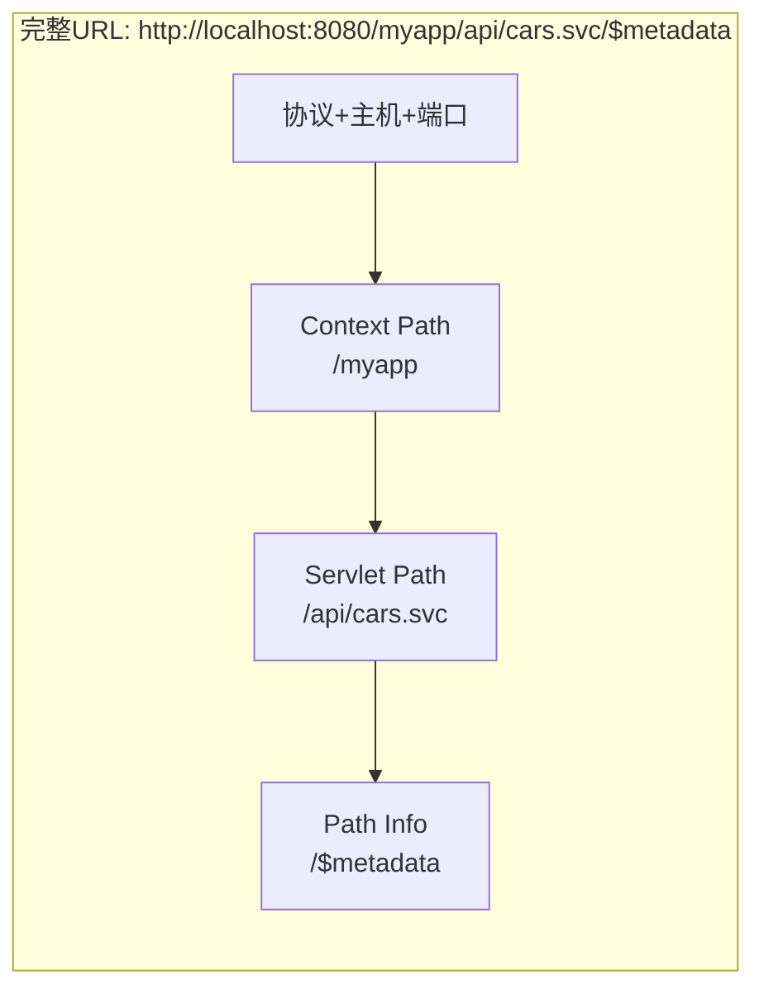
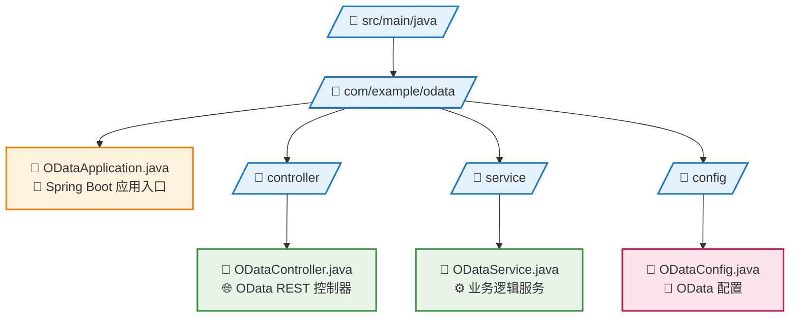

# Spring Boot中处理Servlet路径映射问题

## 引言

在现代Java Web开发中，Spring Boot因其简化配置和快速开发的特性而广受欢迎。然而，当我们需要将传统的基于Servlet的框架（如Apache Olingo OData）集成到Spring Boot应用中时，往往会遇到路径映射的问题。本文将深入探讨这些问题的根源，并提供多种实用的解决方案。

## 问题的来源

### 传统Servlet容器的路径解析机制

在传统的Java EE环境中（如Tomcat + WAR部署），HTTP请求的路径解析遵循标准的Servlet规范：



**各组件说明：**
- **Context Path**: `/myapp`（WAR包名称或应用上下文）
- **Servlet Path**: `/api/cars.svc`（在web.xml中定义的url-pattern）
- **Path Info**: `/$metadata`（Servlet Path之后的额外路径信息）

### 传统web.xml配置示例

```xml
<web-app>
    <servlet>
        <servlet-name>ODataServlet</servlet-name>
        <servlet-class>com.example.ODataServlet</servlet-class>
    </servlet>
    
    <servlet-mapping>
        <servlet-name>ODataServlet</servlet-name>
        <url-pattern>/api/cars.svc/*</url-pattern>
    </servlet-mapping>
</web-app>
```

在这种配置下，Servlet容器会自动解析请求路径：

```java
// 请求: GET /myapp/api/cars.svc/$metadata
HttpServletRequest request = ...;

request.getContextPath()  // "/myapp"
request.getServletPath()  // "/api/cars.svc"
request.getPathInfo()     // "/$metadata"
request.getRequestURI()   // "/myapp/api/cars.svc/$metadata"
```

### Spring Boot的路径处理差异

Spring Boot采用了不同的架构设计：

1. **DispatcherServlet作为前端控制器**：所有请求都通过DispatcherServlet进行分发
2. **基于注解的路径映射**：使用`@RequestMapping`而不是web.xml
3. **嵌入式容器**：通常打包为JAR而不是WAR

这导致了与传统Servlet规范的差异：

```java
@RestController
@RequestMapping("/api/cars.svc")
public class ODataController {
    
    @RequestMapping(value = "/**")
    public void handleRequest(HttpServletRequest request) {
        // Spring Boot环境下的实际值：
        request.getContextPath()  // "/" 或 ""
        request.getServletPath()  // "" (空字符串)
        request.getPathInfo()     // null
        request.getRequestURI()   // "/api/cars.svc/$metadata"
    }
}
```

## 问题分析：为什么会出现映射问题？

### 1. Servlet规范期望 vs Spring Boot实现

许多第三方框架（如Apache Olingo）是基于标准Servlet规范设计的，它们期望：

```java
// 框架期望的路径信息
String servletPath = request.getServletPath(); // "/api/cars.svc"
String pathInfo = request.getPathInfo();       // "/$metadata"

// 根据pathInfo决定处理逻辑
if (pathInfo == null) {
    return serviceDocument();
} else if ("/$metadata".equals(pathInfo)) {
    return metadata();
} else if (pathInfo.startsWith("/Cars")) {
    return handleEntitySet();
}
```

但在Spring Boot中，这些方法返回的值与期望不符，导致框架无法正确路由请求。

### 2. Context Path的处理差异

传统部署方式中，Context Path通常对应WAR包名称：
- WAR文件：`myapp.war`
- Context Path：`/myapp`
- 访问URL：`http://localhost:8080/myapp/api/cars.svc`

Spring Boot默认使用根路径：
- JAR文件：`myapp.jar`
- Context Path：`/`
- 访问URL：`http://localhost:8080/api/cars.svc`

### 3. 路径信息的缺失

在Spring Boot中，`getPathInfo()`方法通常返回`null`，因为Spring的路径匹配机制与传统Servlet不同。这对依赖PathInfo进行路由的框架来说是致命的。

## 解决方案

### 方案一：设置Context Path（推荐）

这是最简单且最符合传统部署模式的解决方案。

**application.properties配置：**
```properties
# 设置应用上下文路径
server.servlet.context-path=/myapp

# 其他相关配置
server.port=8080
```

**Controller代码：**
```java
@RestController
@RequestMapping("/api/cars.svc")  // 保持简洁的相对路径
public class ODataController {
    
    @RequestMapping(value = {"", "/", "/**"})
    public void handleODataRequest(HttpServletRequest request, HttpServletResponse response) {
        // 使用包装器提供正确的路径信息
        HttpServletRequestWrapper wrapper = new HttpServletRequestWrapper(request);
        odataService.processRequest(wrapper, response);
    }
    
    // HttpServletRequest包装器
    private static class HttpServletRequestWrapper extends jakarta.servlet.http.HttpServletRequestWrapper {
        
        public HttpServletRequestWrapper(HttpServletRequest request) {
            super(request);
        }
        
        @Override
        public String getServletPath() {
            return "/api/cars.svc";
        }
        
        @Override
        public String getPathInfo() {
            String requestUri = getRequestURI();
            String contextPath = getContextPath();
            String basePath = contextPath + "/api/cars.svc";
            
            if (requestUri.startsWith(basePath)) {
                String pathInfo = requestUri.substring(basePath.length());
                return pathInfo.isEmpty() ? null : pathInfo;
            }
            return null;
        }
    }
}
```

**效果：**
```bash
# 请求: GET http://localhost:8080/myapp/api/cars.svc/$metadata

# Spring Boot + Context Path:
request.getContextPath()  // "/myapp"
request.getServletPath()  // ""
request.getPathInfo()     // null

# 包装器处理后:
wrapper.getContextPath()  // "/myapp"
wrapper.getServletPath()  // "/api/cars.svc"
wrapper.getPathInfo()     // "/$metadata"
```

### 方案二：完整路径映射

将完整路径硬编码在`@RequestMapping`中。

```java
@RestController
@RequestMapping("/myapp/api/cars.svc")  // 包含完整路径
public class ODataController {
    
    @RequestMapping(value = {"", "/", "/**"})
    public void handleODataRequest(HttpServletRequest request, HttpServletResponse response) {
        HttpServletRequestWrapper wrapper = new HttpServletRequestWrapper(request);
        odataService.processRequest(wrapper, response);
    }
    
    private static class HttpServletRequestWrapper extends jakarta.servlet.http.HttpServletRequestWrapper {
        
        public HttpServletRequestWrapper(HttpServletRequest request) {
            super(request);
        }
        
        @Override
        public String getServletPath() {
            return "/myapp/api/cars.svc";  // 返回完整路径
        }
        
        @Override
        public String getPathInfo() {
            String requestUri = getRequestURI();
            String basePath = "/myapp/api/cars.svc";
            
            if (requestUri.startsWith(basePath)) {
                String pathInfo = requestUri.substring(basePath.length());
                return pathInfo.isEmpty() ? null : pathInfo;
            }
            return null;
        }
    }
}
```

### 方案三：智能路径适配器

创建一个智能的路径适配器，能够处理多种部署场景。

```java
/**
 * 智能路径适配器，支持多种部署模式
 */
public class SmartPathAdapter {
    
    private final String serviceBasePath;
    
    public SmartPathAdapter(String serviceBasePath) {
        this.serviceBasePath = serviceBasePath;
    }
    
    public static class SmartHttpServletRequestWrapper extends jakarta.servlet.http.HttpServletRequestWrapper {
        
        private final String serviceBasePath;
        
        public SmartHttpServletRequestWrapper(HttpServletRequest request, String serviceBasePath) {
            super(request);
            this.serviceBasePath = serviceBasePath;
        }
        
        @Override
        public String getServletPath() {
            return serviceBasePath;
        }
        
        @Override
        public String getPathInfo() {
            String requestUri = getRequestURI();
            String contextPath = getContextPath();
            
            // 尝试多种路径组合
            String[] possibleBasePaths = {
                contextPath + serviceBasePath,                    // 标准模式：/myapp + /api/cars.svc
                serviceBasePath,                                  // 直接模式：/api/cars.svc
                contextPath.isEmpty() ? serviceBasePath : contextPath + serviceBasePath,
                requestUri.contains(serviceBasePath) ? 
                    requestUri.substring(0, requestUri.indexOf(serviceBasePath) + serviceBasePath.length()) : null
            };
            
            for (String basePath : possibleBasePaths) {
                if (basePath != null && requestUri.startsWith(basePath)) {
                    String pathInfo = requestUri.substring(basePath.length());
                    return pathInfo.isEmpty() ? null : pathInfo;
                }
            }
            
            return null;
        }
    }
}
```

使用智能适配器：

```java
@RestController
@RequestMapping("/api/cars.svc")
public class ODataController {
    
    private static final String SERVICE_BASE_PATH = "/api/cars.svc";
    
    @RequestMapping(value = {"", "/", "/**"})
    public void handleODataRequest(HttpServletRequest request, HttpServletResponse response) {
        SmartHttpServletRequestWrapper wrapper = 
            new SmartHttpServletRequestWrapper(request, SERVICE_BASE_PATH);
        odataService.processRequest(wrapper, response);
    }
}
```

### 方案四：使用Spring Boot的路径匹配特性

利用Spring Boot提供的路径变量功能。

```java
@RestController
public class ODataController {
    
    @RequestMapping("/api/cars.svc/{*oDataPath}")
    public void handleODataWithPathVariable(
            @PathVariable String oDataPath,
            HttpServletRequest request, 
            HttpServletResponse response) {
        
        // 创建模拟的HttpServletRequest
        PathVariableHttpServletRequestWrapper wrapper = 
            new PathVariableHttpServletRequestWrapper(request, oDataPath);
        
        odataService.processRequest(wrapper, response);
    }
    
    @RequestMapping("/api/cars.svc")
    public void handleODataRoot(HttpServletRequest request, HttpServletResponse response) {
        // 处理根路径请求（服务文档）
        PathVariableHttpServletRequestWrapper wrapper = 
            new PathVariableHttpServletRequestWrapper(request, null);
        
        odataService.processRequest(wrapper, response);
    }
    
    private static class PathVariableHttpServletRequestWrapper extends jakarta.servlet.http.HttpServletRequestWrapper {
        
        private final String pathInfo;
        
        public PathVariableHttpServletRequestWrapper(HttpServletRequest request, String pathInfo) {
            super(request);
            this.pathInfo = pathInfo;
        }
        
        @Override
        public String getServletPath() {
            return "/api/cars.svc";
        }
        
        @Override
        public String getPathInfo() {
            return pathInfo == null || pathInfo.isEmpty() ? null : "/" + pathInfo;
        }
    }
}
```

## 实际案例：集成Apache Olingo OData

以下是一个完整的Apache Olingo OData集成示例：

### 项目结构



### 主要配置文件

**application.yml：**
```yaml
server:
  port: 8080
  servlet:
    context-path: /odata-sample

logging:
  level:
    com.example.odata: DEBUG
    org.apache.olingo: INFO

# 应用信息
spring:
  application:
    name: OData Sample Service
```

**ODataController.java：**
```java
@RestController
@RequestMapping("/cars.svc")
@Slf4j
public class ODataController {

    @Autowired
    private ODataService odataService;

    @RequestMapping(value = {"", "/", "/**"}, 
                   method = {RequestMethod.GET, RequestMethod.POST, 
                            RequestMethod.PUT, RequestMethod.DELETE, 
                            RequestMethod.PATCH})
    public void handleODataRequest(HttpServletRequest request, HttpServletResponse response) 
            throws ServletException, IOException {
        
        log.info("Processing OData request: {} {}", request.getMethod(), request.getRequestURI());
        
        try {
            ODataHttpServletRequestWrapper wrapper = new ODataHttpServletRequestWrapper(request);
            odataService.processRequest(wrapper, response);
            
        } catch (Exception e) {
            log.error("Error processing OData request", e);
            response.setStatus(HttpServletResponse.SC_INTERNAL_SERVER_ERROR);
            response.getWriter().write("Internal Server Error: " + e.getMessage());
        }
    }

    /**
     * OData专用的HttpServletRequest包装器
     */
    private static class ODataHttpServletRequestWrapper extends jakarta.servlet.http.HttpServletRequestWrapper {
        
        private static final Logger log = LoggerFactory.getLogger(ODataHttpServletRequestWrapper.class);
        
        public ODataHttpServletRequestWrapper(HttpServletRequest request) {
            super(request);
        }
        
        @Override
        public String getServletPath() {
            return "/cars.svc";
        }
        
        @Override
        public String getPathInfo() {
            String requestUri = getRequestURI();
            String contextPath = getContextPath();
            String basePath = contextPath + "/cars.svc";
            
            log.debug("Path calculation: requestUri={}, contextPath={}, basePath={}", 
                     requestUri, contextPath, basePath);
            
            if (requestUri.startsWith(basePath)) {
                String pathInfo = requestUri.substring(basePath.length());
                String result = pathInfo.isEmpty() ? null : pathInfo;
                log.debug("Calculated PathInfo: {}", result);
                return result;
            }
            
            log.warn("Unable to calculate PathInfo for requestUri: {}", requestUri);
            return null;
        }
    }
}
```

### 测试验证

创建测试用例验证路径映射：

```java
@SpringBootTest(webEnvironment = SpringBootTest.WebEnvironment.RANDOM_PORT)
@TestPropertySource(properties = {
    "server.servlet.context-path=/odata-sample"
})
class ODataControllerTest {

    @Autowired
    private TestRestTemplate restTemplate;

    @LocalServerPort
    private int port;

    @Test
    void testServiceDocument() {
        String url = "http://localhost:" + port + "/odata-sample/cars.svc";
        ResponseEntity<String> response = restTemplate.getForEntity(url, String.class);
        
        assertThat(response.getStatusCode()).isEqualTo(HttpStatus.OK);
        // 验证返回的服务文档内容
    }

    @Test
    void testMetadata() {
        String url = "http://localhost:" + port + "/odata-sample/cars.svc/$metadata";
        ResponseEntity<String> response = restTemplate.getForEntity(url, String.class);
        
        assertThat(response.getStatusCode()).isEqualTo(HttpStatus.OK);
        assertThat(response.getBody()).contains("<?xml version=\"1.0\"");
    }

    @Test
    void testEntitySet() {
        String url = "http://localhost:" + port + "/odata-sample/cars.svc/Cars";
        ResponseEntity<String> response = restTemplate.getForEntity(url, String.class);
        
        assertThat(response.getStatusCode()).isEqualTo(HttpStatus.OK);
        // 验证返回的实体集数据
    }
}
```

## 各方案对比分析

| 方案 | 优点 | 缺点 | 适用场景 |
|------|------|------|----------|
| 方案一：Context Path | ✅ 配置简单<br>✅ 符合传统模式<br>✅ 代码清晰 | ❌ 需要配置文件支持 | 大多数项目 |
| 方案二：完整路径映射 | ✅ 无需额外配置<br>✅ 路径明确 | ❌ 硬编码路径<br>❌ 不够灵活 | 简单固定场景 |
| 方案三：智能适配器 | ✅ 高度灵活<br>✅ 适应多种场景<br>✅ 可重用 | ❌ 复杂度较高<br>❌ 调试困难 | 复杂部署环境 |
| 方案四：路径变量 | ✅ Spring原生特性<br>✅ 类型安全 | ❌ 需要多个映射<br>❌ 不够直观 | Spring Boot优先项目 |

## 最佳实践建议

### 1. 选择合适的解决方案

- **简单项目**：使用方案一（Context Path），配置简单，符合传统部署模式
- **复杂环境**：使用方案三（智能适配器），能适应多种部署场景
- **Spring原生**：使用方案四（路径变量），更符合Spring Boot风格

### 2. 日志和调试

始终添加详细的日志记录：

```java
@Override
public String getPathInfo() {
    String requestUri = getRequestURI();
    String contextPath = getContextPath();
    String basePath = contextPath + "/cars.svc";
    
    log.debug("Path debugging - URI: {}, Context: {}, Base: {}", 
             requestUri, contextPath, basePath);
    
    if (requestUri.startsWith(basePath)) {
        String pathInfo = requestUri.substring(basePath.length());
        String result = pathInfo.isEmpty() ? null : pathInfo;
        log.debug("Calculated PathInfo: [{}]", result);
        return result;
    }
    
    log.warn("No matching base path for URI: {}", requestUri);
    return null;
}
```

### 3. 单元测试

为路径映射逻辑编写专门的单元测试：

```java
@Test
void testPathInfoCalculation() {
    MockHttpServletRequest request = new MockHttpServletRequest();
    request.setRequestURI("/myapp/cars.svc/$metadata");
    request.setContextPath("/myapp");
    
    ODataHttpServletRequestWrapper wrapper = new ODataHttpServletRequestWrapper(request);
    
    assertThat(wrapper.getServletPath()).isEqualTo("/cars.svc");
    assertThat(wrapper.getPathInfo()).isEqualTo("/$metadata");
}
```

### 4. 配置管理

将路径配置外部化：

```java
@Component
@ConfigurationProperties(prefix = "odata")
@Data
public class ODataProperties {
    private String servicePath = "/cars.svc";
    private String contextPath = "/";
    private boolean enableDebugLogging = false;
}
```

```yaml
odata:
  service-path: /api/v1/cars.svc
  context-path: /myapp
  enable-debug-logging: true
```

### 5. 错误处理

添加完善的错误处理机制：

```java
@Override
public String getPathInfo() {
    try {
        String requestUri = getRequestURI();
        String contextPath = getContextPath();
        
        if (requestUri == null || contextPath == null) {
            log.error("Null path components: requestUri={}, contextPath={}", requestUri, contextPath);
            return null;
        }
        
        String basePath = contextPath + "/cars.svc";
        
        if (requestUri.startsWith(basePath)) {
            String pathInfo = requestUri.substring(basePath.length());
            return pathInfo.isEmpty() ? null : pathInfo;
        }
        
        return null;
        
    } catch (Exception e) {
        log.error("Error calculating PathInfo", e);
        return null;
    }
}
```

## 性能考虑

### 1. 缓存计算结果

对于高频访问的应用，可以考虑缓存路径计算结果：

```java
private static final Map<String, String> pathInfoCache = new ConcurrentHashMap<>();

@Override
public String getPathInfo() {
    String requestUri = getRequestURI();
    
    return pathInfoCache.computeIfAbsent(requestUri, uri -> {
        // 执行路径计算逻辑
        String contextPath = getContextPath();
        String basePath = contextPath + "/cars.svc";
        
        if (uri.startsWith(basePath)) {
            String pathInfo = uri.substring(basePath.length());
            return pathInfo.isEmpty() ? null : pathInfo;
        }
        return null;
    });
}
```

### 2. 避免重复计算

```java
public class CachedHttpServletRequestWrapper extends jakarta.servlet.http.HttpServletRequestWrapper {
    
    private String cachedPathInfo;
    private boolean pathInfoCalculated = false;
    
    @Override
    public String getPathInfo() {
        if (!pathInfoCalculated) {
            cachedPathInfo = calculatePathInfo();
            pathInfoCalculated = true;
        }
        return cachedPathInfo;
    }
    
    private String calculatePathInfo() {
        // 实际的路径计算逻辑
    }
}
```

## 常见问题和解决方案

### 1. 路径中包含特殊字符

```java
@Override
public String getPathInfo() {
    String requestUri = getRequestURI();
    String contextPath = getContextPath();
    
    // URL解码处理特殊字符
    try {
        requestUri = URLDecoder.decode(requestUri, StandardCharsets.UTF_8);
        contextPath = URLDecoder.decode(contextPath, StandardCharsets.UTF_8);
    } catch (Exception e) {
        log.warn("Failed to decode URL: {}", e.getMessage());
    }
    
    String basePath = contextPath + "/cars.svc";
    
    if (requestUri.startsWith(basePath)) {
        String pathInfo = requestUri.substring(basePath.length());
        return pathInfo.isEmpty() ? null : pathInfo;
    }
    
    return null;
}
```

### 2. 多个服务路径

```java
@Component
public class MultiServicePathHandler {
    
    private final List<String> servicePaths = Arrays.asList("/cars.svc", "/api/v1/odata", "/services/data");
    
    public String calculatePathInfo(HttpServletRequest request) {
        String requestUri = request.getRequestURI();
        String contextPath = request.getContextPath();
        
        for (String servicePath : servicePaths) {
            String basePath = contextPath + servicePath;
            if (requestUri.startsWith(basePath)) {
                String pathInfo = requestUri.substring(basePath.length());
                return pathInfo.isEmpty() ? null : pathInfo;
            }
        }
        
        return null;
    }
}
```

### 3. 开发和生产环境差异

```java
@Profile("development")
@Configuration
public class DevelopmentPathConfig {
    
    @Bean
    public PathCalculator developmentPathCalculator() {
        return new PathCalculator("/dev/cars.svc");
    }
}

@Profile("production")
@Configuration
public class ProductionPathConfig {
    
    @Bean
    public PathCalculator productionPathCalculator() {
        return new PathCalculator("/api/v1/cars.svc");
    }
}
```

## 监控和诊断

### 1. 健康检查端点

```java
@RestController
@RequestMapping("/actuator/path-mapping")
public class PathMappingHealthController {
    
    @GetMapping("/status")
    public Map<String, Object> getPathMappingStatus(HttpServletRequest request) {
        Map<String, Object> status = new HashMap<>();
        
        status.put("requestURI", request.getRequestURI());
        status.put("contextPath", request.getContextPath());
        status.put("servletPath", request.getServletPath());
        status.put("pathInfo", request.getPathInfo());
        
        // 测试包装器
        HttpServletRequestWrapper wrapper = new HttpServletRequestWrapper(request);
        status.put("wrappedServletPath", wrapper.getServletPath());
        status.put("wrappedPathInfo", wrapper.getPathInfo());
        
        return status;
    }
}
```

### 2. 度量指标

```java
@Component
public class PathMappingMetrics {
    
    private final Counter pathCalculationCounter;
    private final Timer pathCalculationTimer;
    
    public PathMappingMetrics(MeterRegistry meterRegistry) {
        this.pathCalculationCounter = Counter.builder("path.calculation.count")
            .description("Number of path calculations")
            .register(meterRegistry);
            
        this.pathCalculationTimer = Timer.builder("path.calculation.duration")
            .description("Path calculation duration")
            .register(meterRegistry);
    }
    
    public String calculatePathInfoWithMetrics(HttpServletRequest request) {
        return pathCalculationTimer.recordCallable(() -> {
            pathCalculationCounter.increment();
            return calculatePathInfo(request);
        });
    }
}
```

## 总结

Spring Boot中的Servlet路径映射问题主要源于其与传统Servlet规范在路径处理机制上的差异。通过合理选择解决方案并实施最佳实践，我们可以成功地将传统的基于Servlet的框架集成到Spring Boot应用中。

### 关键要点

1. **理解差异**：明确Spring Boot与传统Servlet在路径解析上的不同
2. **选择方案**：根据项目需求选择最适合的解决方案
3. **包装器模式**：使用HttpServletRequestWrapper桥接两种架构
4. **测试验证**：确保路径映射在各种场景下都能正常工作
5. **日志调试**：添加充分的日志来帮助问题诊断
6. **性能优化**：考虑缓存和避免重复计算
7. **监控运维**：建立完善的监控和诊断机制

### 推荐的实施步骤

1. **分析现有系统**：确定当前的路径映射需求
2. **选择合适方案**：根据项目复杂度和部署要求选择解决方案
3. **实现包装器**：编写HttpServletRequestWrapper实现
4. **添加测试**：编写单元测试和集成测试
5. **配置日志**：添加详细的调试日志
6. **性能测试**：验证解决方案的性能影响
7. **生产部署**：在生产环境中验证和监控

通过这些方法，我们可以在享受Spring Boot便利性的同时，无缝集成现有的Servlet生态系统组件，为现代化改造提供强有力的技术支撑。

---

*本文基于Apache Olingo OData框架的集成实践，相关概念和解决方案同样适用于其他类似的传统Servlet框架。在实际应用中，建议根据具体的业务需求和技术栈选择最适合的解决方案。*

## 参考资料

- [Spring Boot官方文档](https://spring.io/projects/spring-boot)
- [Servlet API规范](https://jakarta.ee/specifications/servlet/)
- [Apache Olingo文档](https://olingo.apache.org/)
- [Spring Framework参考文档](https://docs.spring.io/spring-framework/docs/current/reference/html/)
