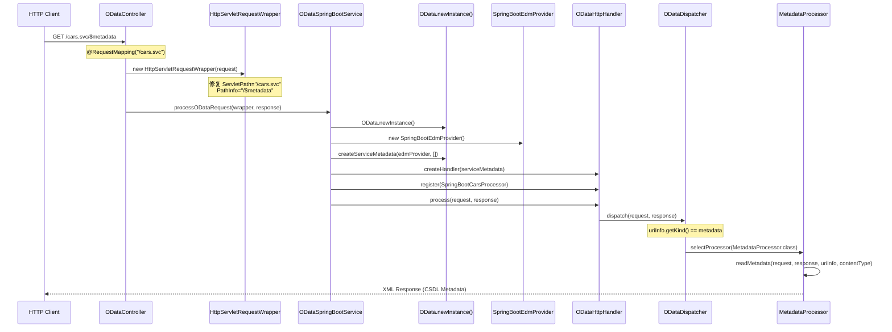

# OData $metadata 请求流程图

## 1. 整体架构流程



## 2. 关键类和方法调用链

### 2.1 Spring Boot层面
```
ODataController.handleODataRequest()
├── HttpServletRequestWrapper (路径修复)
│   ├── getServletPath() → "/cars.svc"
│   └── getPathInfo() → "/$metadata"
└── ODataSpringBootService.processODataRequest()
```

### 2.2 OData框架层面
```
ODataSpringBootService.processODataRequest()
├── OData.newInstance()
├── SpringBootEdmProvider (EDM定义)
├── OData.createServiceMetadata()
├── OData.createHandler()
├── ODataHttpHandler.register()
└── ODataHttpHandler.process()
    └── ODataDispatcher.dispatch()
        └── case metadata:
            ├── checkMethods(GET, HEAD)
            ├── ContentNegotiator.doContentNegotiation()
            └── MetadataProcessor.readMetadata()
```

## 3. 核心类详细说明

### 3.1 ODataController
**文件**: `controller/ODataController.java`
**关键方法**:
- `handleODataRequest(HttpServletRequest, HttpServletResponse)`
- `HttpServletRequestWrapper` (内部类)

**职责**: 
- 接收Spring Boot HTTP请求
- 修复路径信息给OData框架使用
- 委托给OData服务层处理

### 3.2 ODataSpringBootService
**文件**: `service/ODataSpringBootService.java`
**关键方法**:
- `processODataRequest(HttpServletRequest, HttpServletResponse)`

**职责**:
- 初始化OData框架组件
- 创建ServiceMetadata和Handler
- 注册处理器
- 调用OData处理链

### 3.3 SpringBootEdmProvider
**文件**: `edm/SpringBootEdmProvider.java`
**关键方法**:
- `getSchemas()` - 返回CSDL Schema定义
- `getEntityContainer()` - 返回实体容器
- `getEntityType()` - 返回实体类型定义

**职责**:
- 定义OData服务的元数据模型
- 提供CSDL Schema信息

### 3.4 ODataDispatcher
**文件**: `org.apache.olingo.server.core.ODataDispatcher`
**关键方法**:
- `dispatch(ODataRequest, ODataResponse)`
- Switch case for `uriInfo.getKind() == metadata`

**职责**:
- 根据URI类型分发请求
- 对于metadata请求，调用MetadataProcessor

### 3.5 MetadataProcessor
**接口**: `org.apache.olingo.server.api.processor.MetadataProcessor`
**关键方法**:
- `readMetadata(ODataRequest, ODataResponse, UriInfo, ContentType)`

**职责**:
- 生成CSDL格式的XML元数据文档
- 返回完整的OData服务元数据

## 4. 请求路径信息处理

### 4.1 问题原因
Spring Boot默认的路径处理与OData框架期望的不匹配:

```java
// Spring Boot 默认行为
request.getServletPath() → "/cars.svc/$metadata"
request.getPathInfo() → null

// OData框架期望
request.getServletPath() → "/cars.svc" 
request.getPathInfo() → "/$metadata"
```

### 4.2 解决方案
通过`HttpServletRequestWrapper`修复路径信息:

```java
public class HttpServletRequestWrapper extends jakarta.servlet.http.HttpServletRequestWrapper {
    @Override
    public String getServletPath() {
        return "/cars.svc";  // 固定返回服务基础路径
    }
    
    @Override
    public String getPathInfo() {
        String requestUri = getRequestURI();
        String basePath = getContextPath() + "/cars.svc";
        if (requestUri.startsWith(basePath)) {
            String pathInfo = requestUri.substring(basePath.length());
            return pathInfo.isEmpty() ? null : pathInfo;  // "/$metadata"
        }
        return null;
    }
}
```

## 5. 元数据生成流程

### 5.1 EDM Provider调用顺序
```
MetadataProcessor.readMetadata()
└── ServiceMetadata.getEdm()
    └── SpringBootEdmProvider
        ├── getSchemas()
        │   ├── getEntityType(ET_CAR_FQN)
        │   └── getEntityContainer()
        │       └── getEntitySet(CONTAINER, "Cars")
        └── 生成CSDL XML
```

### 5.2 最终输出
```xml
<?xml version="1.0" encoding="UTF-8"?>
<edmx:Edmx Version="4.0" xmlns:edmx="http://docs.oasis-open.org/odata/ns/edmx">
  <edmx:DataServices>
    <Schema xmlns="http://docs.oasis-open.org/odata/ns/edm" 
           Namespace="org.apache.olingo.sample.springboot">
      <EntityType Name="Car">
        <Key><PropertyRef Name="Id"/></Key>
        <Property Name="Id" Type="Edm.Int32"/>
        <Property Name="Brand" Type="Edm.String"/>
        <!-- 更多属性 -->
      </EntityType>
      <EntityContainer Name="SpringBootContainer">
        <EntitySet Name="Cars" 
                   EntityType="org.apache.olingo.sample.springboot.Car"/>
      </EntityContainer>
    </Schema>
  </edmx:DataServices>
</edmx:Edmx>
```

## 6. 调试要点

### 6.1 关键日志位置
- `ODataController`: 请求接收和路径修复
- `ODataSpringBootService`: OData框架初始化
- `ODataDispatcher`: URI类型识别和处理器选择

### 6.2 常见问题
1. **路径信息错误** → 使用HttpServletRequestWrapper修复
2. **返回服务文档而非元数据** → 检查PathInfo是否正确设置为"/$metadata"
3. **EDM Provider配置错误** → 检查getSchemas()等方法实现

这个流程图展示了从HTTP请求到最终XML响应的完整调用链，突出了Spring Boot与OData框架的集成关键点。
